*These instructions were copied from the manuals provided by BTT, FysEtc, and Tircown and updated for ERCF v2.*

> [!IMPORTANT] 
> These instructions assume you already have CAN communication working on your printer (unless you're using a USB connection). If you don't, check out [Esoterical's CANBus Guide](https://canbus.esoterical.online/).

**Click on the relevant headings for your mainboard:**

<details>
<summary>Flashing Katapult onto MMBv1.1</summary>

> **NOTE**
> Katapult (formerly CanBoot) is for updating MCU firmware directly via CAN Bus. If you prefer to update your firmware via USB (DFU Mode), skip this entire section.

To flash Katapult onto Raspberry Pi or CB1, refer to the following instructions to download the Katapult project: https://github.com/Arksine/katapult

1. Connect to CB1/Raspberry Pi via SSH and enter the command `cd ~` to go to the home directory.
Use the command `git clone https://github.com/Arksine/katapult` to download the Katapult project. Then enter `cd katapult` to navigate to the Katapult directory.

2. Enter `make menuconfig` and configure as shown in the provided image:

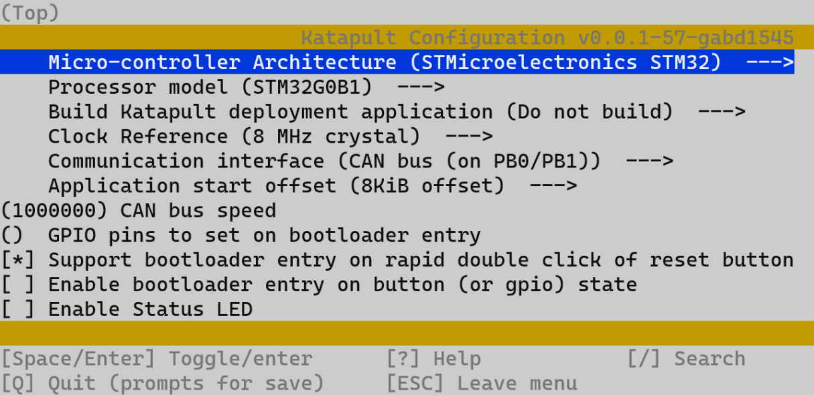

3. Use the command `make` to compile the firmware. The resulting katapult.bin file will be in the home/username/katapult/out folder. This can be directly downloaded to your computer from the SSH software's left panel.

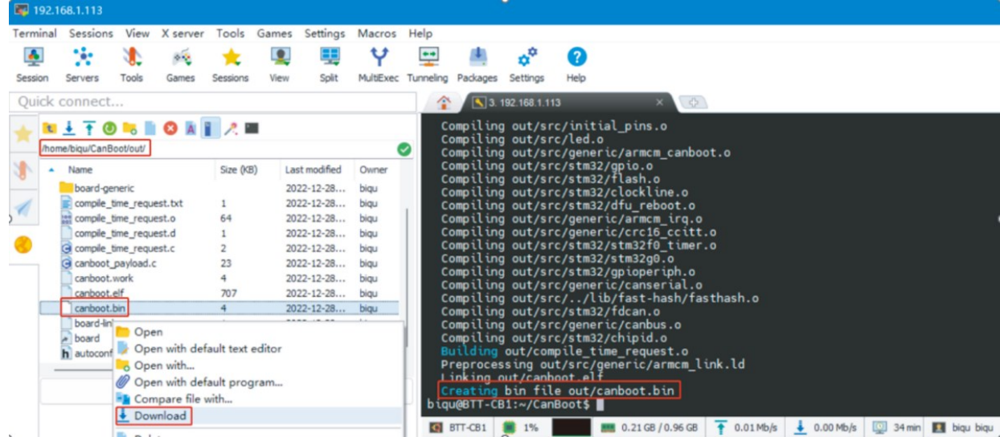

4. Hold the Boot button and connect the board to Raspberry Pi/CB1 via Type-C cable to enter DFU mode.

5. Enter `lsusb` in the SSH terminal to query the DFU device ID.

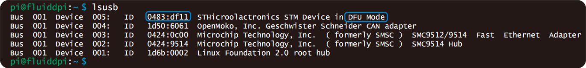

6. Enter the following command to flash Katapult: `make flash FLASH_DEVICE=0483:df11`

> **NOTE**
> Replace `0483:df11` with the actual device ID found in the previous step.

7. After flashing, disconnect the Type-C cable.
</details>

---

<details>
<summary>Compiling Klipper Firmware for MMBv1.1</summary>

1. Connect to CB1/Raspberry Pi via SSH and enter the following commands:
`cd ~/klipper/`
`make menuconfig`

Configure the firmware as shown in the provided image (update Klipper firmware to the latest version if options are not available).

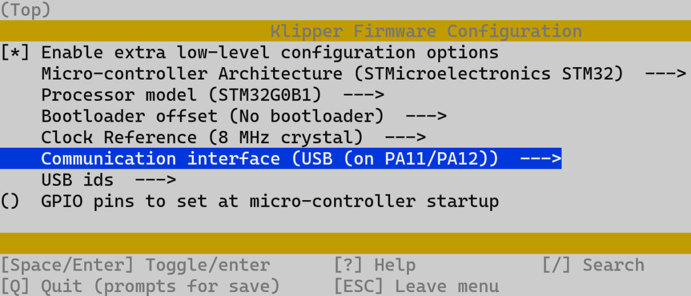

`[*] Enable extra low-level configuration optionsMicro-controller`

`Micro-controller Architecture (STMicroelectronics STM32) --->`

`Processor model (STM32G0B1) --->`

If not using Katapult:

`Bootloader offset (No bootloader) --->`

If using Katapult:

`Bootloader offset (8KiB bootloader) --->`

If USB communication on Type-C is used:

`Communication interface (USB (on PA11/PA12)) --->`

If CAN-Bus communication is used:

`Communication interface (CAN bus (on PB0/PB1)) --->`
`(1000000) CAN bus speed`

2. After configuration, press `q` to exit, and select `Yes` when prompted to save.

3. Enter `make` to compile the firmware. The resulting `klipper.bin` file will be in the `home/username/klipper/out` folder. This can be directly downloaded to your computer from the SSH software's left panel.

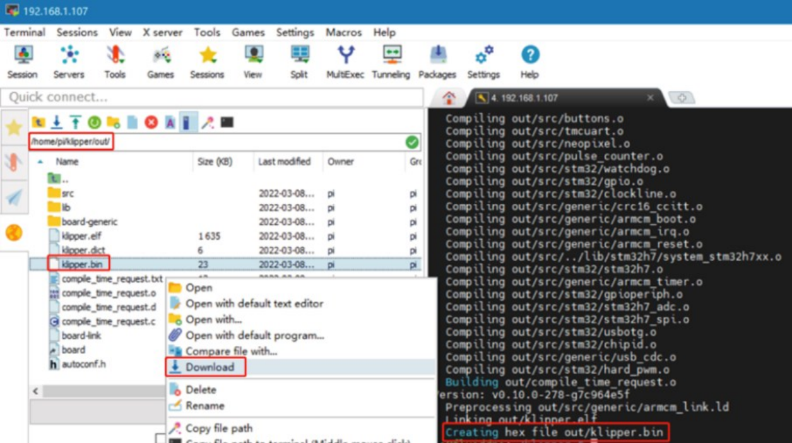

</details>

---

<details>
<summary>Flashing Katapult onto MMBv2.0</summary>

> **NOTE** 
> Katapult (formerly CanBoot) is for updating MCU firmware directly via CAN bus. If you prefer to update via USB (DFU Mode), skip this entire section.

To flash Katapult onto Raspberry Pi or CB1, refer to the following instructions to download the Katapult project: https://github.com/Arksine/katapult

1. Connect to CB1/Raspberry Pi via SSH and enter the command `cd ~` to go to the home directory.
Use the command `git clone https://github.com/Arksine/katapult` to download the Katapult project. Then enter `cd katapult` to navigate to the Katapult directory.

2. Enter `make menuconfig` and configure as shown in the provided image:

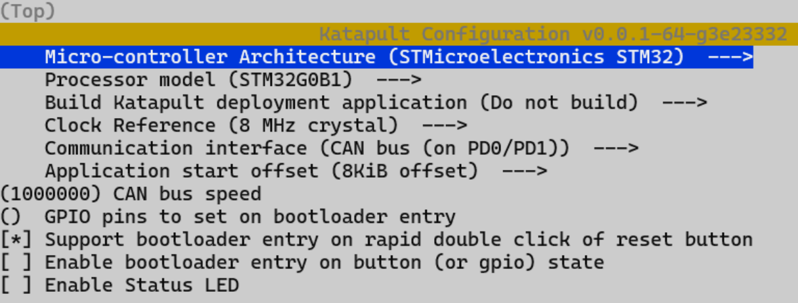

3. Use the command `make` to compile the firmware. The resulting katapult.bin file will be in the home/username/katapult/out folder. This can be directly downloaded to your computer from the SSH software's left panel.


4. Hold the Boot button and connect the board to Raspberry Pi/CB1 via Type-C cable to enter DFU mode.

5. Enter `lsusb` in the SSH terminal to query the DFU device ID.


6. Enter the following command to flash Katapult: `make flash FLASH_DEVICE=0483:df11`

> **NOTE**
> Replace `0483:df11` with the actual device ID found in the previous step.

7. After flashing, disconnect the Type-C cable.

</details>

---

<details>
<summary>Compiling Klipper Firmware for MMBv2.0</summary>

1. Connect to CB1/Raspberry Pi via SSH and enter the following commands:
`cd ~/klipper/`
`make menuconfig`

Configure the firmware as shown in the provided image (update Klipper firmware to the latest version if options are not available).

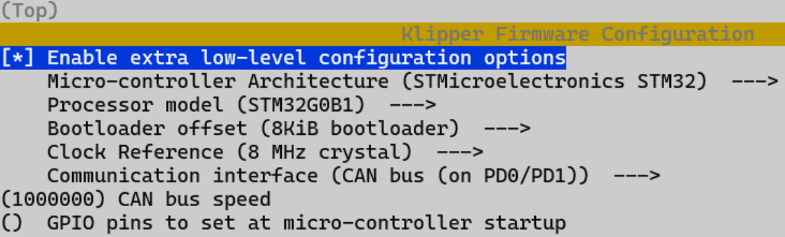

`[*] Enable extra low-level configuration optionsMicro-controller`

`Micro-controller Architecture (STMicroelectronics STM32) --->`

`Processor model (STM32G0B1) --->`

If not using Katapult:

`Bootloader offset (No bootloader) --->`

If using Katapult:

`Bootloader offset (8KiB bootloader) --->`

If USB communication on Type-C is used:

`Communication interface (USB (on PA11/PA12)) --->`

If CAN-Bus communication is used:

`Communication interface (CAN bus (on PD0/PD1)) --->`
`(1000000) CAN bus speed`

2. After configuration, press `q` to exit, and select `Yes` when prompted to save.

3. Enter `make` to compile the firmware. The resulting `klipper.bin` file will be in the `home/username/klipper/out` folder. This can be directly downloaded to your computer from the SSH software's left panel.


</details>

---

<details>
<summary>Firmware Update via Katapult for MMB (CANBus only)</summary>

Guide to update Raspberry Pi / CB1 / primary MCU via CANBus using Katapult. These steps are identical for MMBv1.1 and MMBv2.0.

1. Connect the CAN bus cable and plug a jumper at the 120R terminal resistor.

2. Enter the command `cd ~/katapult/scripts` then enter `python3 flash_can.py -i can0 -q`
This will query the canbus ID (make sure the CAN cable is connected and powered on) as shown in the figure below, the UUID of the device has been found:

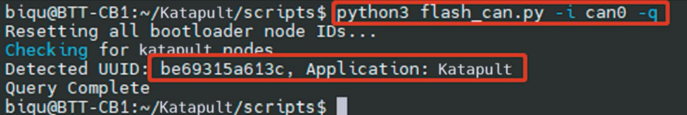

3. Enter `python3 flash_can.py -i can0 -f ~/klipper/out/klipper.bin -u be69315a613c`

> **NOTE** 
> Replace `be69315a613c` with the actual device UUID found in the previous step.

klipper.bin needs to be generated in advance using the `make` command, and the application start offset of Katapult is 8KiB offset, so Klipper's menuconfig Bootloader offset should also be 8KiB bootloader as shown in the following figure.

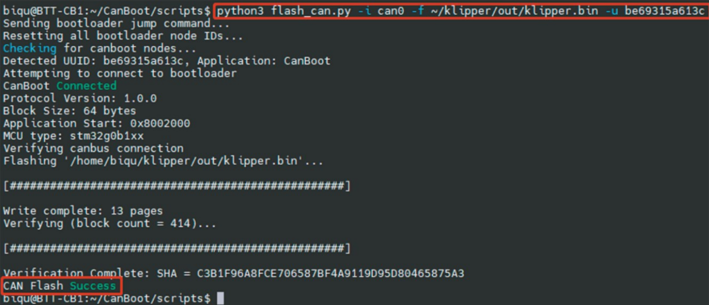

4. Query again with `python3 flash_can.py -i can0 -q`
The Application should now show Klipper, indicating it is running correctly.

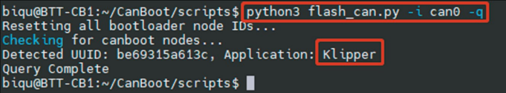
</details>

---

<details>
<summary>Firmware Update for MMB using USB (DFU Mode)</summary>

Guide to update Raspberry Pi / CB1 / primary MCU via USB (DFU Mode). These steps are identical for MMBv1.1 and MMBv2.0.

1. Hold the Boot button and connect the MMB to Raspberry Pi/CB1 via Type-C cable to enter DFU mode.

2. Enter `lsusb` in the SSH terminal to query the DFU device ID.

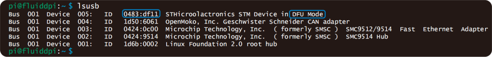

3. Enter `cd klipper` to navigate to the Klipper directory, and enter:

`make flash FLASH_DEVICE=0483:df11`

> **NOTE **
> Replace `0483:df11` with the actual device ID found in the previous step.

This will start flashing the firmware.

4. After flashing, enter `ls /dev/serial/by-id/` to query the device's Serial ID (only applicable for USB communication, not for CANBus).

5. If you are using USB communication, you don't need to press the Boot button for subsequent updates. You can enter the following command to flash the firmware:

`make flash FLASH_DEVICE=/dev/serial/by-id/usb-Klipper_stm32g0b1xx_4550357128922FC8-if00`

> **NOTE**
>  Replace `/dev/serial/by-id/xxx` with the actual ID found in the previous step.

6. If you are using CAN bus for communication, disconnect the Type-C cable after flashing.

</details>

---

<details>
<summary>Compiling and flashing Klipper onto EASY-BRD</summary>

This guide assumes you are using the version with Seeeduino XIAO.
Other microcontrollers configurations are available in [config](https://github.com/Tircown/ERCF-easy-brd/blob/master/config/Seeeduino%20XIAO%20-%20SAMD21G18/ercf_hardware.cfg).

* Install bossac (version ≥1.8)
```
sudo apt install libreadline-dev libwxgtk3.0-*
git clone https://github.com/shumatech/BOSSA.git
cd BOSSA
make
sudo cp bin/bossac /usr/local/bin
```
* Prepare the firmware
```
cd ~/klipper
make menuconfig
```

```
make clean
make
```
* Flashing the Seeeduino XIAO
Connect the Seeeduino XIAO to your raspberry if it's not already done.
Get the port of the XIAO, i.e. `ls /dev/tty*`, and modify the default `/dev/ttyACM1` in the command line bellow.
Use tweezers or short lines to short the RST pins in the diagram twice. The orange LED lights flicker on and light up. Then send in the next few seconds this command line matching your port.
```
sudo /usr/local/bin/bossac -i -d -p /dev/ttyACM1 -e -w -v -R --offset=0x2000 out/klipper.bin
```

More informations on how to reset for flashing:
https://wiki.seeedstudio.com/Seeeduino-XIAO/#enter-bootloader-mode
</details>

---

<details>
<summary>Other EASY-BRD MCU configurations</summary>

See [ercf_hardware.cfg](https://github.com/Tircown/ERCF-easy-brd/blob/master/config/Seeeduino%20XIAO%20-%20SAMD21G18/ercf_hardware.cfg) for the Seeeduino XIAO (most common solution)
Other microcontrollers configurations are available in config.
</details>

---

<details>
<summary>Compiling Klipper for ERBv1.0</summary>

### Compile options
On your klipper device (usually Raspberry Pi) run the following to create your make configuration:

```shell
cd  ~/klipper
make clean
make menuconfig
```

Select the following menuconfig settings


And create the firmware files by running the following:

```shell
make
```

</details>

---

<details>
<summary>Flashing Firmware onto ERBv1.0</summary>

#### 1.With your windows PC

Step 1: Connect 24V (Power on the board)

Step 2: Connect USB-C cable to your Klipper device (usually Raspberry Pi)

Step 3: Push and hold the BOOTSEL button

Step 4: Push the RST button and hold 0.5 seconds

Step 5: Release the RST button, after 3 seconds, Release the bootsel button

Step 6: `RPI-RP2` folder will show up on your computer, copy your built firmware `klipper.uf2` to the folder.


#### 2. With your Pi 

Thanks for mk-maddin's work:
https://github.com/FYSETC/FYSETC-ERB/issues/2#issuecomment-1618902635

##### Connecting the board and bring it into flash mode

Step 1: Connect 24V (Power on the board)

Step 2: Connect USB-C cable to your Klipper device (usually Raspberry Pi)

Step 3: Push and hold the BOOTSEL button

Step 4: Push the RST button and hold 0.5 seconds

Step 5: Release the RST button, after 3 seconds, Release the bootsel button

Verify your device is in boot mode connected by running the following command:

```shell
lsusb
```

The output should contain an entry looking like 2e8a:0003 Raspberry Pi RP2 Boot


##### Flashing the firmware
Now we do not flash the fimware by directly copying it to the storage, but we flash it using the following command:

```shell
make flash FLASH_DEVICE=2e8a:0003
```

The output looks like the following - IF you are prompted (you might or might not) for a password, enter the password of your current user account.


Now restart your fystec-erb by disconnecting 24V - waiting some seconds and reconnecting 24V again.
You should be able to see it as usual klipper device within 
```shell
ls /dev/serial/by-id
```

### Configuration

See `ercf_hardware.cfg` in the ERBv1.0 repository [config](https://github.com/FYSETC/FYSETC-ERB/tree/main/V1.0/config) folder.

### Known issues

The mark of GPIO24 and GPIO25 is swapped, check the silk file [here](https://github.com/FYSETC/FYSETC-ERB/blob/master/hardware/Silk%20Fixed.pdf).
</details>

---

<details>
<summary>Compiling and Flashing Klipper onto ERBv2.0</summary>

### Compile and upload
In order to compile and upload at one time, you need to follow the steps below to put RP2040 into dfu mode.

1. Step 1: Connect 24V (Power on the board)
2. Step 2: Connect USB-C cable to your Klipper device (usually Raspberry Pi)
3. Step 3: Push and hold the BOOTSEL button
4. Step 4: Push the RST button and hold 0.5 seconds
5. Step 5: Release the RST button, after 3 seconds, Release the bootsel button
6. Verify your device is in boot mode connected by running the following command:

```shell
lsusb
```

The output should contain an entry looking like 2e8a:0003 Raspberry Pi RP2 Boot


On your klipper device (usually Raspberry Pi) run the following to create your make configuration:

```shell
cd  ~/klipper
make clean
make menuconfig
```

Select the following menuconfig settings

Use USB communication


Use CANBUS communication


And create and upload the firmware files by running the following:

```shell
make flash FLASH_DEVICE=2e8a:0003
```
The output looks like the following - IF you are prompted (you might or might not) for a password, enter the password of your current user account.


Now restart your fystec-erb by disconnecting 24V - waiting some seconds and reconnecting 24V again.
Or press the reset button for one second and then release it.
You should be able to see it as usual klipper device within 
```shell
ls /dev/serial/by-id
```
### Configuration

See `ercf_hardware.cfg` in the ERBv2.0 repository [config](https://github.com/FYSETC/FYSETC-ERB/tree/main/V2.0/config) folder.

---------------------------------------------------

> **TIP**
> We recommend using the Katapult bootloader, whether you use USB or CANBUS communication. This can avoid many strange problems.
> 
> Configuration of the Katapult bootloader:
> 
> 
> 
> 
> Configuration of klipper using Katapult:
> 
> 
> 

</details>

---

### ERCF Setup Steps:
- Flashing Your Local MCU
- [Installing Happy Hare](https://github.com/Enraged-Rabbit-Community/ERCF_v2/blob/master/Documentation/Installing-Happy-Hare.md)
- [Happy Hare Configuration](https://github.com/Enraged-Rabbit-Community/ERCF_v2/blob/master/Documentation/Happy-Hare-Configuration.md)
- [Hardware Configuration Checks](https://github.com/Enraged-Rabbit-Community/ERCF_v2/blob/master/Documentation/Hardware-configuration-checks.md)
- [Hardware Calibration](https://github.com/Enraged-Rabbit-Community/ERCF_v2/blob/master/Documentation/Hardware-Calibration.md)
- [Toolhead Distances](https://github.com/Enraged-Rabbit-Community/ERCF_v2/blob/master/Documentation/Toolhead-Distances.md)
- [Installing KlipperScreen Happy Hare](https://github.com/Enraged-Rabbit-Community/ERCF_v2/blob/master/Documentation/Installing-KlipperScreen.md)
- [Slicer Setup](https://github.com/Enraged-Rabbit-Community/ERCF_v2/blob/master/Documentation/Slicer-Setup.md)
- [Further Mods to Consider](https://github.com/Enraged-Rabbit-Community/ERCF_v2/blob/master/Documentation/Further-Mods.md)

#### Even more Happy Hare info can be found at:
- [Happy Hare Wiki](https://github.com/moggieuk/Happy-Hare/wiki)