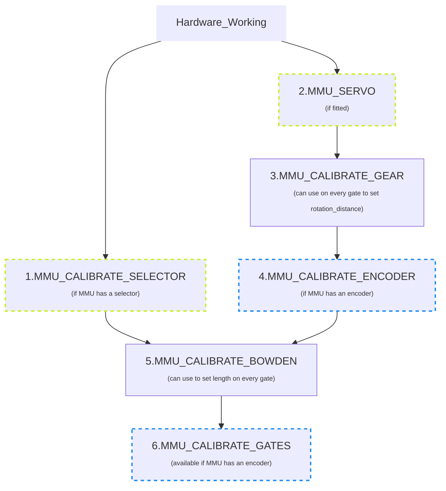
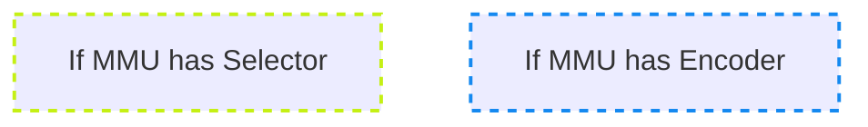
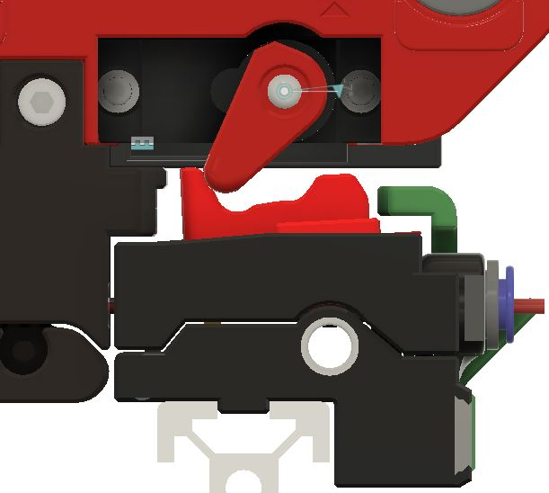
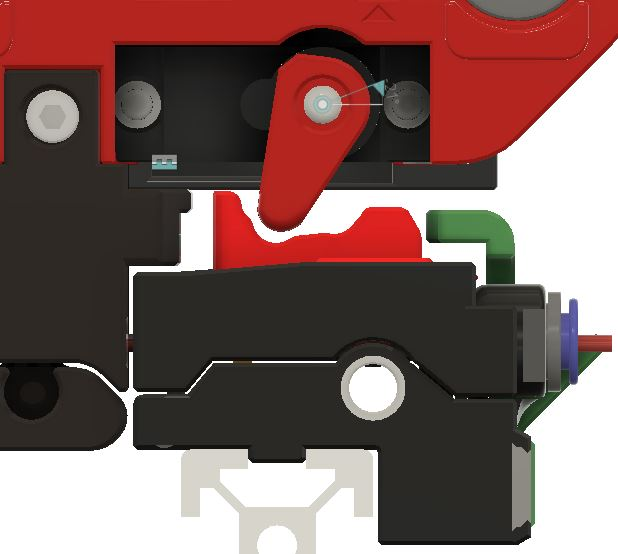
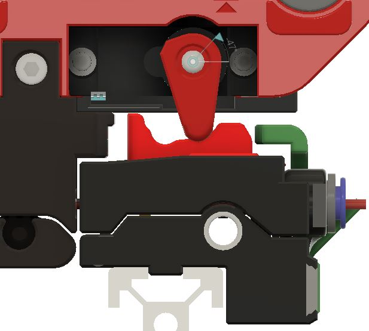

## Page Sections:
- [Calibration Steps](#---calibration-steps)
  - [1. Servo](#---step-1-calibrate-your-servo)
  - [2. Selector Offsets](#---step-2-calibrate-selector-offsets)
  - [3. Springy Tension](#---step-3-springy-calibration)
  - [4. Gear Stepper](#---step-4-calibrate-your-gear-stepper)
  - [5. Encoder](#---step-5-calibrate-your-encoder)
  - [6. Bowden Length](#---step-6-calibrate-bowden-length)
  - [7. Gates](#---step-7-calibrating-individual-gates)
- [Calibration Storage](#---calibration-storage)

*\[This guide was adapted from the [Happy Hare Wiki](https://github.com/moggieuk/Happy-Hare/wiki) for ERCF v2. Thanks Moggie!\]*


This discussion assumes that you have setup and debugged your [Hardware Configuration](https://github.com/Enraged-Rabbit-Community/ERCF_v2/blob/master/Documentation/Hardware-configuration-checks.md).

Before using your ERCF you will need to calibrate it to adjust for differences in components used on your particular build. Be careful to calibrate in the recommended order because some settings build and depend on earlier ones. Happy Hare now has automated calibration for some of the traditionally longer steps and does not require any Klipper restarts so the process is quick and painless.

Upon starting your printer, you should be greeted by a large warning on your console:

```yml
Prerequsite calibration steps are not complete:
Use MMU_CALIBRATE_SELECTOR to calibrate selector for gates: 0,1,2,3,4,5,6,7
Use MMU_CALIBRATE_GEAR (with gate 0 selected) to calibrate gear rotation_distance on gate: 0
Use MMU_CALIBRATE_ENCODER (with gate 0 selected)
Use MMU_CALIBRATE_GEAR (with gate selected) or MMU_CALIBRATE_GATES GATE=xx to calibrate gear rotation_distance on gates: 1,2,3,4,5,6,7
Use MMU_CALIBRATE_BOWDEN
```

Let's take care of that next!


##    Calibration Steps

> [!IMPORTANT]  
> When calibrating the first time you must perform calibration in the prescribed order.  Once complete you can re-calibrate particular steps but remember that some calibration changes will cascade.  E.g. after calibrating the gear, you must recalibrate the encoder, the bowden and possibly all the `gear_rotation_distances`.  Generally you can re-calibrate the servo (step 1) selector (step 2) and the gates (step 7) at any time, but the gear, encoder and bowden must always be done in that order!


<!--

-->


- For ERCF, Happy Hare keeps a `rotation_distance` on each gate which requires separate measured calibration of each gate, using `MMU_CALIBRATE_GEAR` or, using the encoder, with `MMU_CALIBRATE_GATES` to automate the process. This is important even if the drive gears are from the same vendor look similar. 

> [!TIP] 
> All of the calibration commands can be run in a "check/test" mode. Simply add `SAVE=0` to the command and the calibration will be run but the results will not be saved. This is very useful to practice or to verify calibration.


###    Step 1. Calibrate your servo

Now it's finally time to install the servo arm!

Run the command `MMU_SERVO POS=down`. This will set the servo to the initial down position while you attach the servo arm.

Attach the servo arm, at about 90 degrees, perpendicular to the servo body. *Be careful not to twist the Servo splines while adding the arm - if you do, stop and run the previous command again!* Add the servo arm screw.

Next, tighten down the M3x10mm BHCS that clamps the servo arm down on the servo drive shaft splines. This will make an impression of the splines, locking the servo arm in place.

Happy Hare sets up theoretically good servo postions during installation, however they should be calibrated. ERCF *requires* precise servo calibration to work correctly. To get that precision, you need to run through this process to update and record the correct angle for the `UP` position. Refer to the pictures below to see what each of the servo arm positions should look like.

```yml
MMU_SERVO POS=up
  (Assume the position isn't quite right)
MMU_SERVO
Current servo angle: 125, Positions: {'down': 110, 'up': 125, 'move': 110}
  (Without arguments you can view the current angles)
MMU_SERVO ANGLE=128
  (Tweak until you are happy with the "up" position as compared to the picture below)
MMU_SERVO POS=up SAVE=1
  (Save the current angle (128) for the "up" position)
```

Repeat for the other two positions (`DOWN` and `MOVE`).

> [!NOTE]  
> Servos have a limited range of rotation. If you are unable to attain the servo angle required you might need to reposition the servo arm on the servo, or edit the servo configuration in `mmu_hardware.cfg`
 
**Servo positions on ERCF**

Make sure the `MOVE` and `UP` positions of your servo arm are set so that the arm does not hit the tophats when the selector is moving. See picture below to see where the servo arm should be for the 3 positions.

- Servo Up. This position releases the filament trap for printing without sync mode.

<p align="center"></p>

- Servo Move. This position activates the filament trap so that the Selector can move.

<p align="center"></p>

- Servo Down. This position meshes the BMG gears to push filament. The filament trap is released to allow for Load/unload or to print with sync mode)

<p align="center"></p>

**If the servo angles are set incorrectly, the servo will struggle to reach the angle set, which will reduce the servo's lifetime, and may even burn the servo out! You will know if the servo is struggling to reach position because it will keep buzzing while it tries to reach the set angle.**

> [!NOTE] 
> It is normal for the Gear motor to move back and forth slightly during a `MMU_SERVO POS=down` command. This is to ensure that the BMG gears mesh properly.

Once you are satisfied with your angles, you are done with this step!

###    Step 2. Calibrate selector offsets

First, make sure that there is room between the endstop and Gate 0. We don't want the endstop to be activated while using Gate 0, instead we want there to be at least a 1.0mm gap between the two positions. If the endstop is activated when using Gate 0, you need to tighten the endstop adjustment screw (the BHCS on the Encoder). If for the endstop isn't activating even at the end of travel, the endstop adjustment screw needs to be loosened. The screw has a pitch of 0.5mm, so one full turn will move it in or out 0.5mm.

Once you have the endstop distance adjusted, There are three ways to calibrate the selector offsets:

#### A) Fully automatic calibration
Let's start by getting the selector cailbrated in this easy step (it is important to do this early because the bowden and gate calibration need to be able to select gates). This sets up the position all of all the gates as well as the bypass position if fitted. Firstly ensure MMU motors are off by running `MMU_MOTORS_OFF` and remove filament from gate #0 -- you may need to run `MMU_SERVO POS=up` to release the filament. Then re-insert and remove filament through selector to ensure that gate #0 is correctly alined with selector. Be careful and move the selector side to side whilst moving the filament inside the gate. Try to assess where the filament is centered in the gate and leave the selector in that position. Then run:

  > MMU_CALIBRATE_SELECTOR

Sit back and relax. The selector will move to find the extremes of movement and then use information about the geometry of the particular MMU and version/options you are using to generate and save the selector offsets automatically!

#### B) Extrapolate first and last gates
Although the above automated method above will attempt to calibrate the Selector, it can result in drift unless all the gates/lanes are perfectly tight together. To address this a better method that can be used with ERCF v2 is as follows:
```yml
MMU_MOTORS_OFF
  (Use a piece of filament to align gate 0; remove filament)
MMU_CALIBRATE_SELECTOR GATE=0
MMU_MOTORS_OFF
  (Use a piece of filament to align the last gate; remove filament)
MMU_CALIBRATE_SELECTOR GATE=n
  (where n is the last gate number, remember we are 0 based)
```
This will automatically set the offset of all intermediate gates distributing any build variance


#### C) Individual gate calibration
Although it should not be necessary other than for the bypass gate, there is an option update a single position if you would like to tune or run into problems. See the command reference for more detailed information on options, but basically, you turn MMU motors off, line up the desired gate with the selector and run:

  > MMU_CALIBRATE_SELECTOR SINGLE=1 GATE=...

Strictly speaking `SINGLE=1` is only required if calibrating just your final gate to avoid automatic extrapolation.

#### C part 2) Bypass gate calibration
ERCF has a built-in bypass gate. Similar to the above step, you can calibrate it's position by aligning the selector and running:

  > MMU_CALIBRATE_SELECTOR BYPASS=1

**Validation:** At the end of this step you should be able to select any tool/gate on your MMU. For instance, try running `MMU_HOME TOOL=3` to re-home and select tool/gate #3.

###    Step 3. Springy Calibration

*You should start with the Springy adjustment bolt only just touching the Spring Cap part, with little to no tension on the spring.*

Put a scrap of PTFE into Gate 0. Run the command `MMU_SELECT GATE=0`.

Feed a **new** piece of filament at least 250mm long into Gate 0 and past the encoder.

Run the command `MMU_TEST_GRIP`

Pull on the filament in the unloading direction. The gears should grip the filament and move the entire Drive Shaft as you pull. 

If the filament slips on the gears at all, tighten the Springy tensioner bolt, half a turn at a time, until the filament is fully and firmly gripped by the drive gears when you pull.

If the grip is too strong, eg. the filament is being mangled by the gears, or the filament is grinding, back off the Springy tensioner bolt half a turn and test again.

It is important to set the Springy tension correctly so that the drive gears have good grip on the filament. If this is not set correctly, later calibration steps may give erroneous readings, because the length of filament sent by the Gear Motor is used in the calibration calculations.

The Springy spring tensions the Servo downward, while still allowing the Servo to flex upwards slightly as necessary during operation.


###    Step 4. Calibrate your gear stepper
**It is Very Important to get this right!**

In this step you are ensuring that when the gear stepper is told to move 100mm of filament it really does move 100mm.  It is akin to what you did when you set up your extruder rotational distance, although in this case no Klipper restart is necessary!  Select gate #0 (you can use `MMU_SELECT GATE=0` if you have finished the selector calibration above) and put some filament through the gate so that it pokes out just past the selector exit.  Run the following to ensure the filament is gripped if your MMU needs to actuate a servo to grip filament:

  > MMU_SERVO POS=down

Next remove the bowden tube and cut the filament flush with the ECAS connector at the output of the MMU (e.g the encoder on the ERCF design). Run this command to attemp to move 100mm of filament:

  > MMU_TEST_MOVE MOVE=100

Get out your ruler and very carefully measure the length of the emited filament.  Hold your ruler up to the bowden and gently pull the filament straight to get an accurate measurement. Next run this specifying your actual measured value (102.5 used in this example):

  > MMU_CALIBRATE_GEAR MEASURED=102.5

```
    Gear stepper 'rotation_distance' calculated to be 23.117387 (currently: 22.9)
    Gear calibration for gate 0 has been saved
```

> [!TIP]  
> You can also measure over a different length by using something like `MMU_TEST_MOVE MOVE=200` and `MMU_CALIBRATE_GEAR LENGTH=200 MEASURED=205.25` for a 200mm length for example. Don't forget the `LENGTH=200` argument, or it the calibration calculation will default to 100mm and set your gear calibration wrong!

> [!IMPORTANT]
> The value for `rotation_distance` should be between 22 and 24 for BMG gears - if you get a `rotation_distance` far outside of these values, something has likely gone wrong! Redo this step. Common mechanical causes include overtensioned Selector belts and misaligned Selector positions.

**Validation:** If you want to test, snip the filament flush with the ECAS connector again and run `MMU_TEST_MOVE`.  Exactly 100mm should be moved this time.

You can either repeat this for all other gates, or you can shortcut and use `MMU_CALIBRATE_GATES` in Step 7.


###    Step 5. Calibrate your encoder

The next step is to calibrate the Encoder so it measures distance accurately. Re-fit the bowden to the encoder output. Alternatively, just make sure you have at least 500mm of filament at gate #0 before starting. Now run:

  > MMU_CALIBRATE_ENCODER

You will see an output similar to:

```
    Calibrating over 400mm...
      + counts: 368
      - counts: 368
      + counts: 369
      - counts: 369
      + counts: 369
      - counts: 369
    Load direction:   mean=368.67 stdev=0.58 min=368 max=369 range=1
    Unload direction: mean=368.67 stdev=0.58 min=368 max=369 range=1
    Before calibration measured length: 394.47mm
    Calculated resolution of the encoder: 1.085049 (currently: 1.094543)
    Encoder calibration has been saved
```

> [!NOTE]  
> (i) Use fresh filament - grooves from previous passes through extruder gears can lead to slight count differences.
> (ii) Make sure the selector is aligned with the gate. If it is off to one side you will almost certainly get dissimilar counts in forward and reverse directions.
> (iii) You want the counts on each attempt to be the same or very similar but don't sweat +/-3 counts.  Between the spring-tensioned servo and Binky encoder design they should be very consistent ;-)
> (iv) You can run this (like all calibration commands) without saving the result by adding a `SAVE=0` flag.

If this step worked then you should be able to unload the residual filament with `MMU_UNLOAD`. If you aren't happy with results, leave the filament ready for the next run and repeat this section.


###    Step 6. Calibrate bowden length

Here you can calibrate the length of your bowden from MMU gate to extruder entrance. This is important because it allows the MMU to move the filament at a fast pace over this distance before getting to the more complicated part of the load sequence. To speed up this process, and depending on what sensors you have fitted for extruder homing, you may need to give the calibration routine a hint of how far way the extruder is.

There are different ways to do this depending on your configuration and sensor options:

1. If `extruder_homing_endstop: extruder` (or `mmu_gear_touch` or `filament_compression`), then you have a homing endstop and you can simply specify a `BOWDEN_LENGTH` that is GREATER than your estimated length to give plenty of room to find the homing stop (technically, Happy Hare defaults to 2000mm so you can probably omit this parameter completely).

  > MMU_CALIBRATE_BOWDEN
  > MMU_CALIBRATE_BOWDEN BOWDEN_LENGTH=1500


2. If you are using `extruder_homing_endstop: collision`, then during Bowden calibration `BOWDEN_LENGTH` needs to be supplied and MUST be slightly shorter than the actual length. A good rule of thumb is to manually measure the distance from exit from the selector to the entrance to your extruder. Subtract 40-50mm from that distance. I measured approximately 690mm on my system, so will supply 650mm as the starting value. For example:

  > MMU_CALIBRATE_BOWDEN BOWDEN_LENGTH=650

```
    Homing MMU...
    Tool T0 enabled
    Calibrating bowden length from reference Gate #0
    Tool T0 enabled
    Heating extruder to minimum temp (200.0)
    Finding extruder gear position (try #1 of 3)...
    Pass #1: Filament homed to extruder, encoder measured 683.5mm, filament sprung back 3.2mm
    - Bowden calibration based on this pass is 683.5
    Finding extruder gear position (try #2 of 3)...
    Pass #2: Filament homed to extruder, encoder measured 682.7mm, filament sprung back 3.2mm
    - Bowden calibration based on this pass is 682.7
    Finding extruder gear position (try #3 of 3)...
    Pass #3: Filament homed to extruder, encoder measured 683.9mm, filament sprung back 3.2mm
    - Bowden calibration based on this pass is 683.4
    Recommended calibration reference is 680.2mm. Clog detection length: 16.8mm
    Bowden calibration and clog detection length have been saved
```

3. Finally, if you run into problems with collision detection at the extruder, you can run manual calibration. To do this, select gate 0, push filament through manually all the way to the extruder gears. This run `MMU_CALIBRATE_BOWDEN MANUAL=1` option. This will measure the distance in reverse to the gate homing position:

  > MMU_CALIBRATE_BOWDEN BOWDEN_LENGTH=1000 MANUAL=1

This will reverse home to the gate and uses Klipper's measurement of stepper movement.

> [!NOTE]  
> (i) This calibration assumes that the selector has been calibrated first.
> (ii) This may cause the extruder to be heated. This is to ensure that the extruder motor is energized and can resist the impact of the collision with the filament


###    Step 7. Calibrating individual gates

This step allows for calibrating slight differences between gates and saves you from having to use `MMU_CALIBRATE_GEAR` on every gate. Even with ERCF this is optional because if not run, the gates will tune themselves as they are used automatically!  That said it be beneficial to get this out of the way with a test piece of filament, but doing it also: (i) removes the need to set the `autotune_rotation_distance` in `mmu_parameters.cfg`, (ii) is necessary if there is substantial variation between gates -- e.g. if BMG gears for different gates are sourced from different vendors.

Simply make sure filament is available at the gate you want to calibrate (you can also insert a 500mm piece of filament) and run:

> MMU_CALIBRATE_GATES GATE=1

You will see an output similar to:

```
    Tool T1 enabled
    Calibrating gate 1 over 400.0mm...
      + measured: 404.4mm
      - measured: 404.4mm
      + measured: 404.4mm
      - measured: 404.4mm
      + measured: 405.5mm
      - measured: 405.5mm
    Load direction:   mean=404.7 stdev=0.63 min=404.4 max=405.5 range=1.1
    Unload direction: mean=404.7 stdev=0.63 min=404.4 max=405.5 range=1.1
    Calibration move of 6x 400.0mm, average encoder measurement: 404.7mm - Ratio is 1.011872
    Calculated gate 1 rotation_distance: 22.941324 (currently: 22.672165)
    Calibration for gate 1 has been saved
```

> [!NOTE]  
> (i) You can also quickly run through all gates (and even pass the loose filament gate to gate) with `MMU_CALIBRATE_GATES ALL=1` <br>
> (ii) If you see "Calibration ignored because it is not considered valid (>20% difference from gate 0)" then it either means the calibration failed because filament was not moving correctly, or the encoder was not working correctly. Less likely but possible is because you have not calibrated gate 0 (`MMU_CALIBRATE_GEAR` and `MMU_CALIBRATE_ENCODER`) correctly which serves as the reference gate.

> [!IMPORTANT]
> The value for `rotation_distance` should be very close to the `rotation_distance` from step 4 - if you get a `rotation_distance` that is very different, something has likely gone wrong! Redo this step. Common mechanical causes include overtensioned Selector belts and misaligned Selector positions.


###    Calibration Storage
All calibrated results are stored in the configured `[save_variables]` file. By default and most usually this will be `mmu_vars.cfg`. Here is a list of those variables and the command that sets them:

  | Variable | Command | Notes |
  | -------- | ------- | ----- |
  | mmu_servo_angles | MMU_SERVO | E.g {'down': 45, 'up': 125, 'move': 110} represents the angles for the three servo positions |
  | mmu_gear_rotation_distances | MMU_CALIBRATE_GEAR or MMU_CALIBRATE_GATES | The list represents `rotation_distance` for each gate |
  | mmu_encoder_resolution | MMU_CALIBRATE_ENCODER | The distance each encoder signal transition represents |
  | mmu_selector_offsets | MMU_CALIBRATE_SLECTOR | A list of offsets for each gate of the MMU |
  | mmu_selector_bypass | MMU_CALIBRATE_SELECTOR | The offset of the bypass (passthough) location |
  | mmu_calibration_bowden_home | MMU_CALIBRATE_BOWDEN | Records the gate homing endstop used as a basis for the calibration |
  | mmu_calibration_bowden_lengths | MMU_CALIBRATE_BOWDEN | The list will be the same length as the number of gates on your MMU |
  | mmu_calibration_clog_length | MMU_CALIBRATE_BOWDEN | Only used with encoder although always set incase you add in the future |

Happy Hare documentation lists all [Calibration Commands](https://github.com/moggieuk/Happy-Hare/wiki/Command-Reference#---calibration)


### ERCF Setup Steps:
- [Flashing Your Local MCU](https://github.com/Enraged-Rabbit-Community/ERCF_v2/blob/master/Documentation/Flashing-Local-MCU.md)
- [Installing Happy Hare](https://github.com/Enraged-Rabbit-Community/ERCF_v2/blob/master/Documentation/Installing-Happy-Hare.md)
- [Happy Hare Configuration](https://github.com/Enraged-Rabbit-Community/ERCF_v2/blob/master/Documentation/Happy-Hare-Configuration.md)
- [Hardware Configuration Checks](https://github.com/Enraged-Rabbit-Community/ERCF_v2/blob/master/Documentation/Hardware-configuration-checks.md)
- Hardware Calibration
- [Toolhead Distances](https://github.com/Enraged-Rabbit-Community/ERCF_v2/blob/master/Documentation/Toolhead-Distances.md)
- [Installing KlipperScreen Happy Hare](https://github.com/Enraged-Rabbit-Community/ERCF_v2/blob/master/Documentation/Installing-KlipperScreen.md)
- [Slicer Setup](https://github.com/Enraged-Rabbit-Community/ERCF_v2/blob/master/Documentation/Slicer-Setup.md)
- [Further Mods to Consider](https://github.com/Enraged-Rabbit-Community/ERCF_v2/blob/master/Documentation/Further-Mods.md)

#### Even more Happy Hare info can be found at:
- [Happy Hare Wiki](https://github.com/moggieuk/Happy-Hare/wiki)