*\[This page has been taken from the Happy Hare Wiki (Thanks Moggie!) and modified to be specific to ERCF v2.\]*

#### Page Sections:
- [Cloning Happy Hare Repo](#---cloning-happy-hare-repo)
- [Running Installer](#---running-installer)
- [Creating Base Klipper Config](#---creating-base-klipper-config)
- [Pause/Resume/Cancel_Print Macros](#---pauseresumecancel_print-macros)
- [Upgrading](#---upgrading)

*\[This guide is copied directly from the [Happy Hare Installation](https://github.com/moggieuk/Happy-Hare/wiki/Installation) page. Thanks Moggie!\]*


This section deals with installing Happy Hare to the host computer (most commonly the Raspberry Pi). Basically, the installation proceeds as with any other git based software, indeed like Klipper itsself.

Happy Hare consists of a set of Klipper "extra" modules, a moonraker "component" and a set of macros and configuration files. To install you must first clone from Github and then install using the supplied install script. This install will both setup a base set of klipper configuration files as well as creating the symlinks necessary to link the cloned files into your Klipper/Moonraker installation.

Once installed it will be added to Moonraker update-manager for easy updates like other Klipper plugins.

<br>
 
##    Cloning Happy Hare Repo

The first step is to clone the Happy Hare repository onto your Raspberry Pi. If you're unfamiliar with cloning, it just copies all the data in the git repository to your local computer. Since the Happy Hare git has all the necessay software, we use the `git clone` functionality to pull everything from github to the local computer (the rpi, in most cases of Klipper). So, go ahead and log into your rpi via ssh.

In power shell, and with Mainsail, this will look like this:  

```yml
ssh pi@mainsailos.local
```  

> [!NOTE]  
> You will notice in the following pictures the bash prompt is `Miriax@VoronRed:~`. Yours won't look like that. It will be `username@<hostname.:~` where the hostname is likely "mainsailos" or the ip address.

Alternatively, you can use your Klipper ip address, which will look something like this:  
```
ssh username@192.168.0.256
```  
(You'll need to change the username and ip address.)  

<p align="left">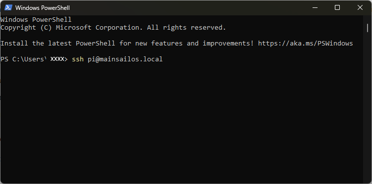</p>

From there, you're going to clone Happy Hare software to your rpi:  

```yml
cd ~
git clone https://github.com/moggieuk/Happy-Hare.git
```

(it's ok to click the copy icon and right click in the ssh terminal to paste or just type it out if you want.)  
Let that finish. It should only take a few seconds, and you'll now have your very own copy of Happy Hare stored on your rpi!
<p align="center"></p>

Now, you're going to change to the Happy Hare directory using the `cd` command (`cd` is Linux Geek for "change directory"):  

```yml
cd Happy-Hare
```

Here is a picture of the previous steps successfully performed:
<p align="left">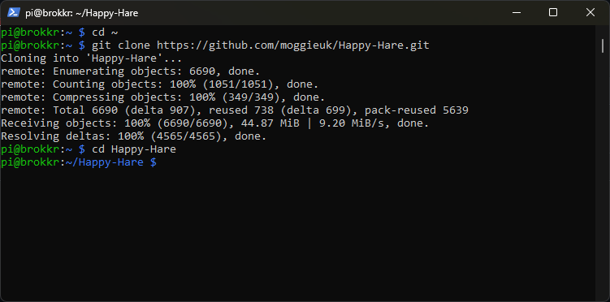</p>

<br>
 
##    Running Installer

The install does not ship a set of template config files, instead you can create your starting templates by running the installer in interactive mode. This will ask questions that will be used to generate and install the template config. See [next section](#---creating-base-klipper-config). Read this section to familiarize yourself with command line options and determine if you need to use `-c`, `-k` or `-r` flags.

You'll be asked to run:

```
cd ~/Happy-Hare
./install.sh -i
```

The `-i` option will bring up an interactive installer to aid setting some confusing parameters. For popular external mcu boards it will also configure all the pins for you. If run without with the `-i` flag it defaults to updating the current installation which is sometimes necessary for significant version updates (see [here](Upgrade-Notice)). Note that if an existing install is found it will never be overwritten, it will be moved to a numbered backup folder with a `<file>.<date>` extension and current configuration defaults carried over. If you still choose not to install the new `mmu*.cfg` files automatically you can copy the templates and fill in all the tokens and blank parameters by hand. Frankly it is much easier to run through an initial install and use the generated config files as a starting point.
<br>

Note that the installer will look for Klipper install and config in standard locations. If you have customized locations or multiple Klipper instances on the same rpi, or the installer fails to find Klipper you can use the `-k` and `-c` flags to override the Klipper home directory and Klipper config directory respectively. Also, if installing on Repetier-Server add the `-r` option. E.g.
```
./install.sh -k /opt/klipper/LK5_Pro_ERCF -c /var/lib/Repetier-Server/database/klipper -m /opt/klipper/LK5_Pro_ERCF/moonraker -r LK5_Pro_ERCF -i
```

If you have multiple Klipper instances installed with for example Kiauh. You can use the `-a` flag to specify the service name. E.g.
```
./install-sh -a klipper-two -k <klipper_home_dir> -c <klipper_config_dir>
```

<br>

> [!IMPORTANT]  
> `mmu.cfg`, `mmu_hardware.cfg`, `mmu_macro_vars.cfg` & `mmu_parameters.cfg` (and other base config files) must all be referenced by your `printer.cfg` master config file with `mmu.cfg` and `mmu_hardware.cfg` listed first (the recommended way to achieve this is simply with `[include mmu/base/*.cfg]`). `mmu/optional/client_macros.cfg` should also explicitly be referenced if you don't already have working PAUSE / RESUME / CANCEL\_PRINT macros (but be sure to read the section beforehand regarding macro expectations and review the default macros). The install script can also include these optional config files for you.
<br>

> [!TIP]  
> If you are concerned about running `install.sh -i` then run like this: `install.sh -i -c /tmp -k /tmp` This will build the `*.cfg` files for you but put then in /tmp rather than overwriting your active configuration. You can then refer to them, pulling out the bits you need to augment your existing install or simply see what answers to the various questions will do...

```
Usage: ./install.sh [-a <kiauh_alternate_klipper>] [-k <klipper_home_dir>] [-c <klipper_config_dir>] [-m <moonraker_home_dir>] [-b <branch>] [-r <repetier_server stub>] [-i] [-d] [-z]

-i for interactive install
-d for uninstall
-b to switch to specified feature branch (sticky)
-z skip github check (nullifies -b <branch>)
-r specify Repetier-Server <stub> to override printer.cfg and klipper.service names
-a <name> to specify alternative klipper-service-name when installed with Kiauh.
-c <dir> to specify location of non-default klipper config directory
-k <dir> to specify location of non-default klipper home directory
(no flags for safe re-install / upgrade)
```

<br>
 
##    Creating Base Klipper Config

### Running the installation script
Finally, you'll install Happy Hare using a bash script which contains all the commands necessary to install Happy Hare:  

```
./install.sh -i
```  

> [!NOTE]  
> Here, we're using the `-i` switch (switch is more Linux Geek for "option") to activate an interactive install. This will help guide you through setting most basic options for your MMU. This is generally only needed for the first install. Upgrading can be done by `./install.sh` with no switches.

You'll be asked a series of questions pertaining to your hardware and options.

### 1.  MMU Type
Choose ERCFv2.0 from the list.

<p align="left">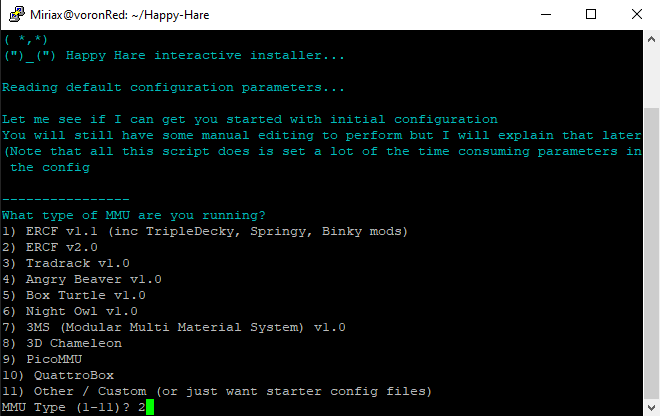</p>

### 2. Number of Gates
Happy Hare installer then asks for the number of gates.  

<p align="left">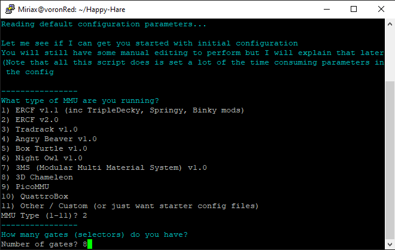</p>

Enter the correct number of gates for your ERCF, usually 8 in v2.5.

#### 3. Control Board
Select the type of control board you have installed. MMBv1.1 and MMBv2.0 are the recommended boards for ERCFv2.

*\[This graphic will be updated soon\]*

<p align="left">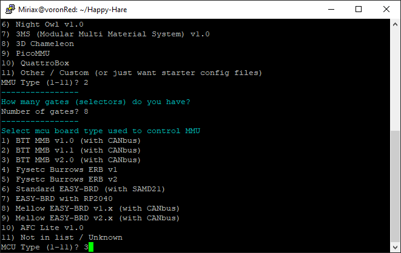</p>

#### 4. Control Board Address
Happy Hare will then attempt to figure out where your control board is. So far, this doesn't work for CANBUS boards. If your printer's mainboard is connected, that will be detected instead, so input "N," unless you're using a Remote MCU setup.

> [!NOTE]
> If you followed the previous guide on [Flashing Your Local MCU](https://github.com/Enraged-Rabbit-Community/ERCF_v2/blob/main/Documentation/Flashing-Local-MCU.md), you should already know your CANBus UUID. You will need to manually add the CANBus UUID to the top of your mmu.cfg. If you are using USB instead, this should work and find your board!

<p align="left">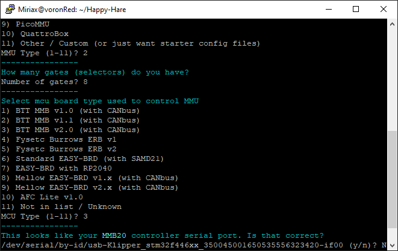</p>

#### 5. LED Options
If you have neopixels installed on your ERCF, enable them here.  

<p align="left">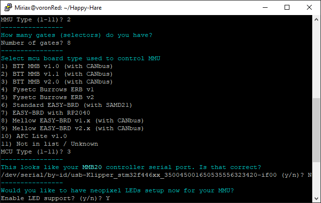</p>

#### 6. Selector Touch Operation
Decide whether or not to enable Selector Touch operation. This can help with recovery of an error, but is also a bit difficult to get set up properly. It's better to say "no" and get it working after you're more familiar with the ERCF and Happy Hare.

<p align="left">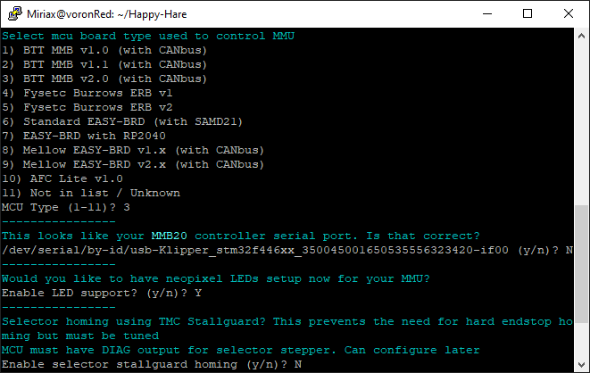</p>

#### 7. Servo Options
Select your servo option from the list.

> [!NOTE] 
> You're going to adjust the angles later, so this doesn't matter too much right now. During Beta Testing, this is something we'll ask you to report on so that we can make more accurate presets.

<p align="left">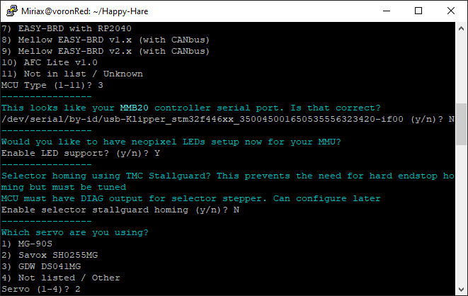</p>

#### 8. Clog detection
With Binky, It's probably best to enable clog detection and set it to automatic. This acts like a smart filament sensor and will pause the print if something goes bad with the filament feed.  

<p align="left">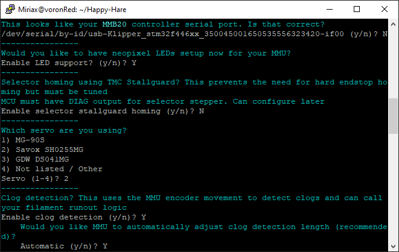</p>

#### 9. EndlessSpool
Happy Hare has the capability to map multiple gates to one tool. This allows for "endless spool" operation. When one spool runs out, if you have the same material and color mapped to another gate, it will automatically switch to the other gate and resume printing. This option is recommended for long prints.

<p align="left">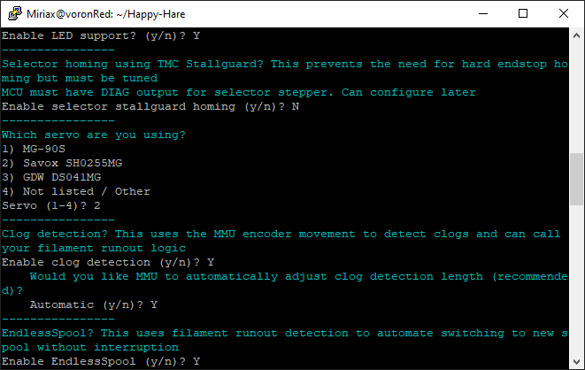</p>

#### 10. Final step
The last step asks to add the `[include mmu*]` lines to your printer.cfg. **On initial setup it is recommended to select yes.** If Happy Hare has already been installed, you should select "no."

<p align="left">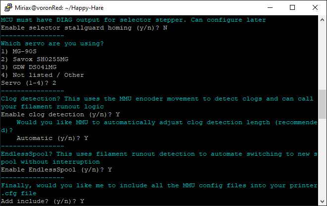</p>

From here, Happy Hare will install itself with the options you've selected. You should have a nice little report that Happy Hare is ready:  

<p align="left">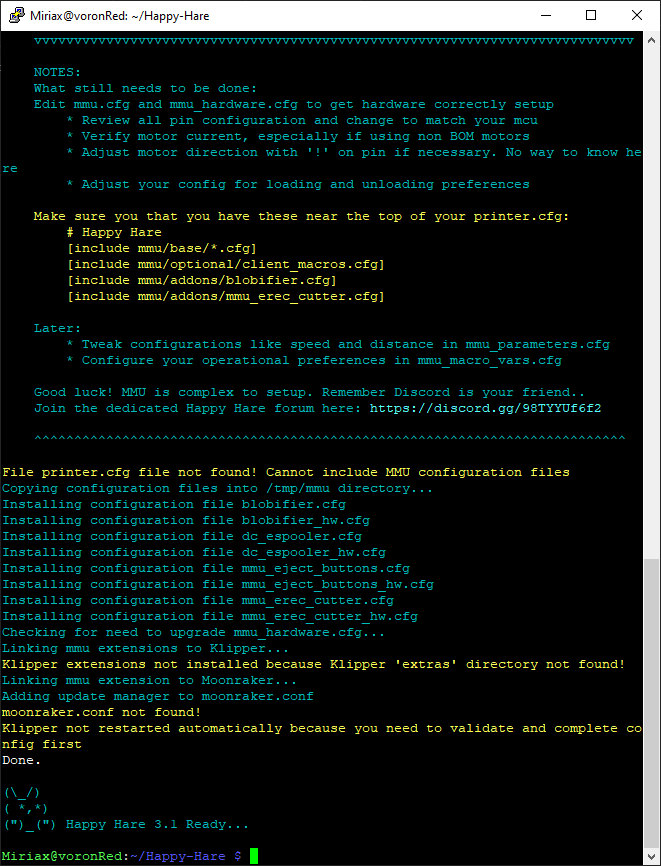</p>

<p align="left"></p>

> [!NOTE] 
> During Beta testing, and really any time it happens, **please report any misfires by the automatic setup!**

Once this has been run sucessfully you will have outline configuration files installed. Happy Hare creates a hierachy of files in the klipper config directory. To review the layout and purpose of each of these files read [Configuration Reference](https://github.com/moggieuk/Happy-Hare/wiki/Configuration-Reference)

Now, you have Happy Hare installed on your rpi. Feels good, doesn't it?  
<p align="center"></p>

<br>

##    Pause/Resume/Cancel\_Print Macros

It is recommended that you use the PAUSE/RESUME/CANCEL\_PRINT macros aka "client macros" that are supplied with Happy Hare at least when setting up. The reason is that they are reasonably full featured and integrate with the "sequence" macros you will learn about later that control toolhead movement during a toolchange. These macros can be used by ensuring that this appears in your `printer.cfg` config after the `[include mmu/base/*.cfg]`:

> [include mmu/optional/client\_macros.cfg]

Regardless of whether you use your own or use the ones provided in `client_macros.cfg`, Happy Hare will automatically wrap anything defined so that it can inject the essential steps to control the MMU.

During a print, if Happy Hare detects a problem, it will record the print position, safely lift the nozzle up to `z_hop_height_error` at `z_hop_speed` (to prevent a blob). It will then call the user's PAUSE macro (which can be the example one supplied in `mmu_software.cfg`). As can be seen with the provided examples it is expected that pause will save it's starting position (GCODE\_SAVE\_STATE) and move the toolhead to a park area, often above a purge bucket, at fast speed.

The user then addresses the issue and calls `RESUME` to continue with the print. More on that subject can be found in Happy Hare's [Handling Errors](https://github.com/moggieuk/Happy-Hare/wiki/Handling-Errors).

The user's RESUME macro may do some purging or nozzle cleaning but is expected to return the toolhead to where it was left when the pause macro was called. At this point the Happy Hare wrapper takes over and is responsible for dropping the toolhead back down to the print and resumes printing.

Happy Hare will always return the toolhead to the correct position, but if you leave it in your park area will will move it back very slowly. You can to follow the above sequence to make this operation fast to prevent oozing from leaking on your print.

<br>

##    Upgrading

Happy Hare is always being improved. You can update in the same way as you update Klipper through the update-manager facility in Moonraker when update is indicated. If you know an update is pending and it is not yet shown in update-manager (it can take 24h) you can force a refresh by clicking on the circular arrow.

<p align="center">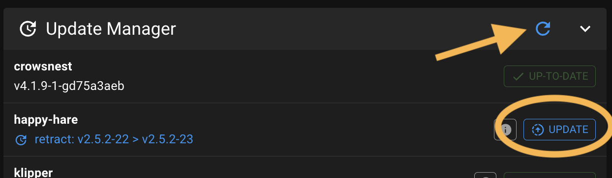<p>

Sometimes an update includes a major change and simply upgrading through update manager is not sufficent. When this occurs you should see an error message directing you to the [Upgrade Notice](https://github.com/moggieuk/Happy-Hare/wiki/Upgrade-Notice) page (read that now because it explains major/minor/point release conventions). You will then need to run the `install.sh` script as below.

Alternatively you can simply run the following. Note that you **must not add the `-i` option to update**. This will pull the very latest code from Github and upgrade any necessary configuration files. This is also a good option to run if you suspect you have broken something or you have upgraded Klipper and it has removed the Happy Hare added modules (Hint: If you see a "step pin not defined for..." it is highly lightly that klipper has lost the Happy Hare modules and it struggling to parse the config).

```yml
cd ~/Happy-Hare
./install.sh
```

> [!TIP]  
> Don't be shy about running this. If there is nothing to update the script will do nothing and it will always backup your entire config in a directory [see config file structure](https://github.com/moggieuk/Happy-Hare/wiki/Configuration-Reference#---location-of-configuration-files) in a parallel directory with name with date stamp, similar to `mmu-20240422_102329`. The new `mmu` directory will be rebuilt extracting all the previous configuration but with updated templates. Note that an additional backup directory is created each time you run the installer uniquely date stamped.

> [!IMPORTANT]  
> If you have Klipper installed in a non-default location (i.e. you used the `-c`,`-k` or `-r` flags) you will need to add these flags again to the above, otherwise the upgrade will look in the default location and likely not find/upgrade what you expect.


### ERCF Setup Steps:
- [Flashing Your Local MCU](https://github.com/Enraged-Rabbit-Community/ERCF_v2/blob/main/Documentation/Flashing-Local-MCU.md)
- Installing Happy Hare
- [Happy Hare Configuration](https://github.com/Enraged-Rabbit-Community/ERCF_v2/blob/main/Documentation/Happy-Hare-Configuration.md)
- [Hardware Configuration Checks](https://github.com/Enraged-Rabbit-Community/ERCF_v2/blob/main/Documentation/Hardware-configuration-checks.md)
- [Hardware Calibration](https://github.com/Enraged-Rabbit-Community/ERCF_v2/blob/main/Documentation/Hardware-Calibration.md)
- [Toolhead Distances](https://github.com/Enraged-Rabbit-Community/ERCF_v2/blob/main/Documentation/Toolhead-Distances.md)
- [Installing KlipperScreen Happy Hare](https://github.com/Enraged-Rabbit-Community/ERCF_v2/blob/main/Documentation/Installing-KlipperScreen.md)
- [Slicer Setup](https://github.com/Enraged-Rabbit-Community/ERCF_v2/blob/main/Documentation/Slicer-Setup.md)
- [Further Mods to Consider](https://github.com/Enraged-Rabbit-Community/ERCF_v2/blob/main/Documentation/Further-Mods.md)

#### Even more Happy Hare info can be found at:
- [Happy Hare Wiki](https://github.com/moggieuk/Happy-Hare/wiki)