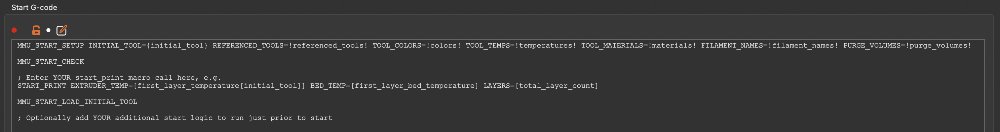
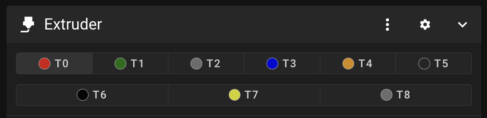
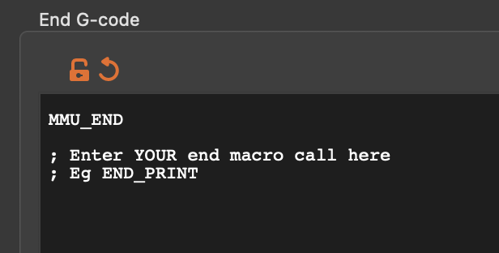
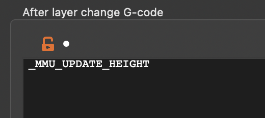
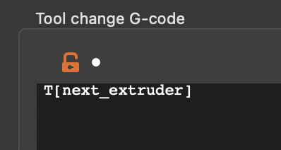
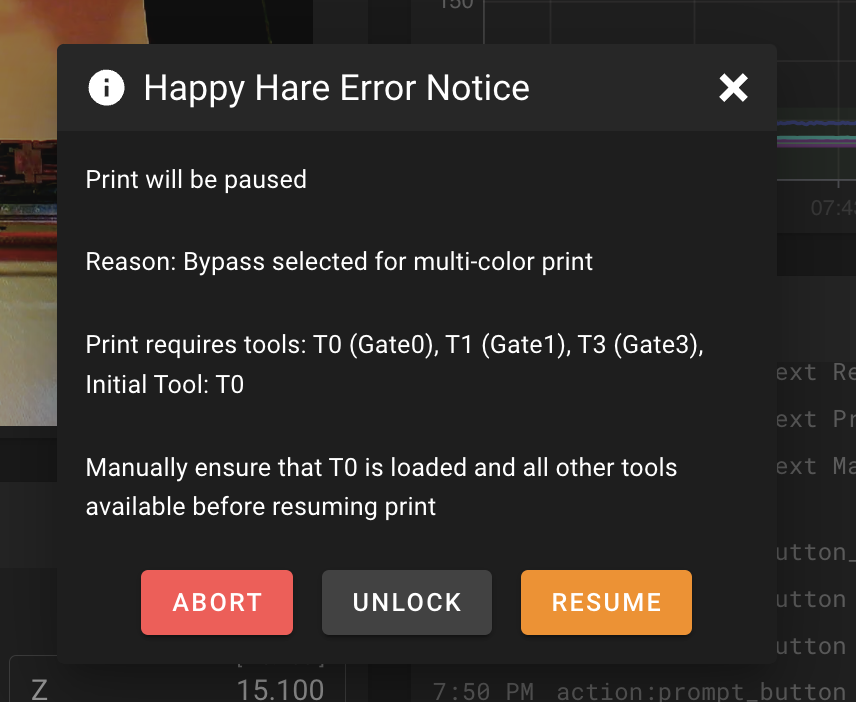
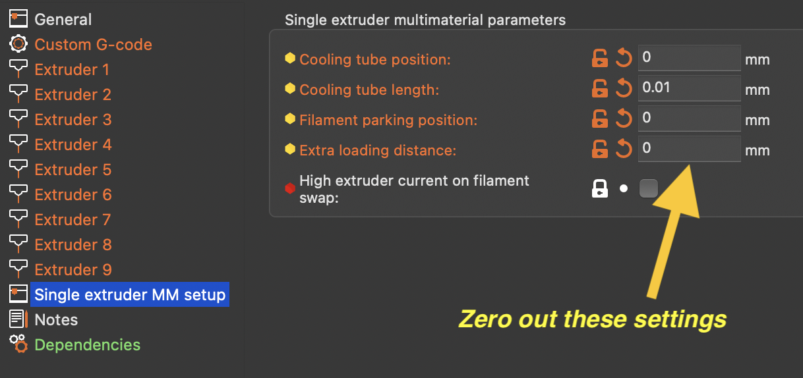
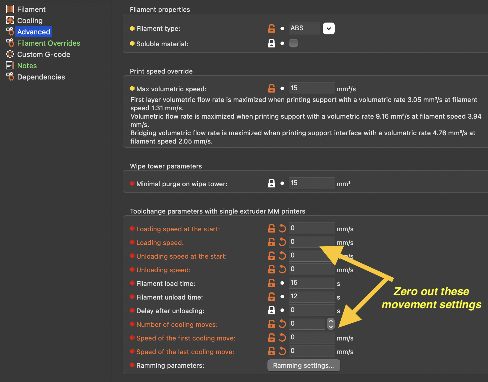
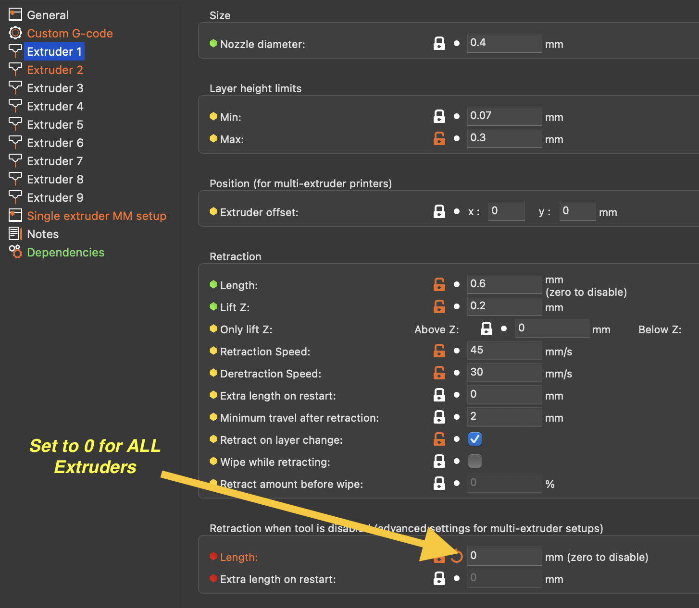
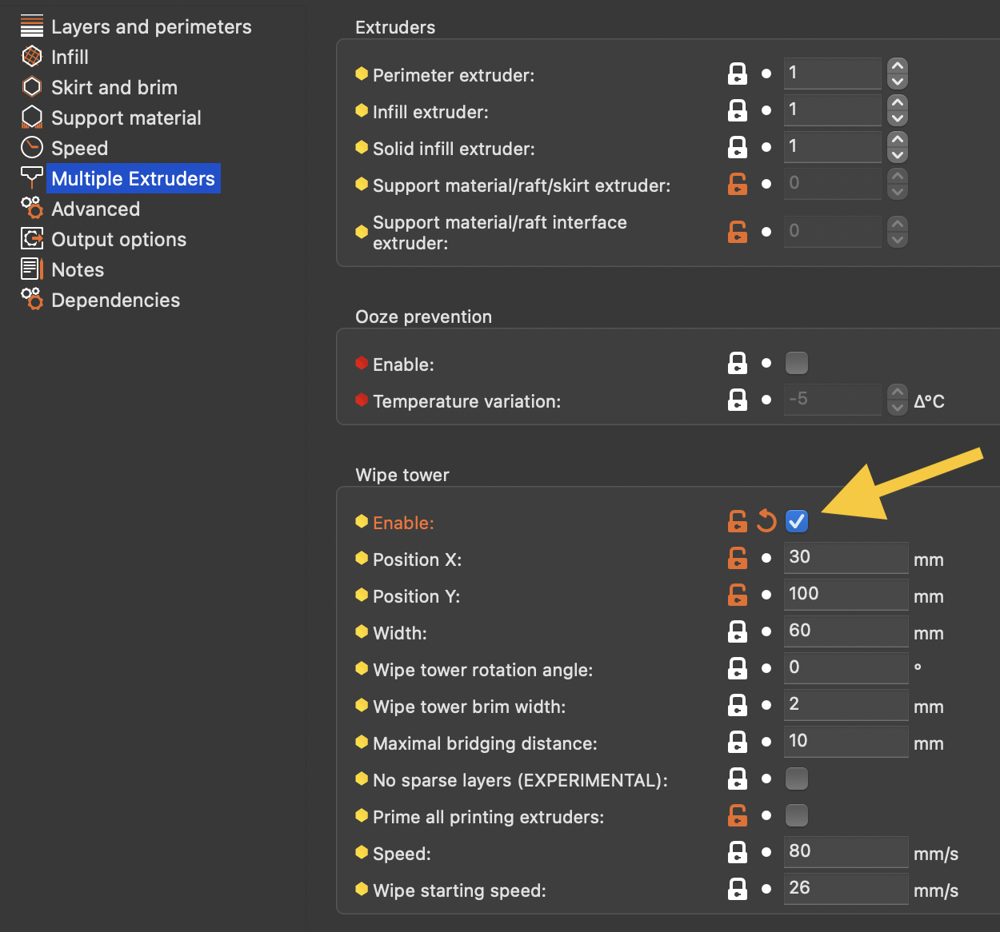

#### Page Sections:
- [Start G-Code](#---start-g-code)
- [End G-Code](#---end-g-code)
- [Toolchange G-Code](#---tool-change-g-code)
- [Customizing MMU Start/End Macros](#---customing-mmu-startend-macros)
- [MMU Error Dialog](#---mmu-error-dialog)
- [Slicer Tip Forming](#---slicer-tip-forming)
  - [Turning off slicer tip forming](#turning-off-slicer-tip-forming)
  - [Turning off slicer wipetower](#turning-off-slicer-wipetower)
  - [How to verify configuration](#how-to-verify-configuration)

*\[This guide is copied directly from the [Happy Hare Slicer Setup](https://github.com/moggieuk/Happy-Hare/wiki/Slicer-Setup) page. Thanks Moggie!\]*


When printing with an MMU you must augment the gcode generated by your slicer to include logic to initialize the MMU, load the initial filament and optionally reset and eject filament at the end of the print. To achive that it is necessary to enable MMU support in your slicer and then edit the custom g-code. While there are many ways to do this, Happy Hare recommends the following pre-packaged macro to take advantage of all the advanced features. Consider this best practice for setut and note the probable need to separate your existing "start_print" macro into two parts.

Make sure the `Expert Options` of your slicer are enabled and go to the Printer Settings tab.

<br>

##    Start G-Code

Enter the following (using your own print start macro call) into your "custom start g-code" box:

<br>Your `START_PRINT ...` macro is likely to be different from mine! Here is some cut'n'paste text:

```yml
MMU_START_SETUP INITIAL_TOOL={initial_tool} TOTAL_TOOLCHANGES=!total_toolchanges! REFERENCED_TOOLS=!referenced_tools! TOOL_COLORS=!colors! TOOL_TEMPS=!temperatures! TOOL_MATERIALS=!materials! FILAMENT_NAMES=!filament_names! PURGE_VOLUMES=!purge_volumes!
MMU_START_CHECK
; Enter YOUR exist start_print macro call here (minus purging logic because tool may not be loaded yet)
MMU_START_LOAD_INITIAL_TOOL
; Optionally add YOUR additional start logic (like purging) here to run just prior to start
SET_PRINT_STATS_INFO TOTAL_LAYER={total_layer_count} ; For pause at layer functionality and better print stats
```

> [!NOTE]  
> There are two reasons that it is recommended to add these separate 4-5 lines in your slicer:<br>
> - Keeping them as separate gcode macros to enables the print to pause and then continue in the case of an error.  If you bundle everything into a single print start macro then the first opportunity to pause will be at the end of that, potentially long running, macro! (This is particularly accute if using the new klipper pop-up dialogs -- these frustratingly will not be able to be closed until the current macro is complete)
> - You will likely want to separate out any nozzle purging logic you have in your current "start_print" marco and run it AFTER all the MMU checks and loading the initial tool

### Sequence Explained:

#### `1. MMU_START_SETUP`
This is a macro (defined in `mmu_software.cfg`) that is passed information either through slicer "placeholder" variables delimited by `{}` like `{initial_tool}` or through a similar mechanism implemented by Happy Hare's moonraker extension which pre-processes the g-code file when it is uploaded and substitutes `!!` like `!referenced_tools!` that are useful for MMU printing. Unfortunately these placeholders are absent in all popular slicer programs hence the pre-processor extension. Happy Hare's g-code pre-processing is explained in [detail here](https://github.com/moggieuk/Happy-Hare/wiki/Gcode-Preprocessing)

This macro initializes the MMU, establishes whether the print is single or multi-color, detects when the intent is to print bypassing the MMU and then stores this infomation in Happy Hare for the duration of the print in the "Slicer Tool Map". This can be accessed in your own macros through the `printer.mmu.slicer_tool_map` printer variable. E.g.

```yml
   printer.mmu.slicer_tool_map.
      initial_tool: 0          ; Initial tool number expected to be loaded at the beginning of the print
      ; List of all the tools referenced in the print (T0 and T3)
      tools.0.color: ff0000    ; Color in RRGGBB format for T0
      tools.0.material: ABS    ; Material type for T0
      tools.0.temp: 240        ; Extruder temperature for T0
      tools.0.in_use: 1        ; Tool used in print
      tools.3.color: 00e410    ; Color in RRGGBB format for T3
      tools.3.material: ASA    ; Material type for T3
      tools.3.temp: 245        ; Extruder temperature for T3
      tools.3.in_use: 1        ; Tool used in print
      purge_volumes: [[100, 100], [100, 100]] ; NxN matrix of purge volume changing from tool X to tool Y
```

The "Slicer Tool Map" can be displayed on the console at any time during the print by running the `MMU_SLICER_TOOL_MAP` command without any set parameters (optional `DETAIL=1` or `PURGE_MAP=1` or `SPARSE_PURGE_MAP=1` to see purge matrix):<br>
> MMU_SLICER_TOOL_MAP PURGE_MAP=1<br>
```
-------- Slicer MMU Tool Summary ---------
2 color print (Purge volume map loaded)
T0 (Gate 0, ABS, ff0000, 240°C)
T3 (Gate 3, ASA, 00e410, 245°C)
Initial Tool: T0
-------------------------------------------
Purge Volume Map:
To -> T0   T1   T2   T3   T4   T5   T6   T7   T8
T0    -   200  200  200  200  200  200  200  200
T1   200   -   200  200  200  200  200  200  200
T2   200  200   -   200  200  200  200  200  200
T3   200  200  200   -   200  200  200  200  200
T4   200  200  200  200   -   200  200  200  200
T5   200  200  200  200  200   -   200  200  200
T6   200  200  200  200  200  200   -   200  200
T7   200  200  200  200  200  200  200   -   200
T8   200  200  200  200  200  200  200  200   -
```
Note that the `DETAIL=1` flag will also report on tools that are defined in slicer but not defined for current print. Similarly adding `SPARSE_PURGE_MAP=1` can make the purge volumes more readable but showing only referenced tools.

#### `2. MMU_START_CHECK`
This macro uses the "Slicer Tool Map" and performs checks to ensure the MMU is fully ready to print. Currently checks are limited to confirming that filament is available in all the required tools, but in the future it might check that the filaments types the sliced g-code expects match those actually loaded in the MMU (think how the Spoolman integration could be used...)
If this macro fails, the print will pause but not abort or skip the rest of the startup sequence. 

> [!TIP]  
> On failure while in a paused state, you can run this macro by hand to repeat the checks. Simply run `MMU_START_CHECK` without any parameters

#### `3.`START_PRINT...
This is where you put your normal print start macro passing additional slicer placeholders it may require. This macro doesn't need to do anything added for MMU support and will likely home the printer, level the bed and set print temperatures. It shouldn't have logic that assumes the extruder is loaded with filament - activities like purging should be separated out and included later (see step 5).

#### `4. MMU_START_LOAD_INITIAL_TOOL`
This macro will load the initial tool used by the print. No need to pass it any information - it retrieves it from the "Slicer Tool Map" setup earlier

#### `5.` Optional purge logic...
Optionally you can put the parts of your original print start macro that you separated out here. Typically this would be the logic that purges the nozzle, cleans nozzle and prints prime line. This is separated out because you want it to run AFTER the initial tool have been loaded.

<br>

> [!TIP]  
> Did you know the slicer defined extruder colors can be displayed on Mainsail / Fluidd UI next to the Extruder "Tx" buttons (see below). Happy Hare ensures the color information is parsed from the slicers g-code and provided to this user interface.
> <p align="center"></p>

<br>

##    End G-Code

Ensure this is added in your slicer's "custom end g-code" box:



```yml
MMU_END
; Optionally enter YOUR print end macro call here
MMU_PRINT_END ; Only required if using Octoprint
```

#### `1. MMU_END`
This is a macro (defined in `mmu_software.cfg`) that finalizes MMU, can print stats, reset any TTG map and eject filament. It is recommended to run this before your existing print end macro which is likely to disable heaters and turn motors off.

#### `2. END_PRINT`
This is where your existing print end macro would be placed

#### `3. MMU_PRINT_END`
This should be the very last g-code executed. When printing from virtual sd-card this isn't techincally necessary (and can be omitted) because Happy Hare will automatically detect the end of print. **It is necessary when printing from Octoprint.**

<br>

##    After Layer Change G-Code

The reason for this is to support sequential printing and explained [here](https://github.com/moggieuk/Happy-Hare/wiki/Toolchange-Movement#---z-hop-moves)



```yml
_MMU_UPDATE_HEIGHT

; If you want enhanced pausing feature with Happy Hare client macros also add this
SET_PRINT_STATS_INFO CURRENT_LAYER={layer_num} ; For pause at layer functionality and better print stats
```

<br>

##    Tool Change G-Code

This is likely to be the slicer default, but it is worth checking that the custom tool change g-code is set to this:



```yml
T[next_extruder]
```

<br>

##    Customing MMU Start/End Macros

The recommended macro described here can be customized in `mmu_macro_vars.cfg`. Look for the `_MMU_SOFTWARE_VARS` section (corresponding to `mmu_software.cfg` where the macros are defined) 

```yml
# PRINT START/END ---------------------------------------------------------
#   (base/mmu_software.cfg)
#
[gcode_macro _MMU_SOFTWARE_VARS]
description: Happy Hare optional configuration for print start/end checks
gcode: # Leave empty

# These variables control the behavor of the optional _MMU_INITIALIZE and _MMU_LOAD_INITIAL_TOOL macros
variable_user_pre_initialize_extension      : "G28"     ; Executed at start of _MMU_INITIALIZE. Commonly G28 to home
variable_home_mmu                           : False     ; True/False, Whether to home mmu before print starts
variable_check_gates                        : True      ; True/False, Whether to check filament is loaded in all gates used
variable_load_initial_tool                  : True      ; True/False, Whether to automatically load initial tool

# These variables control the behavor of the optional _MMU_FINALIZE macro
variable_eject_tool                         : True      ; True/False, Whether to eject the tool at the end of the print
variable_reset_ttg                          : False     ; True/False, Whether reset TTG map at end of print
variable_dump_stats                         : True      ; True/False, Whether to display print stats at end of print
```

<br>

##    MMU Error Dialog

When Happy Hare detects an error, even during print start it will pause the print allowing you to fix and then resume. If the option `show_error_dialog: 1` is set in `mmu_parameters.cfg` a pop-up dialog will be displayed on Mailsail/Fluidd/KlipperScreen providing you options through the UI. If it is occurs during these startup macros there will also be an option to abort the print. The abort option will disappear during the print. To disable the popup, set `show_error_dialog: 0`



> [!IMPORTANT]  
> If you are writing your own startup macros beware of the earlier note because the use of a popup dialog can make it seem as though your printer is locked up for long running macros

<br>

##    Slicer Tip Forming

The most important part of MMU printing is understanding how to configure your slicer for "single extruder multi material".  Because each slicer is different this is beyond the scope this documentation.  That said, the common slicers: Prusaslicer, Superslicer and Orcaslicer all have similar interfaces and there are a couple of settings you need to be aware of in deciding between what is performed by Happy Hare (the MMU "firmware") and the slicer.

### Turning off slicer tip forming
The first thing that has to happen on a tool change is to prepare the tip of the filament being removed from the extruder. The simplist and recommend approach is to disable the tip creation process in the slicer and allow Happy Hare to do this. The reason is Happy Hare will have to do this while not actively printing anyway - so why configure what will likely be the most furstrating part of your journey in two places.

Slicers have some quirks and don't make it very straighforward to turn off as you would expect. Instead you need to configure in a number of different areas.  This screenshots shown here are for Prusaslicer but Superslicer and Orcaslicer are very similar.

The first place is a setting like this on the `printer settings` tab.  This disables the primary retract/extrude oscillation that is the bulk of the tip forming and cooling movement.

> [!NOTE]  
> Whilst it is logical to zero all these settings out, Older versions of Prusaslicer (v2.5 - v2.7) at least has bug that will insert illegal `G1 F0` commands if all the fields are exactly 0.  For these versions only use a tiny value for the cooling tube length, like "0.01" instead.
> <br>
> **With PrusaSlicer v2.8 and above please use a value of exactly 0.**



Working in conjunction with the above and found on the `filament settings` tab is this area where you should zero out all all movement speeds and distances.  Leave only the timing inputs that you can tune once you know the average loading and unloading time for your particular MMU.



The next setting must be configure on each of your extruders.  This turns off an initial retraction and subsequent extrude that will leave blobs on your wipetower.  The reason to turn this off is that Happy Hare will correctly load the filament exatly to the nozzle and additonal extrusion will cause a blob.



Unless you have a sepcialized purge system (documented later) you will want the slicer to manage a wipe tower used to purge out the remains of the previous filament.  To do this, make sure this option is enabled (it usually is by default):



> [!NOTE]  
> If you use SuperSlicer, be sure to turn off Skinnydip:
> <br><br>
> It's probably also a good idea to zero out the distances below.
> Doing this prevents Superslicer from pushing out a blob of filament before cutting the tip.

### Turning off slicer wipetower
To switch to a custom purge system you need only to untoggle the `enable wipetower` option.  All tip forming settings remain the same.

### How to verify configuration
To be sure you have your slicer setup correctly (not doing any tip shaping for example), examine the g-code it creates. Seach for a toolchange section -- this will either have `Tx` commands or will have been parsed to `MMU_CHANGE_TOOL` by the Happy Hare moonraker extension depending on where you are examining the file. Anyway, look at the g-code around the toolchange. It should be clean like this:
```
;--------------------
; CP TOOLCHANGE START
; toolchange #1
; material : ASA -> ASA
;--------------------
; WIPE_TOWER_START
M220 S100
; CP TOOLCHANGE UNLOAD
;WIDTH:0.6
;WIDTH:0.5
M104 S260
; Cooling park
G4 S0
; filament end gcode 
T0
M106 S255
SET_PRESSURE_ADVANCE ADVANCE=0.025 SMOOTH_TIME=0.001 EXTRUDER=extruder
```
And not like this (this is simply one example, many other are more obvious):
```
;--------------------
; CP TOOLCHANGE START
; toolchange #2
; material : ASA -> ASA
;--------------------
; WIPE_TOWER_START
M220 S100
; CP TOOLCHANGE UNLOAD
;WIDTH:0.6
;WIDTH:0.5
; Retract(unload)
G1  X204.504 Y102.283 E-15.0000
G1 E10.4965
G1 E2.9990
G1 E1.4995
; Cooling park
G1 E0.0050 F2000
G4 S0
; filament end gcode 
T2
M106 S255
SET_PRESSURE_ADVANCE ADVANCE=0.025 SMOOTH_TIME=0.001 EXTRUDER=extruder
```
Can you see the unwanted 15mm retraction?  That is the first part of tip creation and you don't want the slicer to do this if you have elected to always let Happy Hare do it.

I wish slicers made it easy to toggle tip forming on/off but unfortunately that is not the case, hence the need to inspect an example generated file to verify it is as expected.


### ERCF Setup Steps:
- [Flashing Your Local MCU](https://github.com/Enraged-Rabbit-Community/ERCF_v2/blob/main/Documentation/Flashing-Local-MCU.md)
- [Installing Happy Hare](https://github.com/Enraged-Rabbit-Community/ERCF_v2/blob/main/Documentation/Installing-Happy-Hare.md)
- [Happy Hare Configuration](https://github.com/Enraged-Rabbit-Community/ERCF_v2/blob/main/Documentation/Happy-Hare-Configuration.md)
- [Hardware Configuration Checks](https://github.com/Enraged-Rabbit-Community/ERCF_v2/blob/main/Documentation/Hardware-configuration-checks.md)
- [Hardware Calibration](https://github.com/Enraged-Rabbit-Community/ERCF_v2/blob/main/Documentation/Hardware-Calibration.md)
- [Toolhead Distances](https://github.com/Enraged-Rabbit-Community/ERCF_v2/blob/main/Documentation/Toolhead-Distances.md)
- [Installing KlipperScreen Happy Hare](https://github.com/Enraged-Rabbit-Community/ERCF_v2/blob/main/Documentation/Installing-KlipperScreen.md)
- Slicer Setup
- [Further Mods to Consider](https://github.com/Enraged-Rabbit-Community/ERCF_v2/blob/main/Documentation/Further-Mods.md)

#### Even more Happy Hare info can be found at:
- [Happy Hare Wiki](https://github.com/moggieuk/Happy-Hare/wiki)

### Additional Happy Hare Information:
- [Tip Forming and Purging](https://github.com/moggieuk/Happy-Hare/wiki/Tip-Forming-and-Purging)
- [Toolchange Movement](https://github.com/moggieuk/Happy-Hare/wiki/Toolchange-Movement)
