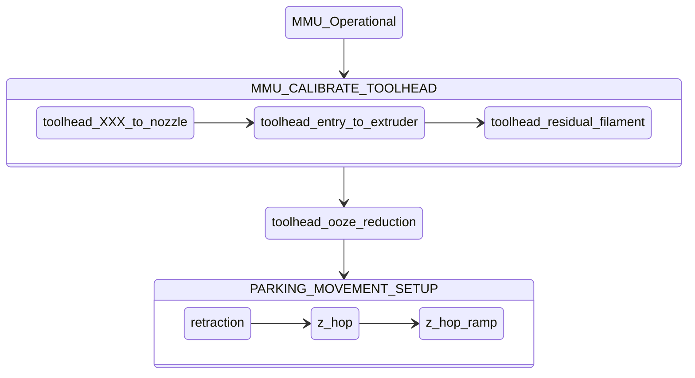

#### Page Sections:
- [Correct Meaning of Key Dimensions](#---correct-meaning-of-key-dimensions)
- [Calibrating Toolhead](#---calibrating-toolhead)
  - [Final Blob Tuning](#---final-blob-tuning---toolhead_ooze_reduction)
  - [Toolchange Retraction](#---tool-change-retraction)
  - [Z-Hop and Ramping](#---z-hop-and-ramping)
- [Summary of Tuning Steps](#---summary-of-tuning-steps)
- [Cleaning Extruder with Cold Pull](#---cleaning-extruder-with-a-cold-pull)

<br>

This discussion assumes that you have initial setup complete and are now ready to tune the quality of your prints. Although some of the information contained here is useful early in your journey it will make a lot more sense once you have some experience with default or "borrowed" toolhead parameters. You *must* configure and calibrate your hardware before doing this step.

This guide will then guide you to optimize a few critical parameters for print quality that avoids blobbing on your wipetower or print and stringing when moving to change tool.

Specifically in this guide you will learn how to correctly set the following parameters (`mmu/base/mmu_parameters.cfg`):
- `toolhead_extruder_to_nozzle`
- `toolhead_sensor_to_nozzle`
- `toolhead_entry_to_extruder`
- `toolhead_residual_filament`
- `toolhead_ooze_reduction`

It will also illustrate how to use z-hop movement/ramping and retraction settings to eliminate blobs and stringing during color changes or EndlessSpool operations in your prints (`mmu/base/mmu_macro_vars.cfg`):
- `variable_park_toolchange`, `variable_park_mmu_error`, `variable_park_pause`, `variable_park_cancel`, `variable_park_complete`
- `variable_restore_xy_pos`
- `variable_park_travel_speed`, `variable_park_lift_speed`
- `variable_retract`, `variable_retract_speed`, `variable_unretract_speed`

And finally, set key tip cutting macro variables (`mmu/base/mmu_macros_vars.cfg`):
- `variable_blade_pos`
- `variable_retract_length`

<br>

##    Correct Meaning of Key Dimensions

Firstly it is important to understand that while sensors like a toolhead sensor can help with extruder loading and unloading, the process relies on precise movement distances. These "dimensions" often interact with each other so it is also important that they are set correctly and match the meaning Happy Hare is expecting. Doing so will give deterministic toolchanges rather than a "these settings seem to work" scenario.

When the extruder is loaded, Happy Hare will move the filament a precise distance from either the extruder gear or the toolhead sensor to the end of the nozzle. This distance is set with `toolhead_extruder_to_nozzle` and/or `toolhead_sensor_to_nozzle` and represents the CAD measured distance in a perfectly clean extruder/nozzle. The reality is that once the extruder is "dirty" this distance changes. This is because some filament is inevitably left behind in the extruder/nozzle shortening this distance. The amount of filament remaining seems to vary greatly from a couple of mm to as much as 15mm in some high flow hotends! In addition, CHT type nozzles use an insert that is not accounted for in external toolhead measurements and often neither in CAD, which equally effects the accuraacy of these measurements. 

To account for this, Happy Hare defines `toolhead_extruder_to_nozzle` and `toolhead_sensor_to_nozzle` as theoretical and thus should be able to be pulled form CAD drawings or other users. It uses `toolhead_residual_filament` to represent how much to reduce the loading move by for the new filament to butt up against the old without accidently blobbing.

In practice it has been hard to determine these values other than through experimentation and even then it is hard to determine for example, whether to increase `toolhead_residual_filament` or reduce `toolhead_sensor_to_nozzle`.

Let's run through the important steps in a toolchange (for both tip forming and tip cutting cases) and relate to these parameters:

### With Tip Forming

Transitioning from an orange filament to a blue _(Click on images to see the detail)_:

<p align="center"><a href="https://github.com/Enraged-Rabbit-Community/ERCF_v2/blob/main/Documentation/assets/Unloading_Tip_Forming.png"></a></p>
<p align="center"><a href="https://github.com/Enraged-Rabbit-Community/ERCF_v2/blob/main/Documentation/assets/Loading_Tip_Forming.png"></a></p>

<br>

### With Toolhead Tip Cutting

With toolhead tip cutting the procedure is a little more complex and introduces two additional macro variables (defined in `mmu_macro_vars.cfg` that configure the tip cutting logic):

<p align="center"><a href="https://github.com/Enraged-Rabbit-Community/ERCF_v2/blob/main/Documentation/assets/Unloading_Tip_Cutting.png"></a></p>
<p align="center"><a href="https://github.com/Enraged-Rabbit-Community/ERCF_v2/blob/main/Documentation/assets/Loading_Tip_Cutting.png"></a></p>

Note that the cut piece of filament remaining and the residual filament are automatically accounted for by Happy Hare so long as you have configured the parameters exactly as defined in this illustration.

> [!TIP] 
> The printer variable `printer.mmu.extruder_filament_remaining` contains the total length of filament left in the extruder combining both the `toolhead_residual_filament` and length of any cut tip.<br>
> Related is the printer variable `printer.mmu.toolchange_purge_volume` that calculates the total volume of filament to be purged by summing both the slicer tool map purge volume and the volume of this remaining material.

<br>

> [!IMPORTANT]  
> 1. The really important reference point is the internal nozzle "shoulder". This is considered the 0mm reference point for most parameters. For CHT nozzle this will be further away from the tip than regular nozzles.
> 2. You can see how the `toolhead_XXX_to_nozzle` settings and `toolhead_residual_filament` are related, so while you can tune the former and ignore latter, it is recommended you use them correctly so that Happy Hare is able to control the filament movement when loading and unloading the toolhead and correctly influence purge volumes.
> 3. `toolhead_residual_filament` is dependent on your extruder and nozzle. High flow and CHT systems generally have a much higher value i.e. more residual filament left over in the extruder) than regular ones.

<br>

##    Calibrating Toolhead

Ok, now you know what the correct meaning of the dimensions are the next question is how to discover them for your setup. For everything other than `toolhead_residual_filament` it is possible to use accurate CAD models to measure them (remember to use the internal shoulder in the nozzle). This can be a challenge if using a CHT nozzle as shown below.

<p align="center"><a href="https://github.com/Enraged-Rabbit-Community/ERCF_v2/blob/main/Documentation/assets/CHT_Cutaway.png"></a></p>

If you have a toolhead sensor there is now an automated way to measure! If not, then you can refer to this wiki in the future, where we will aim to collate verified measurements for common toolhead combinations and once you have those set, you can experiment to discover the correct `toolhead_residual_filament` setting.

If you have a toolhead sensor continue reading below.

Now Happy Hare can help with a new `MMU_CALIBRATE_TOOLHEAD` command.

<br>

### ✅ Step 1: Perform a cold pull to empty your nozzle

This process requires you to start with a CLEAN (as in empty) extruder and nozzle. To do this you need to perform a cold pull. During this operation, you warm up the extruder, purge some filament, then let the nozzle cool. At the right temperature and using a bit of force you manually pull the filament out pulling with it all the old residue as well as any carbon deposits. This is something that most of you probably already know how to do, but for those that need help, or want a more convenient way to perform it you can run the supplied `MMU_COLD_PULL` macro and follow the directions displayed in the console. This is documented [later in this page](#---cleaning-extruder-with-a-cold-pull).

<br>

### ✅ Step 2: Calibrate the empty toolhead dimensions

If you have removed the Bowden tube, reattach it to the toolhead, and prepare the MMU bu selecting the gate you with to use. Ensure filament is available and parked at the gate but don't load the extruder yet.

Then run:

> MMU\_CALIBRATE\_TOOLHEAD CLEAN=1

(optionally add `SAVE=0`)

This will perform a number of probing moves with a cold extruder and report back the empty toolhead parameters. For example:

```
Reminder:
1) 'CLEAN=1' with clean extruder for: toolhead_extruder_to_nozzle, toolhead_sensor_to_nozzle (and toolhead_entry_to_extruder)
2) No flags with dirty extruder (no cut tip) for: toolhead_residual_filament (and toolhead_entry_to_extruder)
3) 'CUT=1' holding blade in for: variable_blade_pos
Desired gate should be selected but the filament unloaded

Modifying MMU gear stepper run current to 40% for collision detection
Run Current: 0.21A Hold Current: 0.09A
Restoring MMU gear stepper run current to 100% configured
Run Current: 0.49A Hold Current: 0.09A
Measuring clean toolhead dimensions after cold pull...
Measured toolhead_sensor_to_nozzle: 62.1
Measured toolhead_extruder_to_nozzle: 70.6
Measured toolhead_entry_to_extruder: 7.9
-----------------------------------
Calibration Results (clean nozzle):
> toolhead_extruder_to_nozzle: 70.6 (currently: 70.0)
> toolhead_sensor_to_nozzle: 62.1 (currently: 62.0)
> toolhead_entry_to_extruder: 7.9 (currently: 8.5)
-----------------------------------
New toolhead calibration active until restart. Update mmu_parameters.cfg to persist settings
```

Assuming you didn't run with the `SAVE=0` option this will temporarily adjust your toolhead parameters, but it will not save them in the configuration files.

> [!TIP]  
> 1. You must note these down and manually update `mmu_parameters.cfg` for them to persist across a restart. Do this once you have finished the complete calibration guide on this page.
> 2. If you want to validate your results, you can run the process again before the next step. You can add the `SAVE=0` parameter to skip updating those variables. Just be mindful that the filament will grind a little in the gears and extruder, so make sure you eject the filament fully from you MMU, cut the used portion and try with a new filament segment again.
> 3. If you have a filament tension/compression sensor like Belay installed on your bowden path, make sure you "lock" it in place so it doesn't move. It is important that the filament path length stays static throughout the calibration process. You can either remove it and install a coupler or simply hold it firmely in its fully extended position when the calibration commands are run.

<table>
<tr>
<td>

Because the extruder was empty we were able to establish the position of the internal nozzle shoulder as well (almost magically) the `toolhead_extruder_to_nozzle`, `toolhead_sensor_nozzle` and `toolhead_entry_to_extruder` distances.

</td>
<td width=30%>
<a href="https://github.com/Enraged-Rabbit-Community/ERCF_v2/blob/main/Documentation/assets/Probe_Nozzle_Shoulder.png"></a>
</td>
</tr>
</table>

<br>

### ✅ Step 3: Load (dirty) the nozzle with filament

During this operation we will load filament all the way to the end of the nozzle tip and extrude some. We will then unload the extruder simulating the amount of molten filament that will be left over inside the nozzle tip when filament is ejected.

As the previous step may have ground your filament a little, make sure you unload your filament from the MMU, remove it, cut any used parts and re-insert at the gate. This will ensure you start this step with a fresh piece of the same filament, improving the accuracy of your results.

#### If you are using tip forming:

Heat up your extruder to your filament print temperature , and run the load and unload filament macros as below:
1. `MMU_LOAD` or `Tx`
2. Manually extrude some filament using the printer’s web interface
3. `MMU_UNLOAD`
4. Switch off your nozzle heater (set the nozzle temperature to 0°C)

#### If you are using tip cutting:
As the tip cutting operation would normally leave additional filament in the toolhead that we don’t want, the dirtying of the extruder is slightly different to the above and avoids the actual cutting action:
1. `MMU_LOAD` or `Tx`
2. Manually extrude some filament using the printer’s web interface
3. `MMU_UNLOAD SKIP_TIP=1` (notice the option)
5. Switch off your nozzle heater (set the nozzle temperature to 0°C)

<br>

### ✅ Step 4: Calibrate residual filament (with dirty nozzle)

Now that the nozzle is “dirty” and simulating the left over material after a filament ejection, it is time to calibrate the residual filament parameter.

To do this, run the below command, with no arguments.

> MMU\_CALIBRATE\_TOOLHEAD
```
...blah blah blah...
-----------------------------------
Calibration Results (dirty nozzle):
> toolhead_residual_filament: 3.0 (currently: 3.4)
-----------------------------------
New calibrated ooze reduction active until restart. Update mmu_parameters.cfg to persist
```

> [!TIP]  
> 1. You can run a dirty calibration as often as you like and to see if it differs with different filament types, changes you make to your tip forming macro, etc.
> 2. Just be mindful that filament will grind a little in the gears & the extruder, so make sure you eject the filament fully from your MMU, cut the used portion and try with a new filament segment again.
> 3. If you are curious, you can also use it as a trick way to measure the "filament_remaining" after tip cutting, validating that you are not cutting molten filament. Just remember to use the SAVE=0 option because you DON'T want to `toolhead_residual_filament` to include the cut piece of filament!
> 4. Again you can use the optional command SAVE=0 to skip saving the results in memory. 
> 5. If you don’t have a filament cutter, the calibration process is done. Make sure you note down the above measurements and update them together with the ones from the first step in your `mmu_parameters.cfg` file. If you do have a filament cutter, make sure you follow step 4 below.  
> 6. If you have a belay sensor (filament tension/compression sensor) installed on your Bowden path, make sure you “lock” it in place so it doesn’t move. It is important that the filament path length stays static throughout the calibration process. You can either remove it and install a coupler or simply hold it firmly in its fully extended position when the calibration commands are run.

> [!IMPORTANT] 
> Remember, that the calibrated `toolhead_residual_filament` is your starting point. You can still fine tune the reduction in loading length according to what you see happening with the wipetower with and actual print. See [Tip Forming and Purging](https://github.com/moggieuk/Happy-Hare/wiki/Tip-Forming-and-Purging#tuning-toolhead_ooze_reduction) for details on what to look for and how to use `toolhead_ooze_reduction` as the final parameter to tweak load volume. But a word of warning, this should be the very last step and should only be a very small adjustment to optimize blobbing and oozing during tool loading.

<table>
<tr>
<td>

Again referring back to the earlier illustrations, the difference between the clean reading and the dirty one is what `toolhead_residual_filament` compensates for and represents the residual filament that is always left behind in the extruder. The command will also measure the `toolhead_entry_to_extruder` variable but these should be similar (as in less than 1mm difference) between the two runs. If this is substantially different, you can re-run the calibration routine as the measurement was probably not accurate enough the first time.

</td>
<td width=30%>
<a href="https://github.com/Enraged-Rabbit-Community/ERCF_v2/blob/main/Documentation/assets/Probe_Filament_Remains.png"></a>
</td>
</tr>
</table>

<br>

### ✅ Step 5: Calibrate toolhead cutting macro variables (if using a filament cutter)

If you have a toolhead cutter, you must now calibrate the blade cutting position `variable_blade_pos` and set the `variable_retract_length`. Because the other toolhead dimensions are now different from your original settings, the blade position will most likely also need to be calibrated correctly. 

These variables control the amount of cut filament left in the extruder after the cut operation, so they need to be correct to avoid oozing when loading the toolhead after a cut move.

To calibrate the above:
1. Run `MMU_LOAD` or `Tx` to load filament in your extruder
2. Switch off the nozzle heating element (set nozzle temperature to 0) and wait for it to cool down.
3. Manually press the cut lever a couple of times to ensure the filament is cleanly cut. 
4. After you have cut the filament, unload/eject without further tip forming by running `MMU_UNLOAD SKIP_TIP=1` (did you notice the skip tip option?)
5. With the filament unloaded and parked in the MMU and a cold nozzle, run `MMU_CALIBRATE_TOOLHEAD CUT=1`

> [!TIP]  
> TIME SAVER: Rather than loading, cutting and cooling you can simply (with the extruder unloaded) press and HOLD the cutter blade in the closed postion. STAY in this position until the calibration is complete. Note that the measurement will be shorter by one blade thickness, so add 0.5mm to the reported distance.

> MMU\_CALIBRATE\_TOOLHEAD CUT=1
```
...blah blah blah...
-----------------------------------
Calibration Results (cut tip):
> variable_blade_pos: 36.2 (currently: 37.5)
> variable_retract_length: 5.0-36.2, recommend: 32.2 (currently: 32.5)
-----------------------------------
New calibrated variables active until restart. Update mmu_macro_vars.cfg to persist
```

> [!TIP]  
> The larger the `variable_retract_length` the less additional purge is necessary to clean out the prior color. However, if you get too aggressive you may experience clogs because you are cutting a hot part of the filament. Experience has shown that about 5mm shorter than the blade position (i.e. 5mm cut length) is about as good as you can get. If you do still run into clogging issues, shorten the `variable_retract_length` value.

Again if you are using a filament tension/compression sensor, make sure you lock it in place for the duration of the calibration moves.

<table>
<tr>
<td>

Referencing earlier illustrations, the blade position `variable_blade_pos` can thus be established and a range of sensible values for `variable_retract_length` is recommended.

</td>
<td width=30%>
<a href="https://github.com/Enraged-Rabbit-Community/ERCF_v2/blob/main/Documentation/assets/Probe_Cut_Remains.png"></a>
</td>
</tr>
</table>


<br>

### Summary of MMU\_CALIBRATE\_TOOLHEAD options

  | Order | Option | Description |
  | ----- |------ | ----------- |
  | 1 | `CLEAN=1` | This will calibrate `toolhead_extruder_to_nozzle`, `toolhead_sensor_to_nozzle`, `toolhead_entry_to_extruder` and MUST be run on clean extruder after cold-pull | 
  | 2 | _none_ | This will calibrate `toolhead_residual_filament` and should be run with a dirty extruder where tip has been formed for filament retracted from extruder. It must not be run after tip cutting |
  | 3 | `CUT=1` | This will calibrate `variable_blade_pos` and suggest `variable_retract_length` for the tip cutting macro. This MUST be run after loading the extruder and manually cutting the filament and running `MMU_UNLOAD SKIP_TIP=1` to unload without re-running the tip cutting macro |

<br>

With the toolhead now properly configured you should experience better basic loading and uploading with reduction of blobbing and thus stringing. However, there is more... 

<br>

##    Final blob tuning - `toolhead_ooze_reduction`

Incorrect toolhead dimensions contribute most to blobbing problems, but even when perfect, blobbing can still occur when the toolhead is loaded. The reason might be air pockets or similar in the extruder or a slight variation in the `toolhead_residual_filament`. Therefore once the toolhead is properly calibrated (with likely fixed values), there is one tuning parameter left. 

This parameter `toolhead_ooze_reduction` should start with a value of 0. It can be tuned to further reduce the extruder loading length to completely eliminate blobs on the wipetower. A positive value will DECREASE the load length by that number of mm. Typically a few mm is all that is required and if you find yourself needing more, check your `toolhead_residual_filament` value. Technically this value can be slightly negative - the effect would be to INCREASE the loading length.

The best way to tune this is while actually printing (it can be altered dynamically during a print with `MMU_TEST_CONFIG`). Refer to this [Tip Forming and Purging](https://github.com/moggieuk/Happy-Hare/wiki/Tip-Forming-and-Purging#tuning-toolhead_ooze_reduction) page for more details.

<br>

##    Tool change retraction

Just like when printing, it is usually necessary to relax the pressure in the extruder prior to a travel move to prevent the slow oozing that would otherwise occur. 

This is where the `retraction` setting comes in. It is set to the filament retraction distance that will be applied immediately before the z-hop move and any travel movements during the toolchange. All the supplied macros will understand this setting and compensate for this accordingly. Generally 2-3mm of retraction will minimize oozing although it might be a little higher on high flow systems.

At the end of the toolchange process and immediately following the reversal of the z-hop move, the un-retract will occur to correctly pressurise the extruder again. In this manner the extruder is never fully loaded during travel moves and thus oozing is minimized.

The retraction and un-retraction speed is set with the related `variable_retract_speed` and `variable_unretract_speed` variables and can thus be set independently (often faster) than your general extruder load/unload speeds.

> [!NOTE]  
> The retraction settings are configured in the MOVEMENT section of `mmu_macro_vars.cfg` and can be specified independently for different operations including toolchange, print complete, pause, cancel, etc. See this section in [Toolchange Movement](https://github.com/moggieuk/Happy-Hare/wiki/Toolchange-Movement#---overview-of-toolhead-parking-movement) for more details.

<br>

##    Z-Hop and Ramping

When a toolchange occurs, it is preferable to move the toolhead away from the print so the hot nozzle isn't left on the print causing marks. 

However, such travel moves can graze the top of the print. This is mitigated by performing a z-hop move (i.e. raising the toolhead) before travelling. The height of the z-hop move is controlled by the `z_hop` parameter in the toolhead parking and movement section of `mmu_macro_vars.cfg`. It is performed immediately after the toolchange retraction (also specified in the same parking and movement section), with usually 1mm being plenty to stay clear of the print.

Despite the retraction and upward movement many filaments will still have a tendency to "string" because a straight up retraction move pulls viscous filament from the nozzle. 

To minimize stringing during the zhop move, what is needed is a much larger toolhead movement in the XY plane to "break the strings". This is controlled by the `z_hop_ramp` setting, which is the length of the horizontal move performed together with the vertical z hop move (`z_hop_height`). 

This ramped z-hop move essentially allows for a fast travel move of a greater distance than vertical movements which are generally much slower and shorter than horizontal. 

To ensure the toolhead does not go out of the print plate “bounds”, the horizontal movement component will be performed towards the center of the build plate.

For full details on how to setup parking and thus define z-hop and retraction movements, read [Toolchange Movement](https://github.com/moggieuk/Happy-Hare/wiki/Toolchange-Movement) page.

<br>

##    Summary of Tuning Steps

Proceed in this order:<br>
1. MMU_CALIBRATE_TOOLHEAD settings are defined in `mmu_parameters.cfg`
2. toolhead_ooze_reduction is defined in `mmu_parameters.cfg`
3. PARKING_MOVEMENT_SETUP is defined in MOVEMENT section of `mmu_macro_vars.cfg`



<br>

##    Cleaning Extruder with a "Cold-Pull"

The cold pull method to clean your extruder is one of the most useful things to be in your bag of printer maintenance tricks! 

Generally, it is a great way to clean carbon deposits that build up over time and can result in under extrusion or dark spots in your prints. 

For this guide, we are using it to empty the nozzle and prepare it for accurate toolhead dimension measurements. However, feel free to use it as part of your periodic nozzle cleaning too!

### Manual Cold Pull Procedure
1. Move toolhead to a convenient location, often the front middle of your build plate and at least 20mm above
2. Detach the Bowden tube from the toolhead
3. Open the extruder latch and manually load a 250mm piece of filament all the way in to the nozzle. Then close the extruder latch.
4. Extrude at least 20mm-30mm of filament or until it comes out the same color as your loaded filament.
5. Turn of the nozzle heater and wait for the nozzle to cool down
6. Keep the nozzle completely full by occasionally extruding 1-2mm of filament while the nozzle is still reasonably hot for your filament
7. Heat the extruder back to the cold pull temperature
8. At this point, pull the filament quite firmly and evenly out of the extruder in a vertical direction
9. Inspect the tip to see if it has been successful

### Using MMU\_COLD\_PULL macro
To help with the process Happy Hare includes a special macro that will guide you through the process and can also run it for you in a fully automated manner. To run it:

1. Move the toolhead to a convenient location, often the front middle of your build plate and at least 20mm above
2. Detach the bowden tube from toolhead
3. Open the extruder latch and manually load a 250mm piece of filament all the way in to the nozzle. Then close the extruder latch.
4. Run `MMU_COLD_PULL MATERIAL=nylon|pla|abs|petg`. Optionally you can add temperature overrides e.g. `PULL_TEMP=xxx` (see [Command Reference](https://github.com/moggieuk/Happy-Hare/wiki/Command-Reference#---calibration) for details) to better suite your material (see [table of defaults](#default-mmu_cold_pull-temperatures-for-different-materials) below)
5. Be ready to pull at the right time! You will be given a little warning but it is important to pull at the correct temperature when the filament is still slightly pliable. 
6. Pull directly upwards with a consistent firm pull. The extruder stepper will also spin to aid the pull. If you want to do the pull manually, unlatch the extruder and pull. Note: some extruders (like the Galileo 2) have enough grip and torque to do this without assistance, although the manual approach allows you to "feel" the correct pull speed.

> MMU\_COLD\_PULL MATERIAL=pla
```yml
Cold Pull with pull_temp=120°C, hot_temp=250°C, min_extrude_temp=160°C, cold_temp=45°C
Heating extruder to 250°C
Cleaning nozzle tip with 25mm of filament
Allowing extruder to cool...
Stuffing nozzle at 250°C
Stuffing nozzle at 240°C
Stuffing nozzle at 230°C
Stuffing nozzle at 220°C
Stuffing nozzle at 210°C
Stuffing nozzle at 200°C
Stuffing nozzle at 190°C
Stuffing nozzle at 180°C
Stuffing nozzle at 170°C
Waiting for extruder to completely cool to 45°C...
Nozzle at 150°C
Nozzle at 140°C
Nozzle at 130°C
Nozzle at 120°C
Nozzle at 110°C
Nozzle at 100°C
Nozzle at 90°C
Nozzle at 80°C
Nozzle at 70°C
Nozzle at 60°C
Nozzle at 50°C
Re-warming extruder to 100°C
Get ready to pull...
>>>>> PULL NOW <<<<<
Cold pull is successful if you can see the shape of the nozzle at the filament end
```

**How do you know if the cold pull was successful?** The pulled end of the filament should like one of the pictures below. You need to be able to see the impression of the nozzle at the tip of the pulled filament. On regular nozzles it should look similar to the image on the left, while with CHT nozzles similar to the image on the right. Note that the author of that picture (@igiannakas) should be commended for an excellent result because CHT nozzles require the pull at exactly the right temperature and a bit of luck!

<p align="center"> </p>

It may take a few pulls to get suitable results...

> [!TIP]  
> - Some materials are better than others for cleaning with nylon often being found to be the best. PLA is also good. PTEG and ABS can be used but often stretch and snap rather than pulling with sufficient force. The cold pulling temperature will be different with each material type so you may need to experiment.
> - You may need to repeat the process if the purpose is to completely clean your nozzle of carbon rather than just prepare for calibration
> - Feedback is that clear filament may be the strongest. Avoid filaments with strong pigmentation.

### Default `MMU_COLD_PULL` temperatures for different materials

 | Material | hot_temp | cold_temp | pull_temp | min_extrude_temp | Suitability |
 | -------- | -------- | --------- | --------- | ---------------- | ----------- |
 | NYLON    | 260      | 50        | 120       | 190              | Best        |
 | PLA      | 250      | 42        | 100       | 160              | Good        |
 | ABS      | 255      | 50        | 120       | 190              | Ok          |
 | PETG     | 250      | 42        | 100       | 180              | Ok          |

The `min_extrude_temp` is the temperature above which `MMU_COLD_PULL` will keep the nozzle pressurised with filament to ensure it is completely full.

Good luck!


### ERCF Setup Steps:
- [Flashing Your Local MCU](https://github.com/Enraged-Rabbit-Community/ERCF_v2/blob/main/Documentation/Flashing-Local-MCU.md)
- [Installing Happy Hare](https://github.com/Enraged-Rabbit-Community/ERCF_v2/blob/main/Documentation/Installing-Happy-Hare.md)
- [Happy Hare Configuration](https://github.com/Enraged-Rabbit-Community/ERCF_v2/blob/main/Documentation/Happy-Hare-Configuration.md)
- [Hardware Configuration Checks](https://github.com/Enraged-Rabbit-Community/ERCF_v2/blob/main/Documentation/Hardware-configuration-checks.md)
- [Hardware Calibration](https://github.com/Enraged-Rabbit-Community/ERCF_v2/blob/main/Documentation/Hardware-Calibration.md)
- Toolhead Distances
- [Installing KlipperScreen Happy Hare](https://github.com/Enraged-Rabbit-Community/ERCF_v2/blob/main/Documentation/Installing-KlipperScreen.md)
- [Slicer Setup](https://github.com/Enraged-Rabbit-Community/ERCF_v2/blob/main/Documentation/Slicer-Setup.md)
- [Further Mods to Consider](https://github.com/Enraged-Rabbit-Community/ERCF_v2/blob/main/Documentation/Further-Mods.md)

#### Even more Happy Hare info can be found at:
- [Happy Hare Wiki](https://github.com/moggieuk/Happy-Hare/wiki)