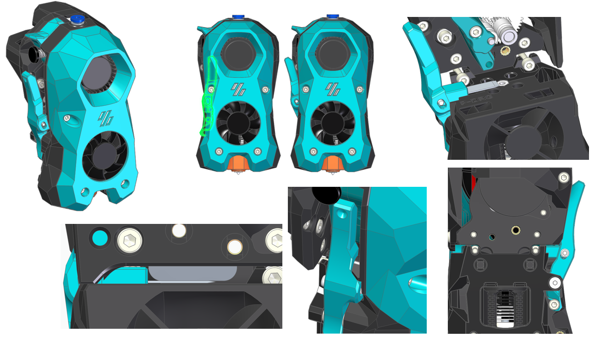
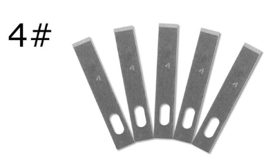
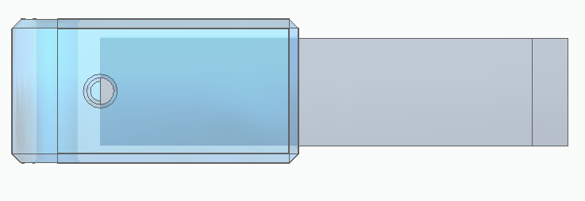
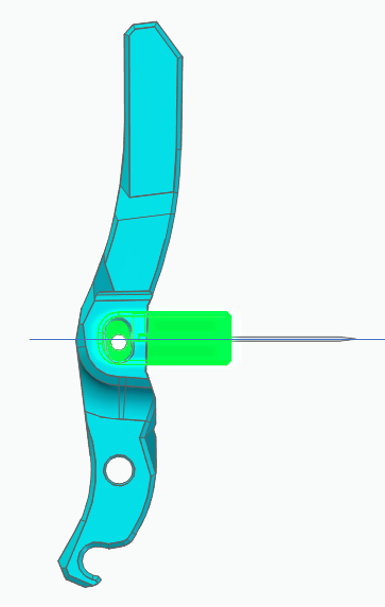
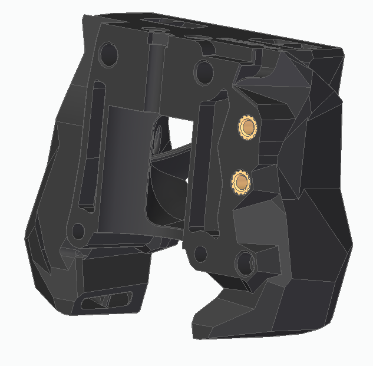
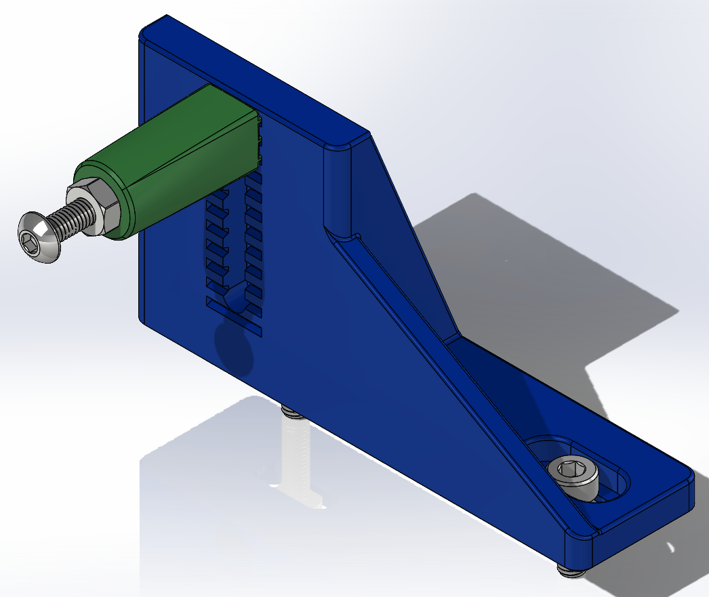

# Enraged Rabbit "Filametrix" Filament Cutter
<table>
  <tr>
    <td width=30%></td>
    <td>
      This options adds a lightweight filament cutting capability to the Voron Stealthburner CW2 toolhead for perfect filament tips without having to tune the traditional tip forming process. Thanks to contributors it supports a number of different hotends. This can lead to much greater reliability of your MMU.  We hope over time to offer support for additional toolheads.
    </td>
  </tr>
</table>

 

## Illustration

## Toolheads

#### StealthBurner CW2 (with various sensor options)
- SB_CW2_Main_Body_Cutting_With_2xD2F_ECAS.stl (Cutter + Entry Sensor + Toolhead Sensor + ECAS)
- SB_CW2_Main_Body_Cutting_With_ECAS.stl (Cutter + ECAS)
- SB_CW2_Main_Body_Cutting_With_Entry_D2F_ECAS.stl (Cutter + Entry Sensor + ECAS)
- SB_CW2_Main_Body_Cutting_With_Toolhead_D2F_EBB_ECAS.stl (Cutter + Toolhead Sensor + EBB board + ECAS)
  - Credit: [juliusjj25](https://github.com/juliusjj25)

#### LGX Lite
- SB_LGX_Lite_Main_Body_Cutting.stl
  - Credit: [tommorox234](https://www.printables.com/de/model/576122-lgx-lite-stealthburner-filament-cutter)

 

## Supported Hotends

#### V6-R6
- SB_V6_R6_Cutting_Printhead_Back.stl
- SB_V6_R6_Cutting_Printhead_Front.stl
  
#### Rapido
- SB_Rapido_TH_Cutting_Printhead_Rear.stl
- SB_Rapido_TH_Cutting_Printhead_Front.stl
  - Credit: [juliusjj25](https://github.com/juliusjj25)

#### Dragon
- SB_Dragon_Cutting_Printhead_Back.stl
- SB_Dragon_Cutting_Printhead_Front.stl

#### Voron Revo
- SB_Revo_Voron_Cutting_Printhead_Back.stl
- SB_Revo_Voron_Cutting_Printhead_Front.stl
  - Credit: Russell Gower

#### Bambu
- SB_Bambu_Cutting_Printhead_Back.stl
- SB_Bambu_Cutting_Printhead_Front.stl
- Bambu_Adapter
   - Credit: "Jakub Kadlec" from Facebook

#### Mosquito (Slice Engingeering)
- Slice_Mosquito_Cutting_Printhead_Front_And_Rear.stl
  - Credit: [MakeAUsername_285162](https://www.printables.com/de/model/614813-filametrix-mod-for-slice-engingeering-mosquito-hot)

 

> [!NOTE]  
> @sorted, the project lead for this wants to recognise the inspiration that came from Bambu Labs and a design by [@pure100kim](https://github.com/pure100kim/ERCF_Filament_Cutting_MOD)

 

## How it works

Proof of concept 1: https://youtube.com/shorts/HOMG8cVk_U4

Proof of concept 2: https://youtu.be/tTcrxttyths

Filametrix in action: https://www.youtube.com/watch?v=tfMZWQRqtvY

### Good to know

Please be aware:
- We will need to use one of the ADXL mounting threads
- Depending on the setup and position of the cutting point we will most probably not lose any build volume
- For the main body i remixed the ECAS version from [Alexanderor](https://www.printables.com/de/model/433797-clockwork-2-ecas-fitting-for-ercf)

 

## What you need
### Print list
#### Toolhead
- 1x SB (hotend name) cutting Printhead back
- 1x SB (hotend name) cutting Printhead front
- 1x SB Main body Cutting with ECAS (or with sensor)
- 1x SB motor plate (as Stealthburner has seen a small update the newest plate does not fit anymore. So please use the one from this git)
- 1x SB latch ECAS
- 1x Cutting arm
- 1x Knife holder

#### Cutting point on gantry
- 1x depressor mount
- 1x depressor

#### Cutting point on gantry with servo
- tbd...

### Parts list - considering you already have a Stealthburner with Dragon Hotend

#### Toolhead: 
- Loctite
- 1x M3 nut (DIN934; ideally a countersunk tool to modify the nut for proper filament insertion)
- 2x M3 washer (0.5mm)
- 1x M3x18 SHCS (it repleaces the top left M3x25 SHCS from the SB-Cover mount) 
- 2x Voron heat inserts
- 1x M3x18 FHCS (counter sunk screw)
- 1x M3x8 SHCS
- 1x M2.5x16 SHCS (15-18mm works)
- Spring 0.4x4x15 or alternative of ballpoint pen (L=15mm; D<=4,5mm) (I've ordered some for testing, to have a "defined" spring)
- Type 4 metal hobby blades (we will cut it to length) [Link](https://de.aliexpress.com/item/1005005117830095.html?spm=a2g0o.order_detail.order_detail_item.9.47c26368QwSbBr&gatewayAdapt=glo2deu) Amazon link, these need glue to be held in but work fine (USA) [Link](https://www.amazon.com/dp/B07QP8L1QG)

#### Cutting point on gantry
- 1x M3x16 BHCS
- 1x M3 nut
- 1x M3x8 FHCS
- 2x M3 SHCS (Lengths: 6mm - no backers, 10mm - titanium backers, 12mm - MGN9 rails)
- 2x Voron heat inserts

 

## Assembly
### Cutting arm
<table>
  <tr>
    <td width=40%></td>
    <td>Cut skalpel to length l=26mm</td>
  </tr>
  <tr>
    <td width=40%></td>
    <td>After cut</td>
  </tr>
  <tr>
    <td width=40%></td>
    <td>Insert skalpel into knife holder</td>
  </tr>
  <tr>
    <td colspan=2>Insert the skalpel (which is cut to 26mm) into the knife holder until you see it in the little hole. Use pliers to push it into the knife holder. Some force should be needed as the skalpel should stay in place due to the "pressfit". If that's not the case add some glue.(Depending on skalpel tolerances)</td>
  </tr>
  <tr>
    <td width=40%></td>
    <td></td>
  </tr>
  <tr>
    <td colspan=2>Put knife holder into cutting arm. The M2.5x15 screw is directly screwed into the plastic of the knife holder. The tip of the screw should be flush with the cutting arm or no more than 0.1-0.3mm above it. Check the orientation of the hole for the M2.5 screw in the knife holder. It needs to be on the bottom side.</td>
  </tr>
</table>

> [!NOTE]  
> The knife holder must move up and down without friction in the cutting arm but shoult not have a lot play. Maybe some grinding is needed.

### Toolhead Body
<table>
  <tr>
    <td width=40%></td>
    <td>Add heat inserts. Tip here for the heat set that goes above the cutter - suggest drilling the threads out with a ~2.5mm drill bit. On the hotend holder side below the cutter make sure you flare out the PTFE tube to help guide the filament.</td>
  </tr>
  <tr>
    <td width=40%></td>
    <td>SB cutting Printhead back</td>
  </tr>
  <tr>
    <td width=40%></td>
    <td>Depressor - one on either end, end with ribs should be flush with surface below ribs with no plastic sticking up past surface</td>
  </tr>
  <tr>
    <td width=40%></td>
    <td>Finished cutting point assembly should look like this. Note: for titanium backers, the backer should be centered between belt clamps and the end of the depressor mount should be flush with the end of the backer. This will work for all backers with 10/20/40mm spacing with the furthest back hole 5-15mm from the end. Height of depressor should be adjusted to press in the depression on the cutting arm and the BHCS can be adjusted in and out for the right positioning and locked in place with the M3 nut</td>
  </tr>
</table>

 

## Happy Hare Setup

### In mmu_parameters.cfg:

`form_tip_macro: _MMU_CUT_TIP` to instruct Happy Hare to use the filament cutter rather than normal tip forming.

Make sure `toolhead_extruder_to_nozzle` and `toolhead_sensor_to_nozzle` are set to your particular toolhead as per the Happy Hare documentation.

`force_form_tip_standalone: 1` this tell Happy Hare to always use the tip cutting macro.

> [!IMPORTANT]  
> Make sure you turn off tip forming or any extruder movements in your slicer - the slicer must not take any part in the filament swap. It should pick up when purging the new filament to the purge block.

### In mmu_filamentix.cfg:
Configure the `_MMU_CUT_TIP` macro variables as per the instructions in the file.

