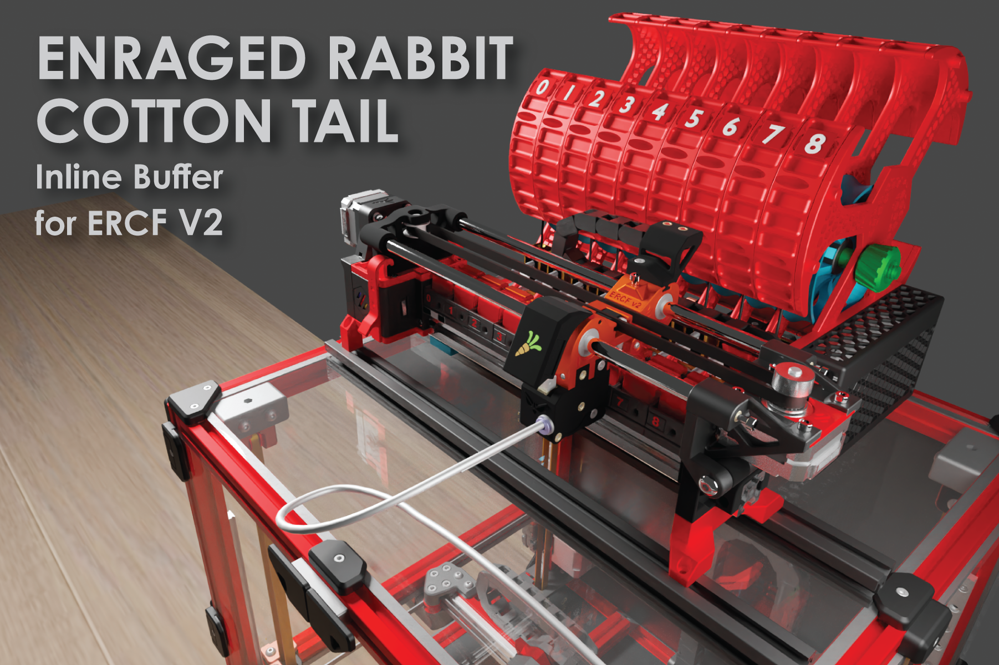

## TEMPORARY Manual Quick Link
[https://docs.google.com/presentation/d/1GNcei5_qR5PPlFaxJqjTnTScKnyJQXV2OCJxBeb3A3g](https://docs.google.com/presentation/d/1GNcei5_qR5PPlFaxJqjTnTScKnyJQXV2OCJxBeb3A3g/edit?usp=sharing)

This is the (temporary) Google Slides document containing the ERCFv2 manual for community development. Currently, we are adding the content from the ERCF v1 manual with placeholder images. Once that is complete, we will move on to updating the manual and loading in update images.

Please be careful sharing the link, as it grants edit permission.

---

# Enranged Rabbit v2 Community Project

  
  <h1 align="center">Voron ERCF v2</h1>

An expandable MMU for Klipper based 3D-Printers

  
  
  
  

This is a community born project and major update to the Voron ERCF MMU that was started a couple of years ago by Ette.  It is endorsed by Ette and the guiding philosophy wasn't to start again with a new MMU design but to refine what has already proven to be a very capable machine and push it to be the best it can be by simplifying construction, improving reliability and aligning as close as possible to v1.1 BOM. However the project includes an all new optional integrated filament buffer system (ERCT) and a bit of bling, filament cutter option (ERF) and a collection of toolhead sensor modifications. It fully leverages the Happy Hare firmware MMU control software and Klipper Screen entensions.

## Table of Content
- [ERCF Changes since V1.1](#enraged_rabbit_carrot_feeder_ercf)
- [Optional Components](#optional_components)
- [Firmware](#firmware)
- [BOM](#bom)
- [Acknowledgements](#acknowledgements)
- [Changelog](#changelog)
- [Build Photos](#build-photos)
- [Showroom](#showroom)
<!--
- [FAQ](https://github.com/EtteGit/EnragedRabbitProject/tree/main/Documentation/FAQ)
  - [Carrot Patch](https://github.com/EtteGit/EnragedRabbitProject/blob/main/Documentation/FAQ/FAQ_ERCP.md)
  - [Carrot Feeder](https://github.com/EtteGit/EnragedRabbitProject/blob/main/Documentation/FAQ/FAQ_ERCF.md)
-->

## Enraged Rabbit Carrot Feeder (ERCF)
If you are familar with ERCF v1.1 this will serve as an overview of changes:
<ol>
  <li>Sturdy backbone
  <li>Reliable encoder
  <li>Sprung servo instead of adjustable top hats
  <li>Innovative 3-position servo design
  <li>Filament trap in blocks instread of magnetic gates
  <li>Formal filament bypass
  <li>Reinforced gearbox assembly
  <li>Updated manual
  <li>High Quality Step-by-step CAD
  <li>New integrated passive buffer system (Cotton Tail)
</ol>
 
## Optional Components
<i>(although you might see variations of these projects elsewhere, consider this the integrated and guaranteed ERCF compable source)</i>

### Enraged Rabbit Cotton Tail (ERCT)
When an MMU changes tool the unloaded filament needs to be thoughtfully managed so that is doesn't tangle. The Enraged Rabbit Cotton Tail (ERCT) buffer system is designed to attach directly to ERCF V2. It is a passive system that optimizes space and is also designed to reduce resistance in the filament path, creating a consistent system for calibration.

ERCT also incorporates a neopixel on each gate that, when driven by the Happy Hare firmware, provides both functional feedback as well as the necessary "bling".  Enjoy!

 [Read more](Options/ERCT_Buffer/ERCT.md)

### Enraged Rabbit Filametrix (ERF)
When an MMU changes tool the unloaded filament needs to be thoughtfully managed so that is doesn't tangle. The Enraged Rabbit Cotton Tail (ERCT) buffer system is a designed to attach directly to ERCF V2. It is a passive system that optimizes space and is also designed to reduce resistance in the filament path, creating a consistent system for calibration and reliable operation.

 [Read more](Options/ERF_Filament_Cutter/Assets/ERF.md)

### Toolhead Sensors
ERCF can be operated without a toolhead sensor (filament detection) in the toolhead but it is not recommended. A toolhead sensor provides an accurate homing point very close to the nozzle but also adds reliability to the tool change process. ERCF includes a set of toolhead sensor modifications for popular extruders. These work reliably through coupling a microswitch to the filament path.

### Other (Possibly) Planned Optional Companion Projects:
<ul>
  <li>Pellet purge system to remove the need for the wipe tower. Stay tuned
</ul>

## Firmware
ERCF is designed to be used with [Happy Hare](https://github.com/moggieuk/Happy-Hare) MMU firmware for Klipper and can optionally be operated by [KlipperScreen](https://github.com/moggieuk/KlipperScreen-Happy-Hare-Edition) extension.

  

## BOM
You can find a Bill of Material for the project and options here: [BOM](https://docs.google.com/spreadsheets/d/1HtVIu4yqzS6xJQr63-JKtMAh4Xq7wbtWPFeuiCnrnnE)
Note that the BOM also contains an upgrade list for those of you wanting to use your existing ERCF v1.1 kits.

## Acknowledgements
Most importantly let me introduce the development and test team.  A project like this doesn't happen without hundreds of hours of volunteer effort and all of these folks are awesome.  Please give some :clap: :clap: :clap:
<ul>
  <li>@moggieuk V0.1503 | V2.4088 (Mr Happy Hare & Chief whip)
  <li>@gneu V2.5345 (Filament block innovator)
  <li>@sneakytreesnake V2.3804 (The project backbone!)
  <li>@mneuhaus VT.483 (Mr Binky)
  <li>@Miriax (Doc Demon)
  <li>@kinematicdigit (Mr Cotton Tail)
  <li>@ningpj (Tester and Breaker)
  <li>@fizzy (Master of CAD)
  <li>@kierantheman (Mr Thumper)
  <li>@gsx8299 (Test Builder Extraordinaire)
  <li>@sorted (Filametix "don't get enraged" filament cutting system)
  <li>@bombella (Purge system experimenter)
  <li>@fragmon (Video guru)
</ul>

## Changelog
<ul>
  <li>v2.0 - Initial Release (Merry Christmas!)
</ul>

CAD Design Guidelines used in this project (in case you were interested) can be found: [here](/Assets/Dev_Notes.md).

## Build Photos

## Showroom

