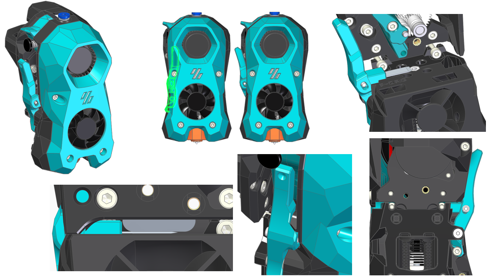
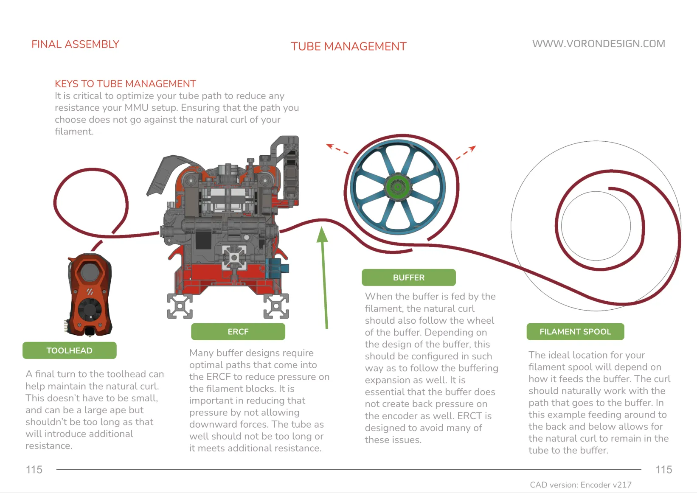
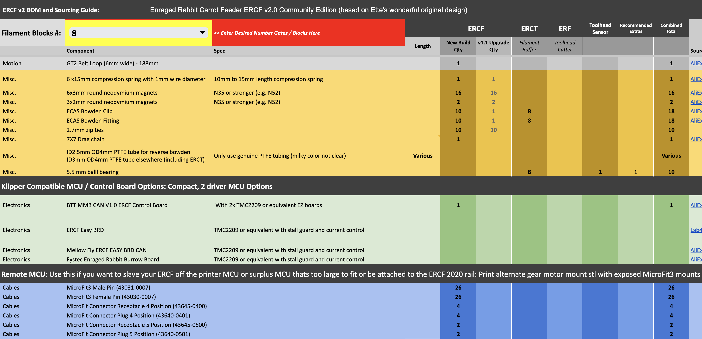
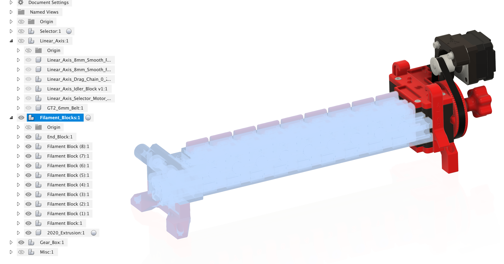

/## TEMPORARY Manual Quick Link
[https://docs.google.com/presentation/d/1GNcei5_qR5PPlFaxJqjTnTScKnyJQXV2OCJxBeb3A3g](https://docs.google.com/presentation/d/1GNcei5_qR5PPlFaxJqjTnTScKnyJQXV2OCJxBeb3A3g/edit?usp=sharing)

This is the (temporary) Google Slides document containing the ERCFv2 manual for community development. Currently, we are adding the content from the ERCF v1 manual with placeholder images. Once that is complete, we will move on to updating the manual and loading in update images.

Please be careful sharing the link, as it grants edit permission.

---

# Enraged Rabbit Community Project

  
  <h1 align="center">ERCF v2 - RC1</h1>

An expandable MMU for Klipper based 3D-Printers

  
  
  
  

 

<table>
<tr>
<td width=30%></td>
<td>
This is a community born project and major update to the Voron ERCF MMU that was started a couple of years ago by Ette.  It is endorsed by Ette and the guiding philosophy wasn't to start again with a new MMU design but to refine what has already proven to be a very capable machine and push it to be the best it can be by simplifying problematic construction, improving reliability and aligning as close as possible to v1.1 BOM. However the project includes an all new optional integrated filament buffer system (ERCT), filament cutter option (ERF), a collection of recommended toolhead sensor modifications and a bit of Bling! It fully leverages the Happy Hare firmware MMU control software with Klipper Screen entensions.

  
There are a rapidly growing list of MMUs in the market place from the mass produced "Fords" who pioneered the market to the "Toyota" that are more recent efficient engineering feat but somehow lack soul. We consider ERCFv2 the "BMW" - a little over engineered perhaps but distinctively cool and you feel good driving it.  We hope you enjoy! [Teaser Video](https://www.youtube.com/watch?v=ohGl1l5op3A)
</td>
</tr>
</table>

## Table of Content
  
**[ERCF](#enraged-rabbit-carrot-feeder-ercf)** 
**[ERCT](#enraged-rabbit-cotton-tail-erct)** 
**[ERF](#enraged-rabbit-filametrix-erf)** 
**[Toolhead Sensors](#toolhead-sensors)** 
**[Firmware](#firmware)** 
**[Documentation](#documentation)** 
**[BOM](#bom)** 
**[CAD](#cad)** 
**[Acknowledgements](#acknowledgements)** 
**[Vendors](#vendors)** 
**[Changelog](#changelog)** 
**[Build Photos](#build-photos)** 
**[Showroom](#user-print-showroom)** 
<!--
**[FAQ](Assets/FAQ.md)
-->

 

## Enraged Rabbit Carrot Feeder (ERCF)
<table>
<tr>
<td width=45%>An MMU or Multimaterial Unit/Upgrade allows for the automatic change of filaments on your 3D printer.  You can use it to create beautiful multi-colored prints or, if you're lazy, simply to avoid loading filament by hand. If you are familar with ERCF v1.1 this will serve as an overview of updates:</td>
<td>
<ol>
  <li>Sturdy backbone - no more flex
  <li>Reliable (and custom) encoder design
  <li>Sprung servo instead of adjustable top hats
  <li>Innovative Filament trap in blocks instead of magnetic gates
  <li>Formal filament bypass
  <li>Reinforced gearbox assembly
  <li>Beautifully illustrated Manual
  <li>High Quality Step-by-step CAD
  <li>New integrated passive buffer system (Cotton Tail)
  <li>Perfect tips with Filametrix Filament cutter
  <li>Functional and asthetic LED status indication
</ol>
</td>
</tr>
</table>

 

## Optional Enraged Rabbit Components

### Enraged Rabbit Cotton Tail (ERCT)
<table>
<tr>
<td width=30%></td>
<td>
When an MMU changes tool the unloaded filament needs to be thoughtfully managed so that is doesn't tangle. The Enraged Rabbit Cotton Tail (ERCT) buffer system is designed to attach directly to ERCF V2. It is a passive system that optimizes space and is also designed to reduce resistance in the filament path, creating a consistent system for calibration.

ERCT also incorporates a neopixel on each gate that, when driven by the Happy Hare firmware, provides both functional feedback as well as the necessary "bling".  Enjoy!

[Read more](Recommended_Options/ERCT_Buffer/ERCT.md)
</td>
</tr>
</table>

 

### Enraged Rabbit Filametrix (ERF)
<table>
<tr>
<td>
Before the MMU can unload a filament it must prepare the tip so that it can be cleanly loaded next time.  This tip forming process is very difficult to tune and varies based on material type, temperature, hotend type and even weather!  Introducing Enraged Rabbit Filametrix (ERF) filament cutting system.  This lightweight addition to your Stealthburner toolhead adds a cutting blade.  When retracting the problematic tip of the filament is simply cut off for perfect tips and no jams.

ERF also supports an optional servo operated ganrtry activation pin so no print area is lost with this addition. ERF designs also include the recommended integrated toolhead sensor

[Read more](Recommended_Options/ERF_Filament_Cutter/ERF.md)
</td>
<td width=30%></td>
</tr>
</table>

 

### Toolhead Sensors
<table>
<tr>
<td>
ERCF can be operated without a toolhead sensor (filament detection) in the toolhead but it is **not recommended**. A toolhead sensor provides an accurate homing point very close to the nozzle but also adds reliability to the tool change process. ERCF includes a set of toolhead sensor modifications for popular extruders. These work reliably through coupling a microswitch to the filament path.

[Read more](Recommended_Options/Toolhead_Sensor/README.md)
</td>
</tr>
</table>

 

### Purge System (ERPS)
Pellet purge system to remove the need for the wipe tower. Stay tuned.

 

## Firmware
<table>
<tr>
<td width=30%></td>
<td>
ERCF is designed to be used with the Happy Hare MMU firmware for Klipper which adds a set of klipper extensions for configuration setup, testing and operation of ERCF. These commands are available through the command line or macros but are perhaps best operated with an interactive UI with the optional KlipperScreen extension.

Happy Hare provides an easy installation script which has knowledge of recommended settings and will greatly accelarate the setup process.

[Happy Hare](https://github.com/moggieuk/Happy-Hare) &nbsp;&nbsp; [KlipperScreen](https://github.com/moggieuk/KlipperScreen-Happy-Hare-Edition)
</td>
</tr>
</table>

 

## Documentation
<table>
<tr>
<td>
Building something as complex as an MMU is a challenging undertaking but ERCFv2 project contains an amazingly detailed and illustrated manual with step-by-step instructions.  We have tried to make the process similar to fitting together a jigsaw puzzle, albeit with a few optional pieces.

[ERCFv2 PDF Manual](Documentation/ERCF_v2_Manual.pdf)
</td>
<td width=30%></td>
</tr>
</table>

 

## BOM
<table>
<tr>
<td width=30%></td>
<td>
You can find a Bill of Material for the project and options here. Note that the BOM also contains an upgrade list for those of you wanting to use your existing ERCF v1.1 kits. Please make a copy and edit the "Filament Blocks #" to be the number of gates for your build.  This can be any number but we encourage kit vendors to use 4/8/12 as size variations. Note that there are separate columns for core ERCF, the optional ERCT and ERF options as well as the suggested "extras"

[BOM](https://docs.google.com/spreadsheets/d/1HtVIu4yqzS6xJQr63-JKtMAh4Xq7wbtWPFeuiCnrnnE)
</td>
</tr>
</table>

 

## CAD
<table>
<tr>
<td>
A lot of work has gone into creating a quality CAD model of the project carefully organized into folders that match the documentation!  It is hightly recommended that you open the CAD and hide every folder and then expose them one at a time as you work through the build.

[Master CAD](CAD/ERCF_v2.step)
</td>
<td width=30%></td>
</tr>
</table>

 

## Acknowledgements
Most importantly let me introduce the development, test and doc team.  A project like this doesn't happen without many hundreds of hours of volunteer effort and all of these folks are truely awesome.  Please give some :clap: :clap: :clap:
<ul>
  <li>@moggieuk V0.1503 | V2.4088 (Mr Happy Hare & Chief whip)
  <li>@gneu V2.5345 (Filament block & bling innovator)
  <li>@sneakytreesnake V2.3804 (The project backbone!)
  <li>@mneuhaus VT.483 (Mr Binky)
  <li>@Miriax (Designer & Doc Demon)
  <li>@kinematicdigit (Mr Cotton Tail & Doc Illustrator)
  <li>@ningpj (Tester, Breaker & Documenter)
  <li>@fizzy (King of CAD)
  <li>@gsx8299 (Test Builder Extraordinaire)
  <li>@sorted (Filametix "don't get enraged" filament cutting system)
  <li>@kierantheman (Mr ThumperBlocks)
</ul>

 

## Vendors
<table>
<tr>
<td width=30%></td>
<td>
These kits and specialty parts have been checked by us and meet good quality standards:
<ul>
  <li>On the way... stay tuned!
  </li>
</td>
</tr>
</table>

**To manufacturers:**
If you want to be included in the list, please contact us. We are happy to validate your kit and then add you to the list.

 

## Changelog
<ul>
  <li>v2.0 rc1 - Initial Release (Merry Christmas!)
</ul>

CAD Design Guidelines used in this project (in case you were interested) can be found: [here](/Assets/Dev_Notes.md).

<i>
There once was a printer so keen, 
To print in red, yellow, and green. 
It whirred and it spun, 
Mixing colors for fun, 
The most vibrant prints ever seen!
</i>

 

## Build Photos

 

## User Print Showroom

