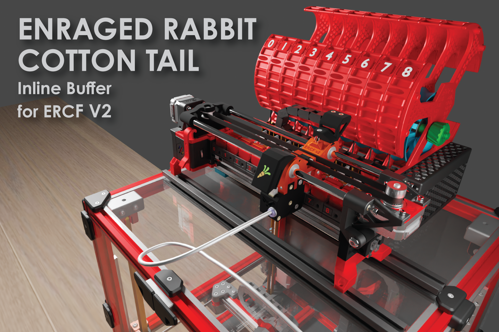

# Enraged Rabbit Cotton Tail

  

## Introduction

The Enraged Rabbit Cotton Tail (ERCT) buffer system is designed to attach directly to ERCF V2. It is also designed to reduce as much resistance as possible in the filament path, creating a consistent system for calibration.

This system is also designed to reduce the buffer length, while the loops are defined by the amount of tube you use from the encoder to the tool head. This is calculated by the total Bowden tube length divided by 225.  QoL features also allow for illuminated coupler blocks to indicate filament states.

**Features include:**

* Large central buffer wheel - reduces the bend radius of the filament's natural shape - each wheel comes pre-notched to make loading filament easier.
* Inline connection - connects directly to the 2020 extrusion arm
* Short Buffer Length - Can operate as short as 500mm in buffer Length
* Stackable Arm - Each arm is stackable for whatever combination of gates you want. They are optimized for strength and lightweight while providing loading and unloading filament access. More than 12 channels will require self-sourcing a metal axle rod, but printing your own up to 12 channels is available in the STL directory.
* Uses most parts from ERCP V1 -  if you already have a kit, most parts should be interchangeable.

##

***

## Acknowledgements

ERCT was designed to simplify the buffer design and integrate cleanly with ERCFv2. I thank the entire team from the ERCF V2 team, especially Moggie, for bringing me onto the team. I also have my home server, Fizzy's Tech, on Discord to thank for the countless support and hosting of the Beta development on that server. Jose from Fizzy's Tech was instrumental in this development as he was part of the system's early development and early testing. There are numerous testers who have helped as well, making suggestions throughout the beta cycle. I want to give a special shout-out to Wolffy01 and gsx8299 for their contributions to ideas, testing and mods.&#x20;

Questions related to this buffer can be directed at <https://discord.com/channels/460117602945990666/909743915475816458> or you may visit my home server at <https://discord.gg/Gs2vAtK7T7>

Terrance Lam
@kinematicdigit
###

***

### BOM (Each arm group/channel):

* (4) 8mm M3 screws
* (1) 16mm M3 screw
* (1) M3 threaded inserts (M3x5x4mm) Heat Sets
* 48.5mm PTFE Tubing (4mm OD/3MM ID Clear)
* (1) 608 ZZ Bearing (same as ERCP - skateboard bearings will work as well)
* (2) ECAS
* (1) M3 Roll-in Spring T-nut (for attaching to 2020 extrusions)

### End cap (with integrated MMB CASE) needs:

* (5) 8mm M3 screws
* (4) M3 threaded inserts (M3x5x4mm) Heat Sets

* (1) BTT MMB Can board
* (1) Microswitch per arm
* (1) 5.5 mm ball bearing per arm
* (2) 8 or 10 mm M2 self-thread screws per arm
* (1) Button Neopixels per arm
***

**FULL BUILD INSTRUCTIONS FOUND IN THE ERCF V2 BUILD GUIDE**

**LOADING THE BUFFER**

There are several ways to load the buffer. Use this as a reference but you may find other ways to load that is easier for you.

|  | To load the buffer, filament from your reverse Bowden. Try your best to work with the natural curl of the filament and feed it till you see it pop out on top.                                                                                                                      |
| -------------------------------------------------------------------------------------------------------------------------------------------------------------------------------------------------------------------------------: | :---------------------------------------------------------------------------------------------------------------------------------------------------------------------------------------------------------------------------------------------------------------------------------- |
|  | Grab it from up top, and curl it back into one of the multiple filament loading holes located along one side of the buffer wheel.                                                                                                                                                   |
|  | Turn the wheel until you have the number of rows needed for your tube length between the ERCF encoder and the tool head (to calculate the right length, measure the tube and divide by 230mm. This will equal the number of rows you need to wrap around the wheel - maximum of 7). |
|  | Back below, grab the filament on the wheel and pull it out.                                                                                                                                                                                                                         |
|  | Give yourself some length (about 30 cm).                                                                                                                                                                                                                                            |
|  | Feed back into the tube located there.                                                                                                                                                                                                                                              |
|  | It will feed through, and you should feel some resistance from the trap; press on the top hat to help it through.                                                                                                                                                                   |
|  | The final step is to push the filament flush to the opening so it doesn’t catch on the selector. That’s it. Load it all up, and away you go!                                                                                                                                        |

