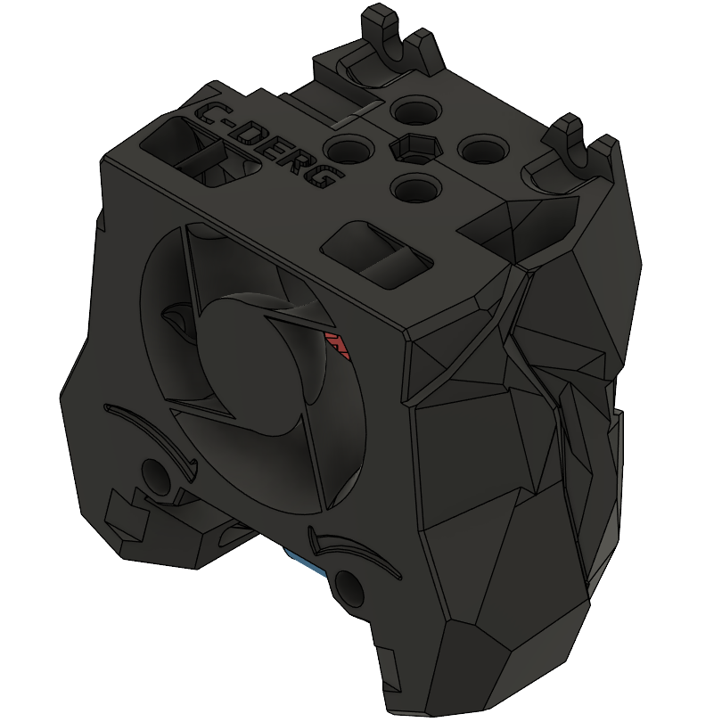
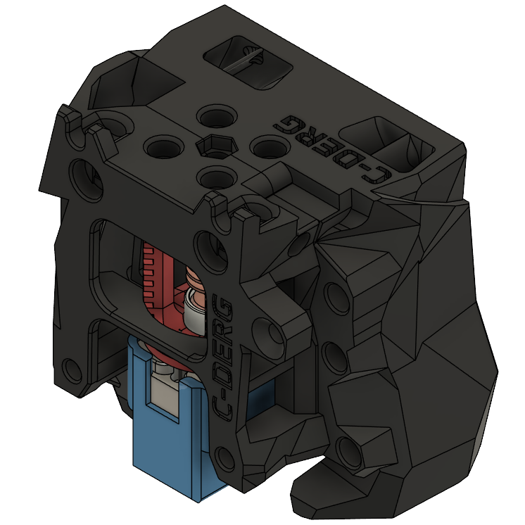
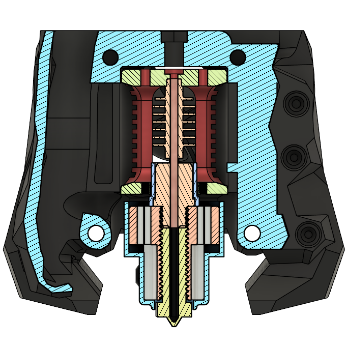

# Filament Cutter - Crazy Dragon Hotend
**Crazy Dragon = Phaetus Dragon + Mellow NF Crazy Heatblock**

Provides a filament cutting option to the Crazy Dragon hotend.

The design started with the SB RC1 Crazy Dragon, and was updated to accommodate the latest Stealthburner revisions. The new design is also tested to work with Voron Tap.

## Credit
 - [@sorted](https://github.com/Enraged-Rabbit-Community/ERCF_v2/blob/master/Recommended_Options/ERF_Filament_Cutter/README.md) - (Filametrix "don't get enraged" filament cutting system)
 - [@eamers](https://github.com/VoronDesign/VoronUsers/tree/main/printer_mods/eamars/stealthburner_crazy_dragon_toolhead) - (The Crazy Dragon Tamer)

## Design Preview

