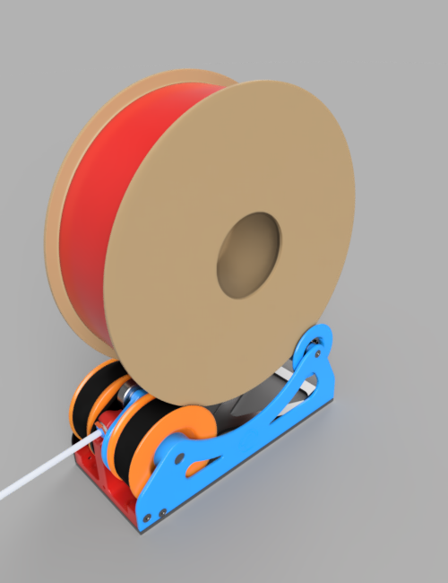

# Enraged Rabbit "Filamentalist" Rewind Buffer
<table>
  <tr>
    <td width=30%></td>
    <td>
      This option which is compatible with the pre-gate sensors from ERCF adds a passive rewind system that leverages the reverse uploading force from the MMU. Use it instead of a classic buffer system to keep filament management under control.
    </td>
  </tr>
</table>

 

Placeholder -- TODO
