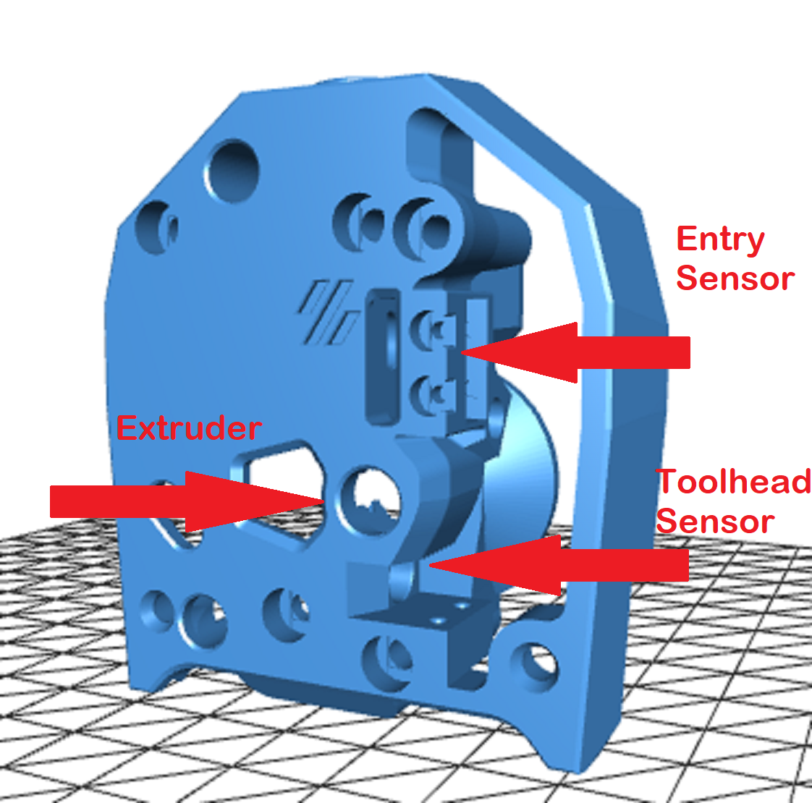

# Enraged Rabbit toolhead filament detection

This page explores the various options available for Toolhead Filament detection that is used by your MMU firmware to ensure reliable filament loading and to spot errors that might occur during the filament's loading and unloading processes. The ERCFv2 team advocate the utilization of a toolhead sensor only or dual-sensor system. In this section, you will find a comprehensive collection of standalone sensor options compatible with popular toolheads.

> [!IMPORTANT]  
> **Secured bowden**: It is important to ensure the bowden tube can't accidently separate from either the MMU or the toolhead. This is essential when opting for no toolhead sensors. We recommend secure fastening using a Push-Fit or ECAS connection. We wish to highlight that there are certain toolheads, such as the stock CW2, where the Bowden tube is simply inserted without any additional securing mechanism. Such setups present a heightened risk of the bowden tube dislodging from its holder and thus we offer a no-sensor version of these toolheads.

> [!NOTE]  
> **Using a filament cutter toolhead**: For users who have integrated the ERF filament cutter into their systems, please refer to the toolhead modifications outlined in then [ERF Filament Cutter](../ERF_Filament_Cutter/README.md) section where you will find a similar set of toolhead modifications but including the cutting option.

 

_____________________________

## Possible Options Explained

<em>Position of the sensor</em>

### **1. Toolhead and Entry Sensor**  
This setup allows the firmware (Happy Hare) to quickly load bowden and optionally home prior to extruder, then home to toolhead sensor before loading to the nozzle. The entry sensor also allow for easier calibration of the bowden length.  The twin sensors also allows for precise location of the filament in an error situation which increases the chances of automatic recovery. The downside is that you need two switch inputs to your MCU. **This is the luxury option.**  
   
✔ smooth bowden loading 
✔ precise extruder loading 
✔✔ great error recovery (excellent through precise filament location)

### **2. Toolhead Sensor only**  
With this setup the firmware can quickly load close to the nozzle and then precisely home to the toolhead sensor inside the extruder. The presence of the toolhead sensor is highly valuable in a MMU so the firmware allowing detection of correct behavior, smooth loading and auto recovery. This is usually an easy setup to accomodate and many toolhead boards or MCUs provide for this input. This option has a small possibliy of the filament not being detected as trapped between extruder and sensor but this is rarely a problem in practive. **This is the most common recommended option.**  
  
✔ smooth bowden loading 
✔ precise extruder loading 
✔ good error recovery (with in-extruder detection)

### **3. Entry Sensor only**  
With this setup the firmware can quickly load the bowden and home to a point close to the nozzle. Because the filament has not yet passed into the extruder there are inaccuracies that can occur during this transistion. Also this option has no way of knowing the filament is inside the extruder in error recovery situations and thus relies on additional user interaction.
     
✔ smooth bowden loading 
✘ extruder loading can be inprecise 
✘ poor error recovery (no way to determine if filament is inside extruder)

### **4. No Sensor**  
This setup has no sensors and is thus not recommended but it can be used if you have not other options with Happy Hare. It does include a secure bowden connection (ECAS or push fit) which is essential because the filament will be colliding with the extruder entrance. **This works but is not recommended.**  
  
✘ rough bowden loading that can fail (this system relies on collision detection when the filament hits the extruder) 
✔ extruder loading precision is reasonable 
✘ poor error recovery (there is no way to assertain the filament position)
_____________________________
 
## Recommend Mods
Here are the STLs for popular Toolhead/Extruder combinations.  Note that this is a compiled list and we invite you to help flesh out the rest...

<strong>Expand for Stealthburner Options</strong>

<table>
  <tr>
    <th>Extruder</th>
    <th>1. Toolhead &amp; Entry Sensor</th>
    <th>2. Toolhead Sensor</th>
    <th>3. Entry Sensor</th>
    <th>4. No Sensor</th>
  </tr>
  <tr>
    <td>Clockwork 2</td>
    <td> <a href="./Stls/1_Toolhead_And_Entry_Sensors/[a]_SB_CW2_Latch.stl">Latch</a>   <a href="./Stls/1_Toolhead_And_Entry_Sensors/SB_CW2_Body.stl">Body</a>   <a href="./Stls/1_Toolhead_And_Entry_Sensors/SB_CW2_Plate.stl">Plate</a>   Additional items:   1x ECAS   2x D2F-5  2x ball 5,5mm   4x self tapping screw M2x10   Credit: <a href="https://www.printables.com/model/466692-stealthburner-cw2-filament-sensors-with-ecas-latch">Petr Kašpar</a> </td>
    <td>   Additional items:   1x ECAS   1x D2F-5  1x ball 5,5mm   2x self tapping screw M2x10 </td>
    <td>   Additional items:   1x ECAS   2x D2F-5  2x ball 5,5mm   4x self tapping screw M2x10 </td>
    <td> <a href="./Stls/4_No_Sensors/SB_CW2_Latch.stl">Latch</a>   <a href="./Stls/4_No_Sensors/SB_CW2_Body.stl">Body</a>   Additional items:   1x ECAS </td>
  </tr>
  <tr>
    <td>Orbiter 2</td>
    <td></td>
    <td></td>
    <td></td>
    <td></td>
  </tr>
  <tr>
    <td>LGX Lite</td>
    <td></td>
    <td></td>
    <td></td>
    <td></td>
  </tr>
  <tr>
    <td>Galileo 2</td>
    <td></td>
    <td></td>
    <td></td>
    <td></td>
  </tr>
  <tr>
    <td>other extruder</td>
    <td></td>
    <td></td>
    <td></td>
    <td></td>
  </tr>
</table>

<strong>Expand for XOL2 Options</strong>

<table>
  <tr>
    <th>Extruder</th>
    <th>1. Toolhead &amp; Entry Sensor</th>
    <th>2. Toolhead Sensor</th>
    <th>3. Entry Sensor</th>
    <th>4. No Sensor</th>
  </tr>
  <tr>
    <td>Clockwork 2</td>
    <td></td>
    <td></td>
    <td></td>
    <td></td>
  </tr>
  <tr>
    <td>Orbiter 2</td>
    <td></td>
    <td></td>
    <td></td>
    <td></td>
  </tr>
  <tr>
    <td>LGX Lite</td>
    <td></td>
    <td></td>
    <td></td>
    <td></td>
  </tr>
  <tr>
    <td>Galileo 2</td>
    <td></td>
    <td></td>
    <td></td>
    <td></td>
  </tr>
  <tr>
    <td>other extruder</td>
    <td></td>
    <td></td>
    <td></td>
    <td></td>
  </tr>
</table>

<strong>Expand for other toolhead options</strong>

<table>
  <tr>
    <th>Extruder</th>
    <th>1. Toolhead &amp; Entry Sensor</th>
    <th>2. Toolhead Sensor</th>
    <th>3. Entry Sensor</th>
    <th>4. No Sensor</th>
  </tr>
  <tr>
    <td>Clockwork 2</td>
    <td></td>
    <td></td>
    <td></td>
    <td></td>
  </tr>
  <tr>
    <td>Orbiter 2</td>
    <td></td>
    <td></td>
    <td></td>
    <td></td>
  </tr>
  <tr>
    <td>LGX Lite</td>
    <td></td>
    <td></td>
    <td></td>
    <td></td>
  </tr>
  <tr>
    <td>Galileo 2</td>
    <td></td>
    <td></td>
    <td></td>
    <td></td>
  </tr>
  <tr>
    <td>other extruder</td>
    <td></td>
    <td></td>
    <td></td>
    <td></td>
  </tr>
</table>

_____________________________
