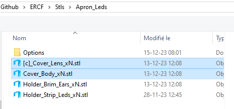
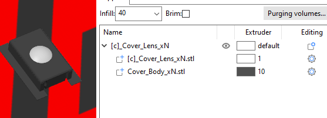
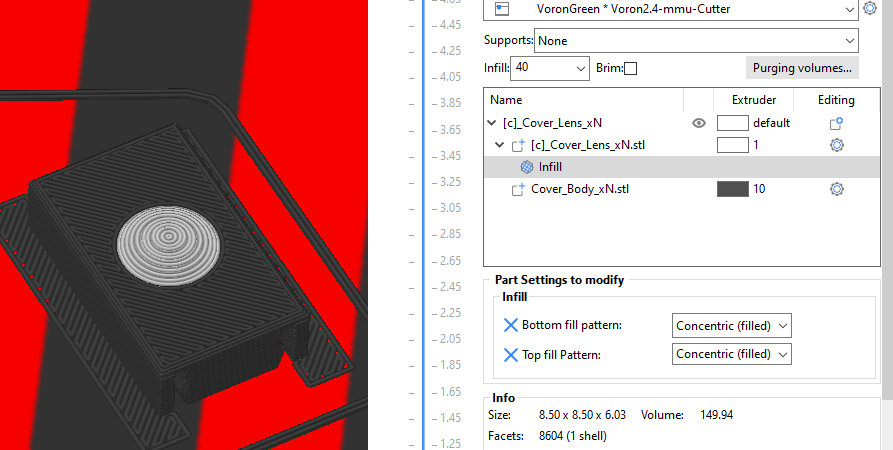

# Apron Neopixels

The neopixel holder is designed to snap on the 2020 extrusion just under each gate. It consists of a Holder and a cover. One of each per gate.
## what to print ?
* **2 holders are available :**
  * One for a strip of LED 10mm wide.
    * **Holder_Strip_Leds_xN.stl**
  The same is used to light the chamber of the Voron printers with a spacing of 16.5mm. It can be found on aliexpress. We used the RGBNW, 1m 60 IP30, Black PCB   https://fr.aliexpress.com/item/32476317187.html?spm=a2g0o.order_list.order_list_main.80.21ef5e5bQ4YCw6&gatewayAdapt=glo2fra
  * The second is designed to hold the individual neopixel RGBW LED.
    * Holder_PCB_Led_xN.stl
  Those are the same neopixels used in the stealthburner.
  The holders are printed standing up with an (optional) brim ears STL : Holder_Brim_ears_xN.stl

* **2 versions of the covers are  provided :**
  * One that print flat but need supports (**recommended**).
    * **Cover_Body_xN.stl**
    * **[t]_Cover_Lens_xN.stl**
    
  * One that print standing up with no supports.
    * Options/Cover_Body_No_support_xN.stl
    * Options/[t]_Cover_Lens_No_support_xN.stl

The recommended STLs are :
  *  Holder_Strip_Leds_xN.stl because strip leds are much easier to solder and install.
  *  Cover with support. They give a better look especially on the lens part that can be printed with concentric(filled) top and bottom infill :
     *  **Cover_Body_xN.stl**
     *  **[t]_Cover_Lens_xN.stl**

## Tips

**Printing tips.**
* Holder can be print in any color. It is not visible.
* Cover_Bodies should be printed with opaque filament.
* Cover_lenses should be print with transparent filament.
* Load both files together into the slicer.
    

 Answer "Yes" to the mulicolor print dialog box.
* Select the color of your choice for the body, and transparent for the lens. 
    

* Add bottom and top infill pattern settings to the lens, and select concentric(filled) pattern. 
   

   Slice and print.
**Installation of the recommended STLs**
* Cut N individual LED form the strip, and tin all the solder pads.
* Snap all the holders on the 2020 extrusion under the filament blocks.
  * one side of the tang that snaps to the extrusion does not go up to the end. This is made to accommodate for the roll in nuts.
  * If for some reason you have a roll in nuts on both side of the holder, the opposite site can be cut off. 
* Stick each individual strip in the holder.
* Solder thin rigid wires between the strips.
* On gate 0 solder 3 wire that will go the RGB pin of the controller.
  * a small opening on each corner of the holders is used to pass the wires through.
  * At the last gate you can also solder 3 wires if you plan to add more RGB LEDs.
  * Snap the covers on the holders.
  

