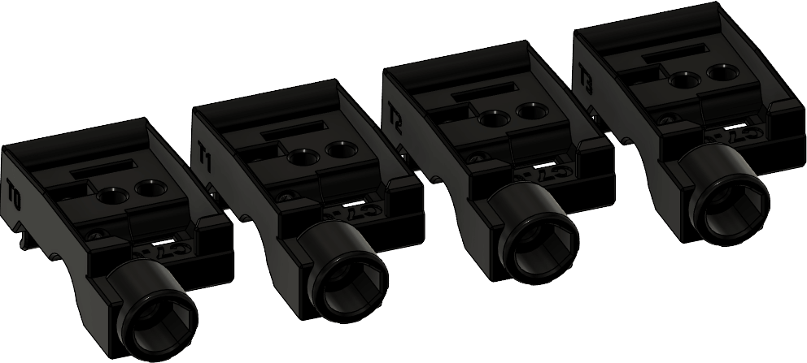

# Adjustable ECAS Filament Blocks

Not all ECAS couplings are made equal. Even if you have good extrusion multipliers, some ECAS couplings can have a smaller outer diameter than expected. Whilst kits may not suffer this issue, it can be a problem if you're self-sourcing.

Try printing these modified filament path pieces if you run into issues where your ECAS coupler slips out of the housing.

* **ERCF Default:** 8.45mm
* **T0 - Snug:**: 8.38mm
* **T1 - Tight:** 8.36mm
* **T2 - Tighter:** 8.34mm
* **T3  - Tightest:** 8.32mm

