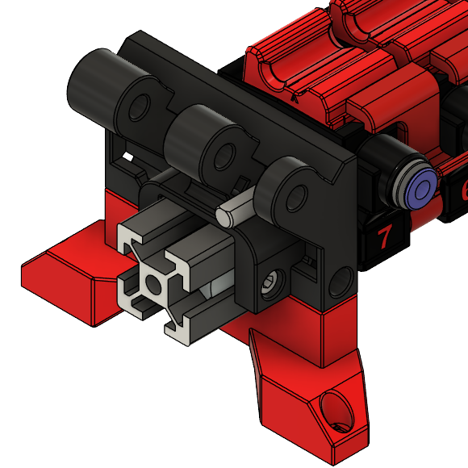

# No Bypass Mod

Removes the bypass from the end block, so that upgrading from ERCF v1.1 with Sturdy Bunny doesn't require new extrusion to be cut.
This is an alternative to using a bypass with the [Thumper Blocks](../../kieraneglin/Thumper-Blocks).

## BOM

Identical to V2 BOM, minus 1x ECAS fitting.

## Software Configuration

Happy Hare will require configuration as a custom MMU, since this now falls out of the vendor specific ERCF V2 configuration.

Generally, you will need to supply the following to your mmu_parameters. It might be necessary to tune these settings.

```yaml
# ADVANCED/CUSTOM MMU: See documentation for use of these ----------------------------------------------------------------
#
# Normally all these settings are set based on your choice of 'mmu_vendor' and 'mmu_version', but they can be overridden.
# If you have selected a vendor of "Other" you must set these else you will get arbitary ERCFv1.1 defaults.
#
cad_gate0_pos: 4.0			# Approximate distance from endstop to first gate. Used for rough calibration only
cad_gate_width: 23.0			# Width of each gate
cad_bypass_offset: 0			# Distance from limit of travel back to the bypass (ERCF v2.0)
cad_last_gate_offset: 0.72		# Distance from limit of travel back to last gate
cad_selector_tolerance: 10.0 		# How much extra selector movement to allow

encoder_default_resolution: 0.95833 # Binky 12 tooth disc with BMG gear
```

### Configuration with Thumper Blocks
If you are using this mod in combination with Thumper Blocks, additionally update `cad_gate_width` to `21.0`.

