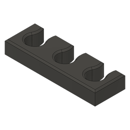

# Tube Management Guides

Guides for keeping those pesky PTFE tubes tidy.
The extrusion guides can be used for the V2 and Trident when mounting spools at the top-front of the printer, such as with Carrot Quiver.

For loose hanging tubes, you might want to try out the clips.

The CAD file for Fusion 360 is parametric, and can be extended to fit the number of tubes you see fit.
Some STLs have already been exported, and this will be enough for most users.

## BOM
Guides for 2020 extrusion:
* 2x M3x8mm SHCS or BHCS
* 2x M3 T-nuts (hammerhead or spring loaded)

Clips:
* No additional hardware

