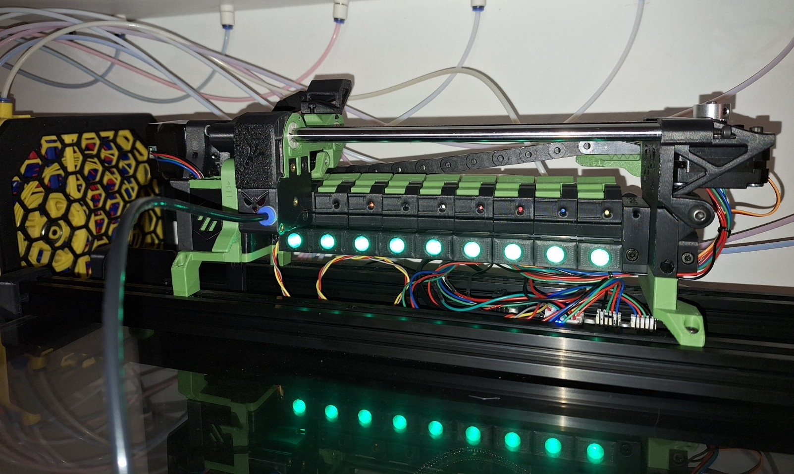

# Apron Neopixels (narrow mod)

This is a narrower version of the Apron Leds to be used with the Thumper Blocks (thinner version) when upgrading from a ERCF v1.1. The original Thumper Blocks has a thinner footprint than the Triple Decky or the v2 Blocks. This enables you to have 9 blocks (plus Bypass) instead of 8 when upgrading from a v1.1. To be able to use the Apron leds for some colorfull effects, i made them narrower.

Everything works as with the original Apron LEDs, but I didn't include all options, because I didn't need them.

I use a fysetc burrow board for controling the leds. It has a led pin header which works fine with Happy Hare.

# Build instructions

Print a **Holder_PCB_Led_xN_ThumperBlock** for each gate and snap it into the 2020 extrusion below the gates. The color doesn't matter as it is not visible anymore when assembled. You can use this with single NeoPixels on a round pcb.

Load **Cover_Body_xN_ThumperBlock** with **[c]_Cover_Lens_xN** as a multi part object. Set the cover lens to a transparent material (I used transparent PETG) and the cover body with a color of your choice. You need one for each gate.

To solder the PCB to a strip you can use the **LED_Soldering_Tool_22.2mm** as it has the right spacing for the scaled version. Cut your wire to a length of 19mm.
