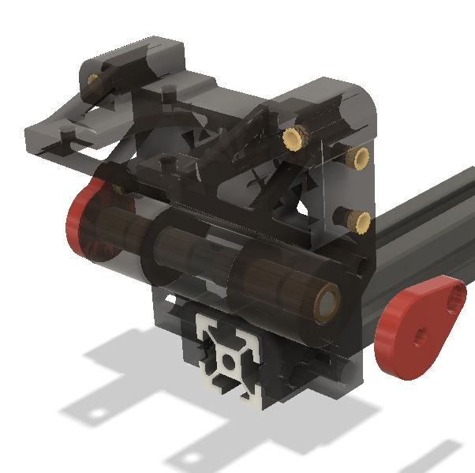
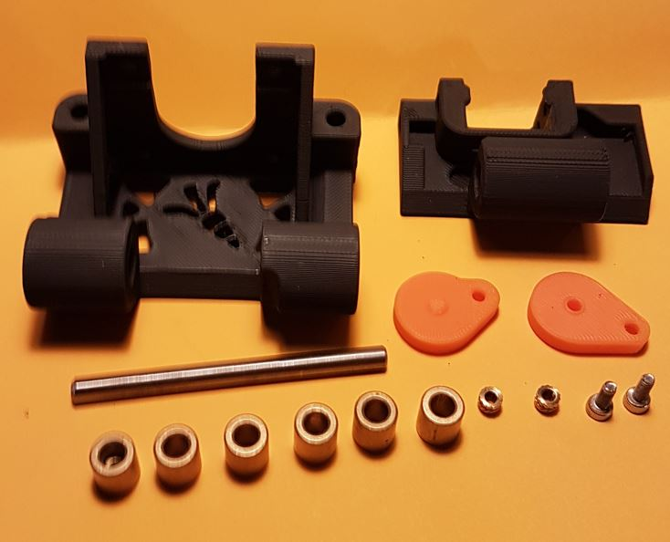
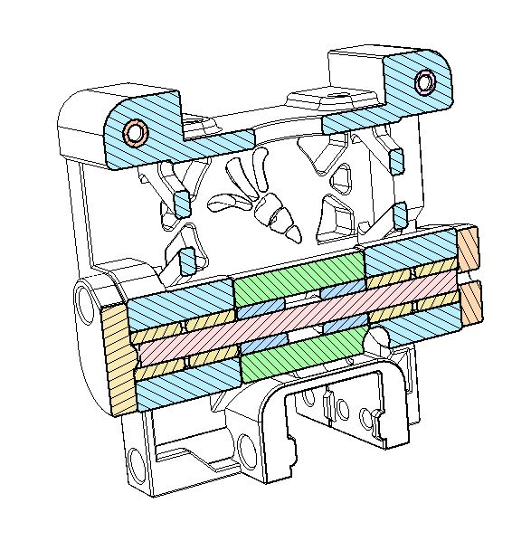
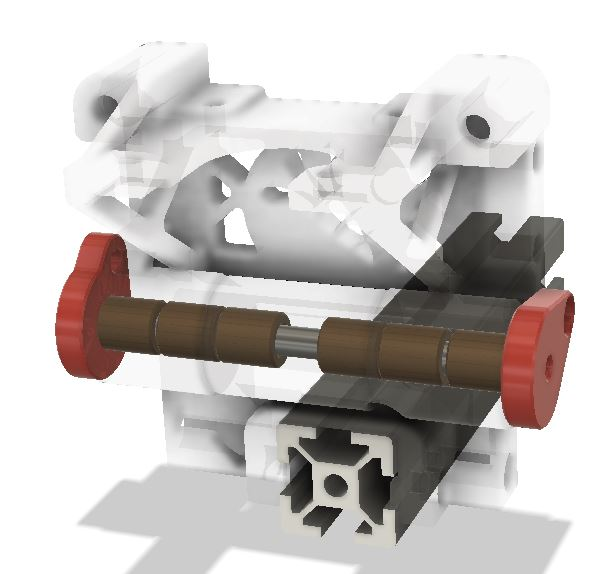
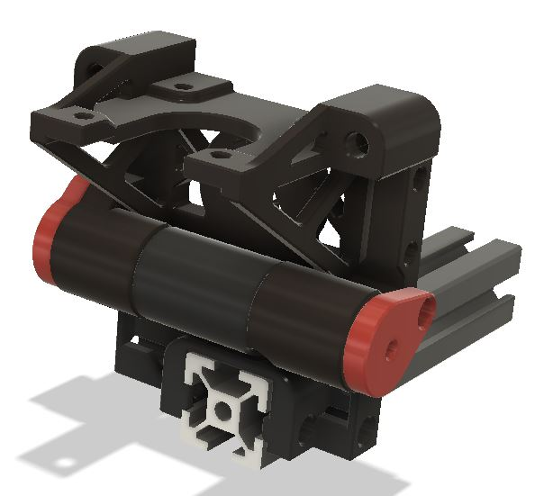
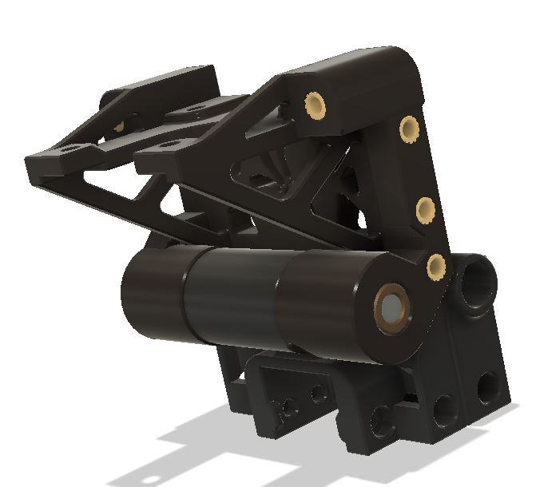
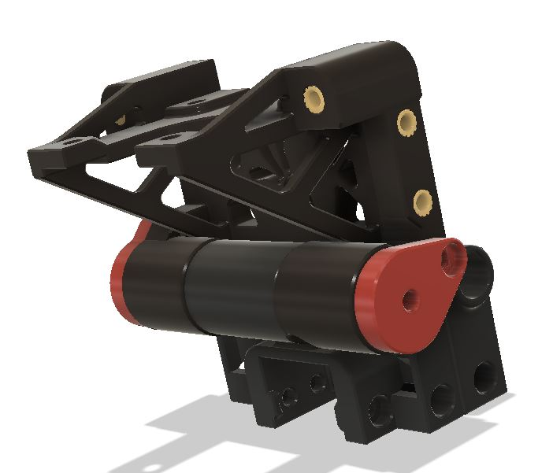
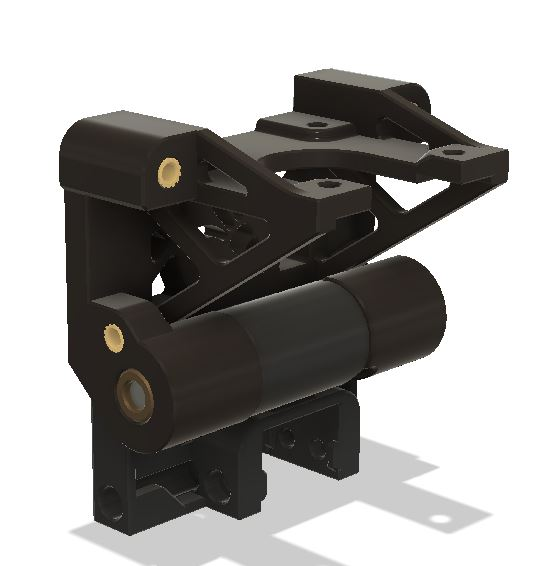
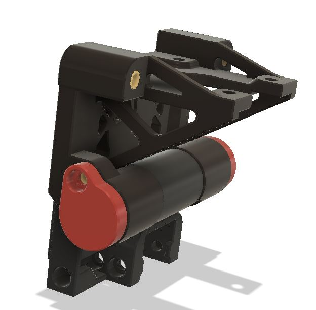

<h1 align="center"><ins>Reinforced Block End </ins></h1>

<H2 align="center">Filament block end with brass bushing and 5mm shaft.</H1>

 

This will give a strong and rigid connection between the top and bottom block end.
It will be very easy to separate the linear axis form the bottom part.
    Just open the exit side Axles stop and push the 5mm shaft with a 2.5mm allen key, and then remove the shaft.

**It will become more useful with the "coming soon" microfit 3 connectors mod that will allow to disconnect the linear axis assembly from the main ERCF.** 

## Bom
In addition to the normal bom for those parts, you will need :
* 2 M3 inserts
* 2 M3x8 SHCS 
* 6 Brass bushings 5x9x10
* 1 Shaft 5mm in diameter, 68mm long.  

 

The bushings can be found on Aliexpress : https://fr.aliexpress.com/item/1005004074472637.html?spm=a2g0o.order_list.order_list_main.52.21ef5e5bn0yau0&gatewayAdapt=glo2fra

## Cut view

 

## Images

 

 

 

