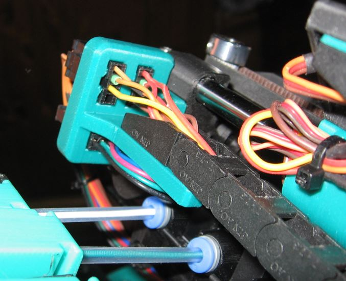
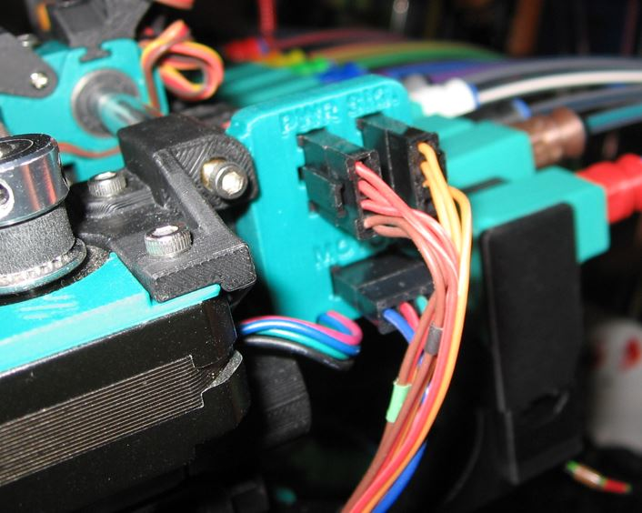
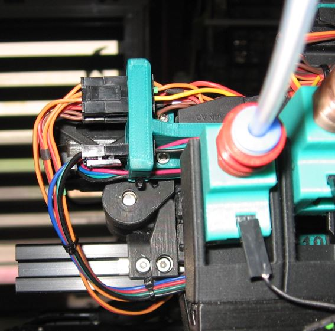
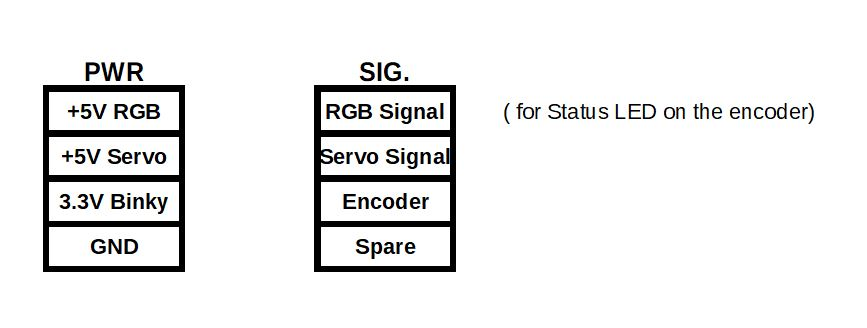

<h1 align="center"><ins>Darg chain anchor with Microfit 3 connectors </ins></h1>

 

This will allow to very easily remove the top part of the ERCF V2 for maintenance purpose.
It is designed to go with the Block End with bushing mods on this repo.

## Bom
In addition to the normal bom for those parts, you will need :
* 2 M3 inserts
* 2 M3x8 SHCS 
* 3 Microfit 3, 4 pins connector male
* 3 Microfit 3, 4 pins connector female  

 

* The connector marked "MOTOR" is used for the motor connection
* The connector marked "PWR" is used for power supply of the Binky encoder, the servo, and the status LED.
* The connector marked "Sig." is used for the signals of the Binky encoder, the servo signal, the status data signal of the status LED, and a spare pin available for what ever you need more. 

**Here is an example of the Microfit3 pinout :**

 

