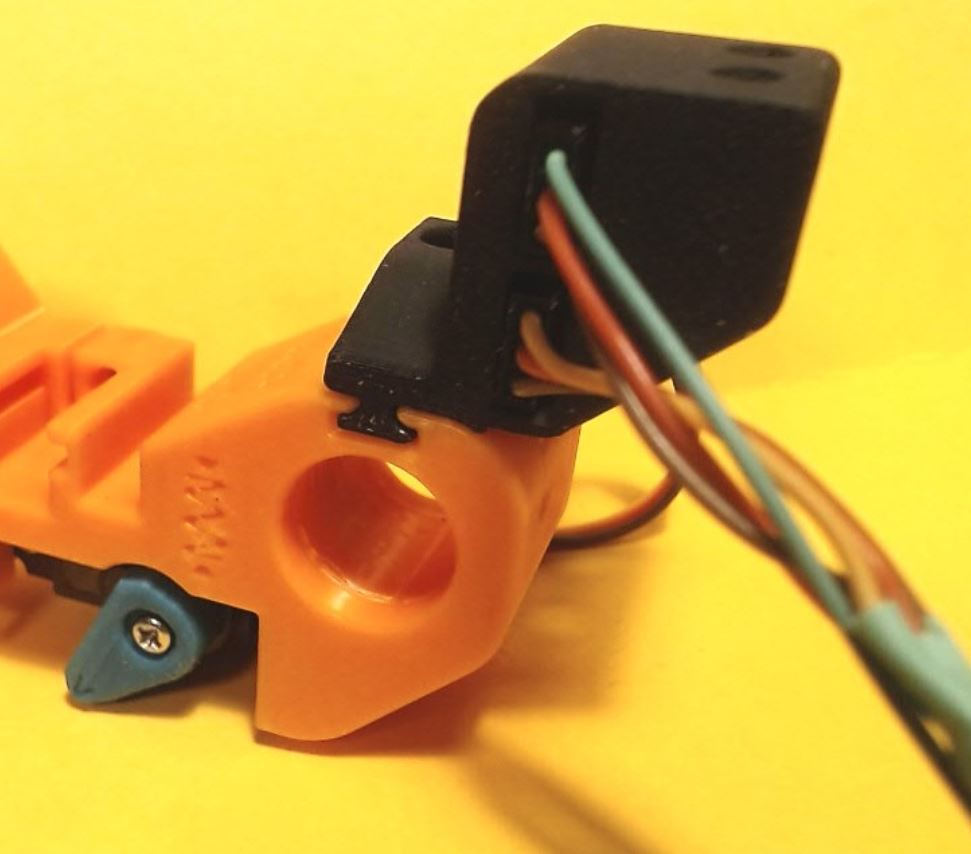
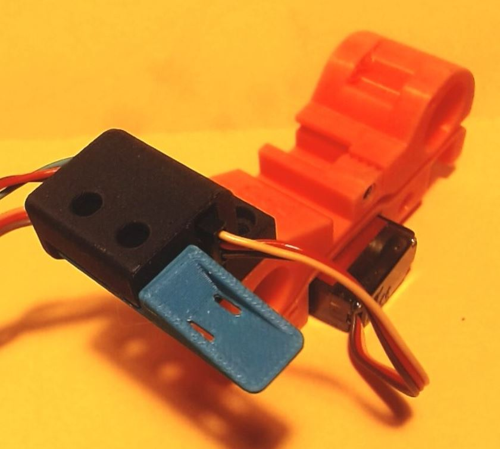

<h1 align="center"><ins>Drag chain anchor with 2 servo connectors and spacer with tie-warp possibility </ins></h1>

 

The Servo connector will allow to very easily replace a faulty servo.
The second connector can be used to connect a second servo like a cutter mounted on the encoder.
The spacer will keep the drag chain in line with the chain end, and allow to secure the cables with a tie-wrap. It mounts between the drag chain and the the anchor. 

## Bom
In addition to the normal bom for those parts, you will need :
* 1 servo connectors (optionnally 2) 
  They are made for the JR/Futaba connectors found on AliExpress : https://fr.aliexpress.com/item/1005004152966553.html?spm=a2g0o.order_list.order_list_main.134.272b5e5bZa4381&gatewayAdapt=glo2fra
* 1 Tie-Wrap

 

