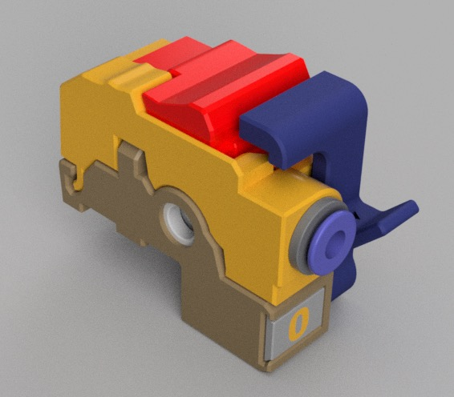

# ERCF Thumper Blocks (beta)

## Table of Contents

- [Which Block - Thicker or Thinner?](#which-block)
- [Credit](#credit)
- [Hardware Requirements](#ercf-requirements)
- [Thumper or Triple-Decky?](#differences-compared-to-triple-decky)
- [BOM](#bom)
- [Assembly](#assembly)
- [Software Configuration](#software-configuration)
- [Troubleshooting](#troubleshooting)
- [Support](#support)
- [Changelog](CHANGELOG.md)

## NOTE: This is a work-in-progress.

The design has performed very well so far, but it's still going to change as we test and iterate. This project is based off the mature [Triple-Decky][triple-decky] design but some significant changes have been made which may affect the overall performance. Please keep this in mind if you decide to use Thumper.

## Credit:

This is based heavily off the fantastic [Triple-Decky][triple-decky] project. I've made some improvements based on my own experience and needs, but the core design can be traced back to the original. Thumper Blocks would not exist without the great work of gneu42 or any of the testers/contributors on that project.

## What is it?

Thumper Blocks are 3-level filament blocks for the ERCF. Their job is threefold:

1. Stop filament from moving in or out of the block when not in use
2. Give solid grip to the gear motor when loading/unloading filament
3. Provide a low-friction path for filament to move through when the main extruder has taken over

## ERCF Requirements

- [Sturdy Bunny][sturdy] ERCF platform
- [Springy][springy] selector cart
- A buffer such as [piKa][pika] is very strongly recommended. This isn't just for Thumper - a buffer will improve your load/unload reliability with any filament block
- [Happy Hare][happy-hare] is very strongly recommended. It's currently in closed beta, but it allows the use of a 3-position servo which is required for Thumper

## Differences compared to Triple-Decky

- Shaves 1.75mm off the width of each block (on `Thinner` model)
  - This allows the blocks to fit existing hardware and kits without modification or omitting a filament block
  - If you're already set up for Triple-Decky, it reclaims 10.5mm for every 6 blocks. With this, you can add things like a dedicated bypass block
- Uses an M4 nut for the filament brake instead of a printed part (low friction) or a grub screw (uncommon part)
  - Subjectively improves the assembly process by having a one-piece brake design
- Removes the need for supports on all parts except the tophat for less post-processing
- Allows for the use of 1 pair of magnets
- Lets you use N35 magnets instead of N52, but stronger is still better if you have them
- Adds features to help with alignment on the 2020 extrusion
- Streamlines filament path for both initial feeding and endless-spool mode
- Updates block tolerances for easier assembly
- Improves tolerances on the latch mechanism

### What hasn't changed

- Triple-Decky's filament tags will fit in Thumper
- Removes the need for standalone bearing blocks by integrating bearings into filament blocks
- The general look, feel, and assembly is very similar to Triple-Decky

## Which Block?

### Thicker

- The official block of the ERCF v2 spec
- Has width compatibility with Triple-Decky so accessories (such as the ERCT filament buffer) will fit
- **Use this if you're using ERCF v2 hardware OR you want to upgrade a v1 to an offical v2 but you don't mind losing a filament block**

### Thinner

- 1.75mm thinner per-block than the Thicker model
- Does not remove a block when using ERCF v1 hardware
- Does not conform to the ERCF v2 spec - the filament bypass and some accessories will not fit
- **Use this if you're on ERCF v1 hardware and you don't want to lose a filament block BUT you don't mind potentially losing compatibility with ERCFv2 accessories**

## BOM

**Hardware**

This is per-block unless otherwise noted. I've added (unchanged) to parts that are the same as Triple-Decky.

- 1x ECAS fitting (unchanged)
- 1x M3x12mm SHCS for latch (unchanged)
- 1x BMG driven gear and idler assembly (unchanged)
- 2x 6x3mm magnets (unchanged)
- 1x M3x8mm SHCS and 1x M3 T-nut for fastening to extrusion (unchanged)
- 1x M4 nut for filament brake

Additionally, every 3rd block will need 1x MR85ZZ bearing (unchanged)

**Printed Parts**

These are made to be printed in ABS and friends (including ASA) and do not require additional shrinkage compensation, just like the main ERCF files.

- 1x [Springy][springy] servo arm for your servo of choice
  - NOTE: I've included a backup in this repository just in case, but you should prefer to use the files from Springy
- 1x every file in the STL folder for each block you want to make
  - NOTE: files are made to be printed in their default orientation and without additional supports

## Assembly

These instructions are going to be pretty sparse until something closer to the final design is reached. It's not a difficult assembly, but you can refer to a combination of Triple-Decky and the STEP file to fill in any gaps.

**Filament Path**

- Optionally drill out filament path with a 2mm drill bit (should not be required for a well-tuned printer)
- Insert the ECAS fitting into the front of the block
- Insert 1x magnet in the hole under the ECAS fitting
  - NOTE: it should oppose the magnet in the base
  - NOTE: there is a slot behind the magnet to help remove it if need be
- Optionally insert filament tag

**Base**

- Insert 1x magnet in the hole in the front of the base
  - NOTE: it should oppose the magnet in the filament path
  - NOTE: there is a hole under the magnet to help remove it if need be
- Press-fit 1x M4 nut into the hole in the back of the base
  - It can help to use an M4 machine screw to help align the nut and press it in
- Attach the latch with 1x M3x12mm SHCS
  - NOTE: the latch should be able to move freely but not be loose
  - NOTE: seriously, use a 12mm machine screw. Using a 6 or 8 will result in the latch breaking its mount
- Push 1x M3x8mm SHCS through the hole beside the M4 nut and loosely attach an M3 T-nut on the other side
- For every 3rd block, insert 1x MR85ZZ bearing into the side hole near where the driven extruder gear will sit
- Optionally insert filament tag

**Tophat**

- Remove support material from hinge and idler path
- Insert the BMG idler gear with bearings into the tophat
- Insert idler rod through holes in tophat and idler assembly
  - NOTE: ensure the flat side of the tophat is on a hard surface and tap the rod in with a hammer

**Final Assembly**

- Place (but don't tighten) the driven BMG gear onto the gear motor shaft of the ERCF
- Slide the base onto the extrusion and slide along the gear-motor shaft until it's in position
  - NOTE: there are features in the base to help align with the extrusion. Some light backward or forward pressure will help ensure squareness but it's recommended to push the block _away_ from the encoder when squaring so they don't interfere
  - NOTE: every 3rd block should have an MR85ZZ bearing in the base
- Tighten the M3x8mm SHCS to secure the base to the extrusion
- Insert the filament path into the base
- Align the driven BMG gear with the filament path and tighten the gear onto the gear motor shaft
- Insert the tophat into the filament path
- Close the latch
- Repeat until satisfied
- Confirm that all latches are closed
- Verify **by hand** that the selector cart/encoder does not hit the blocks when the servo arm is in the `move` position



## Software Configuration

To reiterate, Thumper is made to work with [Happy Hare][happy-hare] and its 3-position servo. 2-position servo control is not supported, although technically possible if _every_ extruder move is synchronized with the ERCF.

`mmu_parameters.cfg`:

```
cad_gate_width: 21.3
encoder_parking_distance: 18.0

##### For MG90S: #####
servo_up_angle: 60
servo_down_angle: 145
servo_move_angle: 30
###### For Savox: ####
servo_up_angle: 120
servo_down_angle: 50
servo_move_angle: 135
######################

# Both of these are optional, but personally I recommend them in general (not just for Thumper)
sync_to_extruder: 1
sync_gear_current: 50
```

## Troubleshooting

**Servo doesn't engage/disengage**

This is an issue with Springy setup, but you probably have too much spring pre-tension

**Filament doesn't feed even though the servo is engaged**

Again, check your Springy setup. You probably need _more_ pre-tension

**Filament path doesn't open fully**

Check that adjacent blocks are aligned properly and not rubbing against each other. You should be able to square the blocks against the extrusion, but worst case you can use a piece of receipt paper as a temporary shim during installation (but this shouldn't be neccessary)

**Rattling sound when another block is feeding**

See above - it's usually from a filament path not opening fully

**Blocks don't seem to bite filament**

The blocks bite the most when the filament has been parked by the software. Don't stress unless filament is actively moving during a print

**Encoder hits the base**

There are alignment features in the base to square it to the extrusion. Try loosening the block and pushing it away from the encoder, using _that_ alignment feature to square it, and tightening it back down

## Support

If you have a question, I'm @kierantheman in the Voron Discord. If there's some issue with the design, documentation, etc., please open an issue or PR on GitHub!

## License

[Creative Commons (4.0 International License) Attribution](https://creativecommons.org/licenses/by/4.0/)

Previous versions were licensed under CC-NC and, although works are beholden to the license they are released under, consider this message approval to use any works within this repository under the CC - Attribution license outlined above.

[triple-decky]: https://github.com/gneu42/Triple-Decky
[springy]: https://github.com/moggieuk/ERCF-Springy
[sturdy]: https://github.com/sneakytreesnake/SturdyBunnyProject
[pika]: https://github.com/geoffrey-young/pika-filament-buffer
[happy-hare]: https://github.com/moggieuk/Happy-Hare
